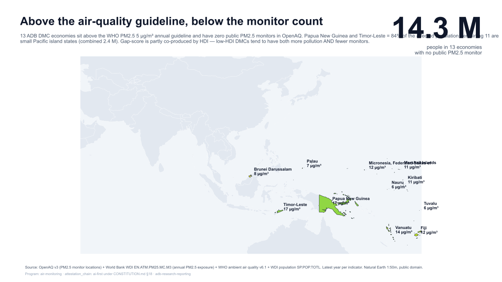

# Air-monitoring public QA observability

`attestation_chain: ai-first`. Current maturity: SR. Public data only.

## Finding

Public monitor routes are visible, but claim-ready station-level quality
evidence is not verifiable in the audited packet. Across 24 economies, 239
official station rows, and 44 official/OpenAQ identity candidates, the
committed evidence ledger verifies 0 same-station joins, 0 complete
monitor-grade rows, 0 station-radius-ready economies, and 0 allowed coverage
claims.

This is a bounded public-data absence. It is not evidence that calibration or
inspection records do not exist, and it is not an estimate of monitor coverage,
population served, exposure, or regulator performance.



## Research problem

Public dashboards and aggregators make station locations and measurements easy
to count. A coverage claim requires more: the same physical station must be
identified across sources, its method and current status must be traceable, and
station-specific quality-assurance evidence must support the intended use.
Without those links, a station buffer is geometry rather than validated
monitoring coverage.

## Evidence object

The primary object is `generated/evidence-ledger.json`, built from 64 committed
public-source summary artifacts. It records the source route, retrieval state,
row scope, evidence fields, claim-enabling zeros, and nonclaim for each audit
lane. Its economy table covers 24 economies in the discovery frame.

## Method

The study applies a claim-permission sequence:

1. identify an official public station route;
2. audit station and method rows;
3. check official/OpenAQ identity candidates;
4. require public evidence for same-station identity;
5. require station-specific grade, inspection, or calibration evidence; and
6. allow a station-radius coverage statement only after the identity and grade
   gates close.

A zero is publishable only when the source route, retrieval result, row scope,
and exact missing field are recorded. Generic source searches are not counted
as sensitivity evidence.

## Main result

The packet contains useful context: 9 economies have an official station
source or portal; 239 official station rows were audited; 44 identity
candidates were checked; 22 BMKG target rows have method, display, and status
context; and 831 denominator joins were computed as nonclaim geometry. None of
those objects closes the public same-station and monitor-grade gates.

## Conclusion

The defensible output is an observability-gap study. Public station visibility
cannot be treated as public proof of station quality or population coverage.
The result should change only when a named public source supplies a
station-specific inspection log, calibration certificate or status row,
official same-station crosswalk, or station-keyed method-grade ledger.

## Reproduce

See `REPRODUCE.md`. The core no-network command is:

```powershell
python air-monitoring\scripts\build-evidence-ledger.py
python air-monitoring\scripts\build-figure-dossier.py
python air-monitoring\scripts\build-thumbnail.py
```

