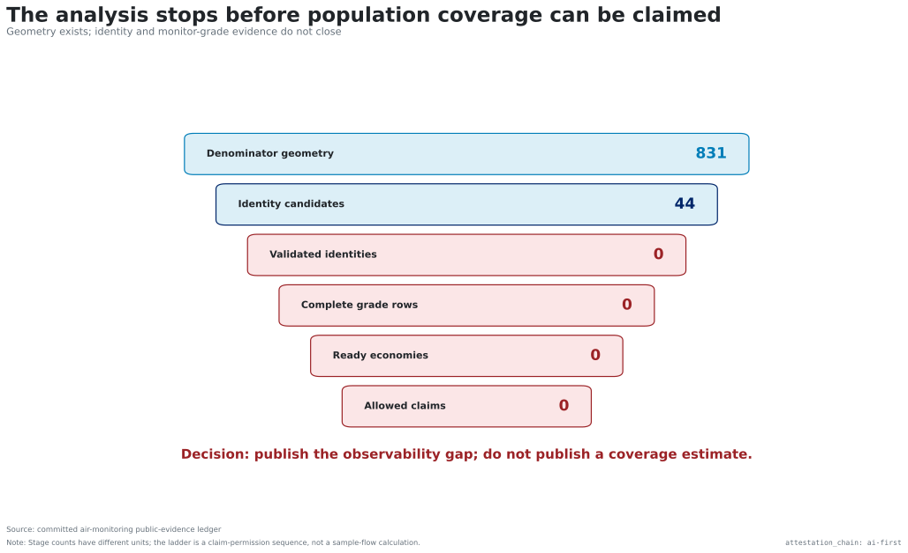
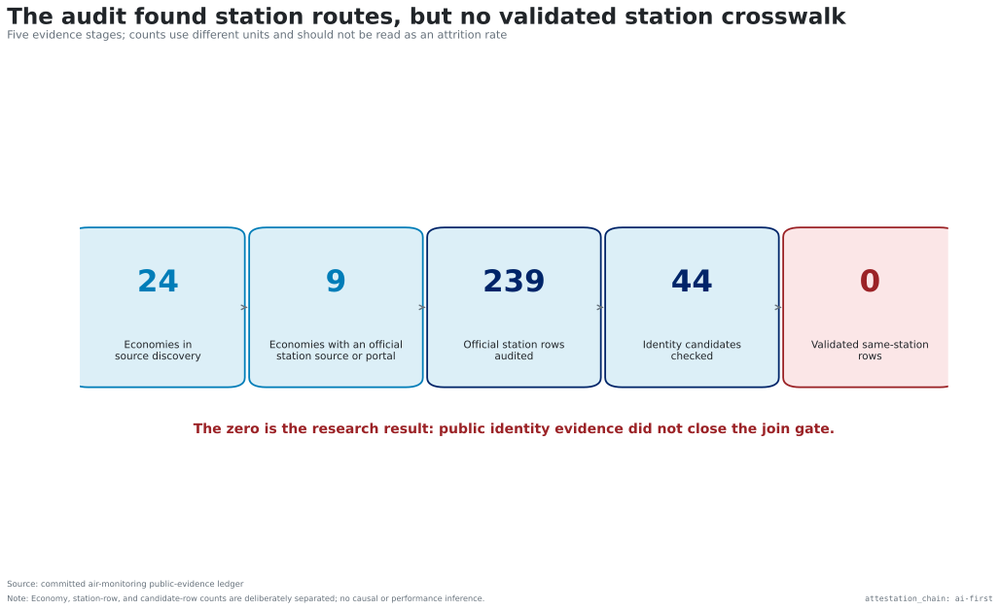
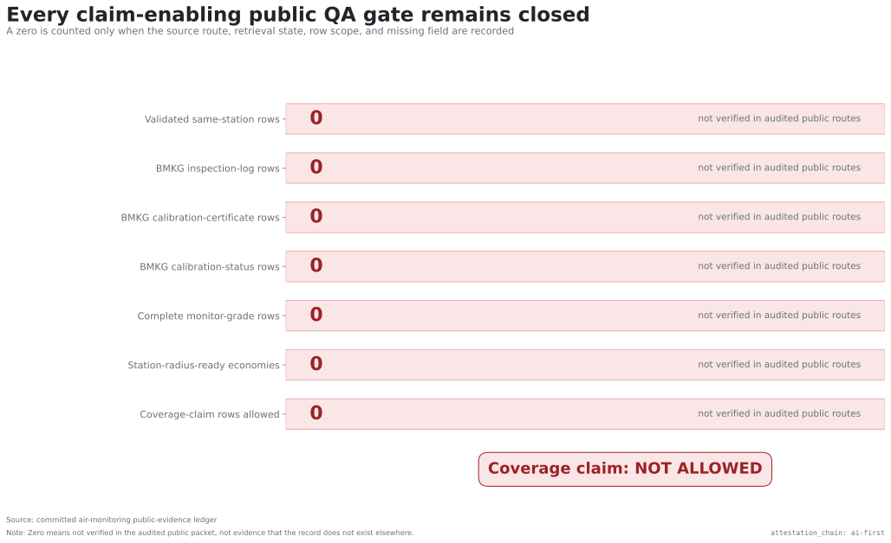
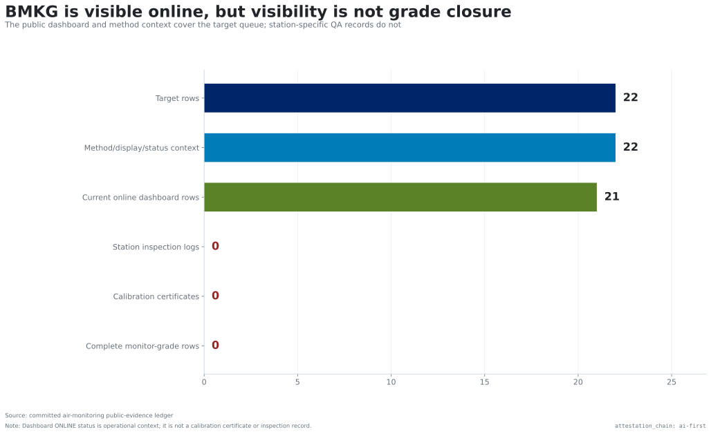
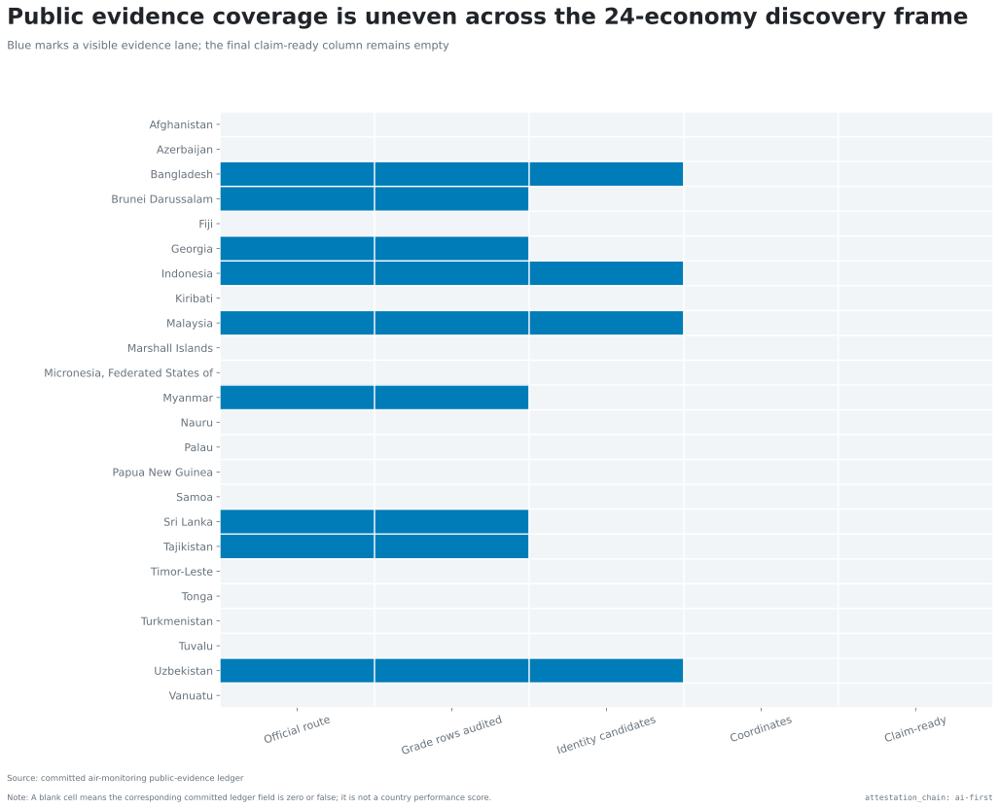
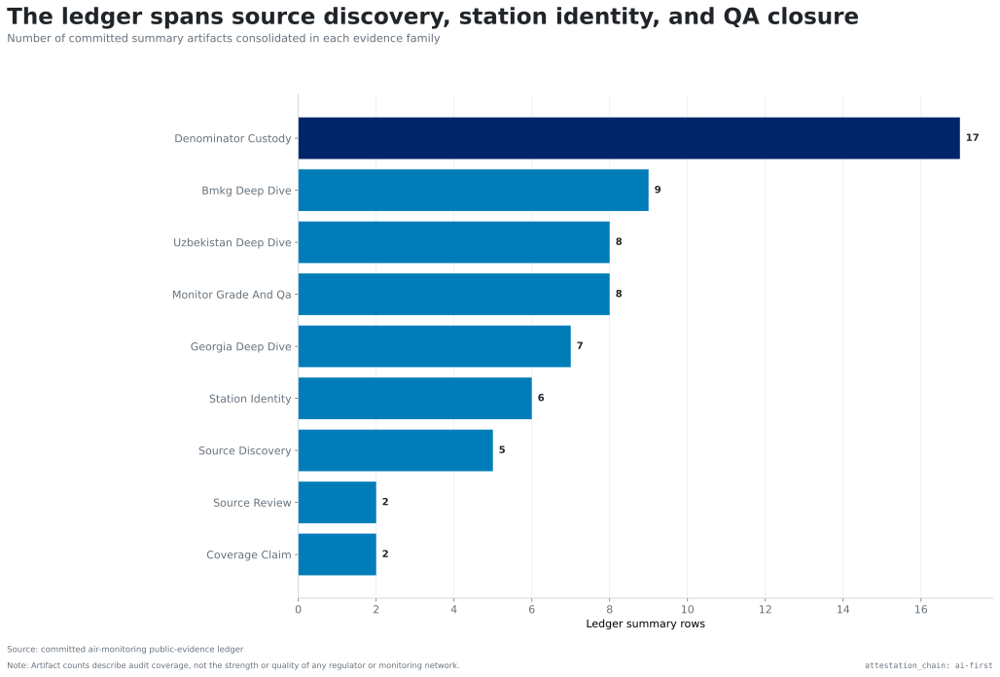
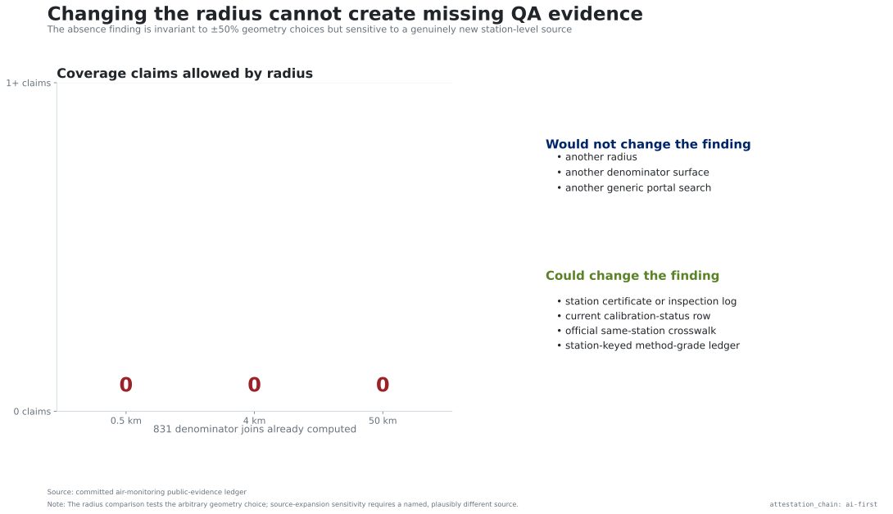
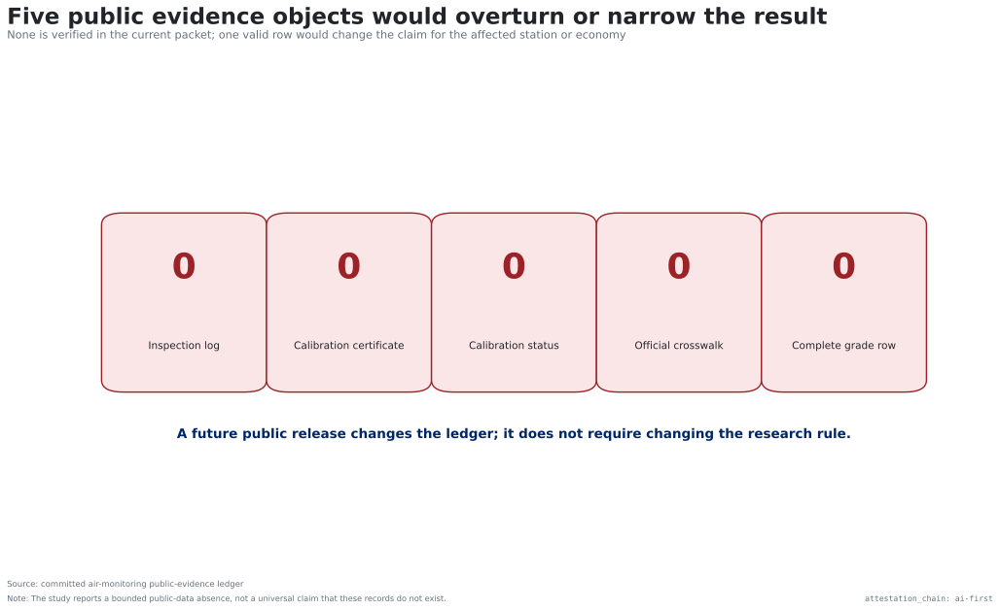

# Results — public station visibility does not close the QA chain

`attestation_chain: ai-first`. SR evidence package. Updated 2026-07-19.

## Main finding

The audit reaches the station-discovery and denominator stages, then stops. It
finds 24 economies in the source-discovery frame, official station routes in 9,
239 official station rows audited for monitor-grade evidence, 44
official/OpenAQ identity candidates, and 831 denominator joins. It verifies 0
same-station rows, 0 complete monitor-grade rows, 0 station-radius-ready
economies, and 0 allowed coverage-claim rows.

The counts use different units and are not an attrition rate. Together they
show where the claim-permission sequence stops.

## Source routes exist, but the public crosswalk does not

Official inventories, regulator portals, dashboards, APIs, OpenAQ metadata,
and denominator sources provide substantial discovery context. The audit's 44
identity candidates are still candidates: no public record in the packet
validates an official and OpenAQ row as the same physical station.

## All seven claim-enabling gates remain closed

The ledger treats a zero as informative only when the source route, retrieval
state, row scope, and exact missing field are recorded. Under that rule, seven
headline gates remain at zero.

## The BMKG lane shows why dashboard visibility is insufficient

All 22 BMKG target rows have method, display, and status context, and 21 are
currently shown as online in the audited dashboard snapshot. The packet still
contains no station-specific inspection log, calibration certificate,
calibration-status row, or complete monitor-grade row for the target queue.
Online status is operational context, not grade closure.

## Evidence availability differs across the discovery frame

The economy matrix makes the missingness pattern visible. Some economies reach
official-source, audited-row, or identity-candidate lanes. None reaches the
claim-ready lane. A blank cell is not a performance score and does not mean a
monitoring network is absent on the ground.

## This was not a one-page source check

The consolidated ledger spans source discovery, station identity, denominator
custody, country-specific deep dives, and claim closure. Artifact counts show
where the audit effort sits; they do not rank agencies or countries.

## The result is insensitive to radius, but sensitive to new evidence

Changing the diagnostic radius from 4 km to 0.5 km or 50 km changes future
geometry, not the missing public QA chain. All three lanes therefore leave the
allowed-claim count at zero. A genuinely new station-level source could change
the finding.

## The falsifier is concrete

Five public evidence objects would narrow or overturn the result: a
station-specific inspection log, calibration certificate, current
calibration-status row, official same-station crosswalk, or station-keyed
method-grade record. None is verified in the current packet.

## Interpretation

The defensible conclusion is an observability gap in public station-level QA
evidence. It is not a claim that these records do not exist; it is a record that
they were not verifiable in the named public routes. It is also not an estimate
of monitor coverage, population served, exposure, data accuracy, or regulatory
performance.
