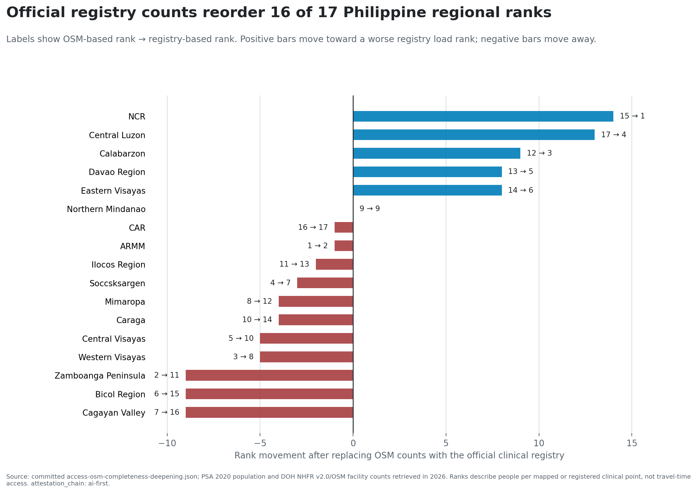
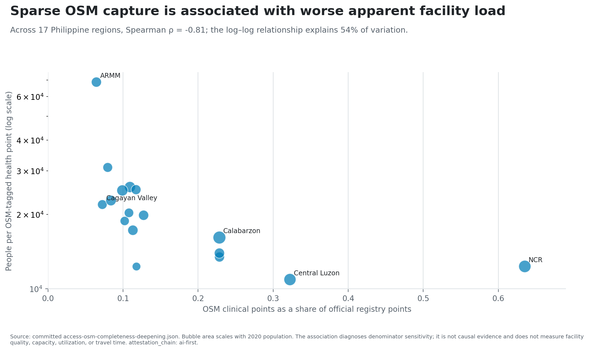
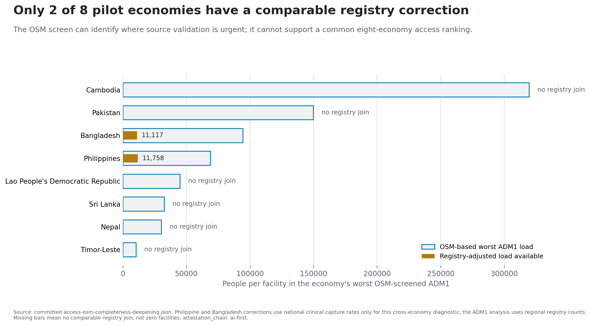
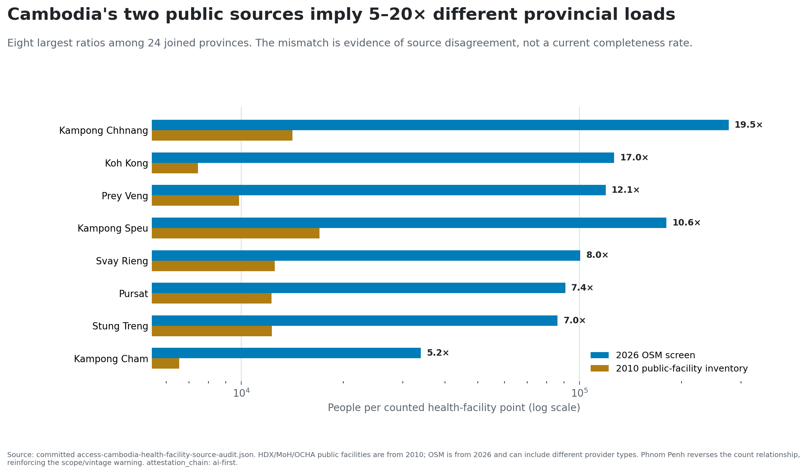

# The question

## Does an open facility map support a service-access rank?

The inherited pilot divides ADM1 population by OSM service points across eight
ADB developing member economies.

- Public and reproducible.
- Useful for discovering possible data gaps.
- But the map denominator may vary with mapping effort.

**Test the denominator before extending the access story.**

`attestation_chain: ai-first`; current maturity PP.

# The main finding

## Official registry counts reorder 16 of 17 Philippine ranks

{width=88%}

# Why the rank changes

## Map capture is associated with apparent facility load

{width=88%}

- OSM capture: **6.45% in ARMM to 63.53% in NCR**.
- Spearman rho with apparent OSM load: **-0.81**.
- Descriptive source signal—not causal evidence.

# The eight-economy boundary

## Only two pilot economies have comparable registry corrections

{width=88%}

Missing correction means **no comparable join**, not zero facilities.

# A second source is not automatically validation

## Cambodia exposes source and vintage disagreement

{width=88%}

- 21 of 24 joined province ranks change.
- 2010 public providers versus 2026 OSM and broader tags.
- Report disagreement, not current completeness.

# What the screen can do

## Use it as a source-validation queue

The panel can prioritize:

- facility-master-list discovery;
- taxonomy and provider-scope crosswalks;
- boundary and identifier repair; and
- mapping review where capture is thin.

It cannot rank travel time, capacity, quality, utilization, affordability,
household access, welfare, or DMC performance.

# The next evidence object

## Build access from validated inputs

1. Current, geocoded, provider-scoped facility master lists.
2. Stable facility identifiers and boundary crosswalks.
3. Routable networks, terrain, barriers, and transport modes.
4. Services, staffing, operating status, and capacity.
5. Utilization or household evidence with appropriate review.

**The old access-ranking headline is retired. The map-observability finding is
the result.**

# Reproducibility and attestation

## Every displayed number traces to committed evidence

- Main evidence: `access-osm-completeness-deepening.json`
- Cambodia audit: `access-cambodia-health-facility-source-audit.json`
- Figure dossier: `access-services/scripts/build-figure-dossier.py`
- Method and sensitivity: `pre-registration.md`, `sensitivity.md`
- Limits and upgrade: `limitations.md`, `upgrade-gap.md`

The package is `attestation_chain: ai-first` under §18. No individual external
reviewer was contacted. Human-final requires owner re-attestation and named
domain/country/statistical review.

