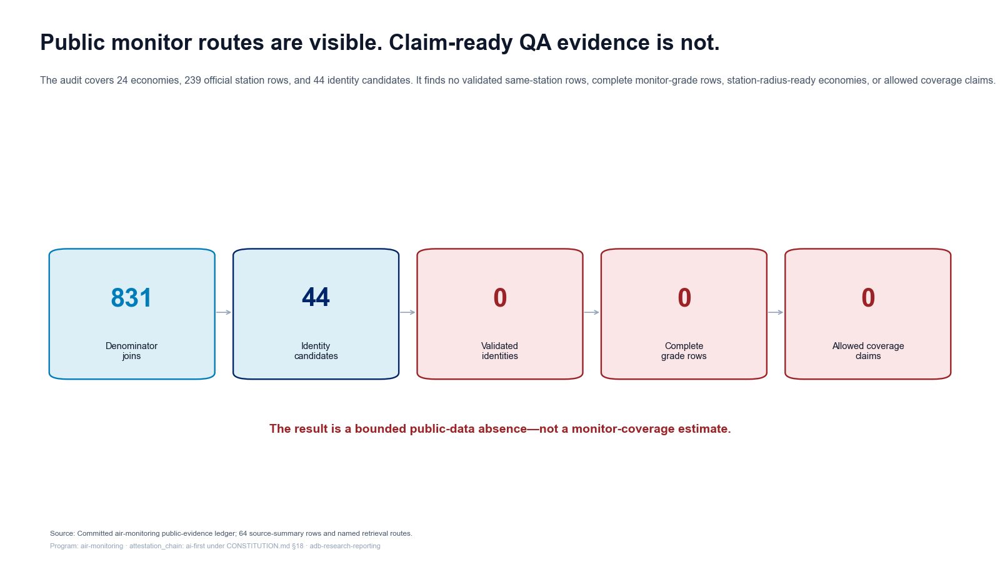
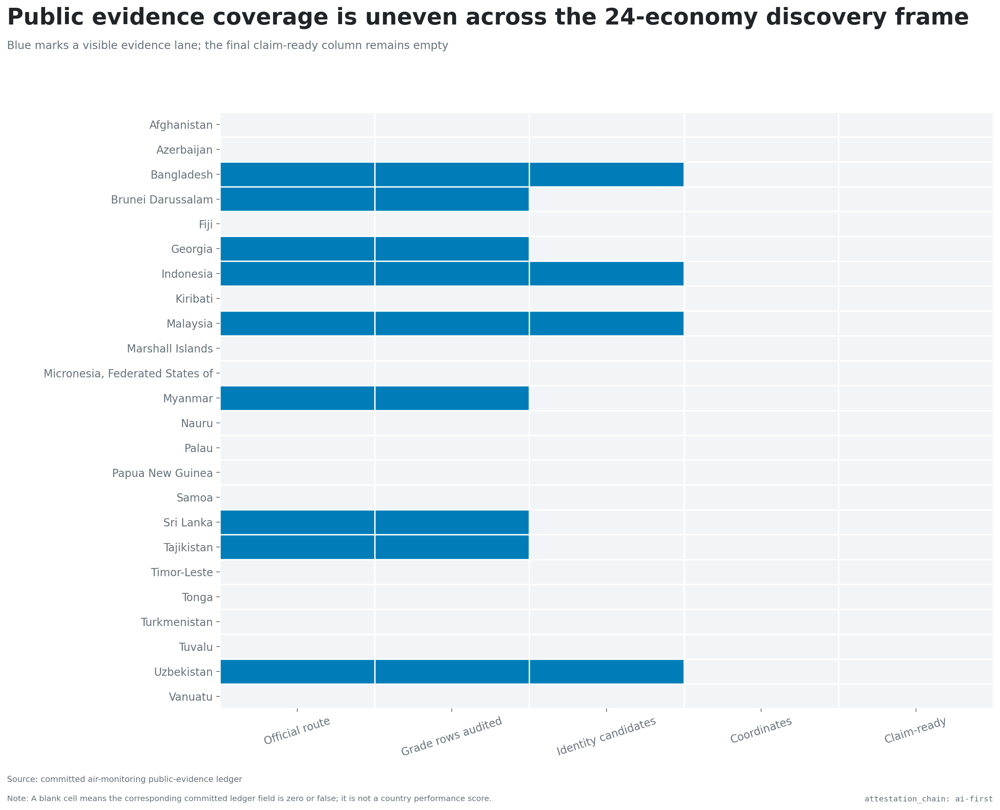
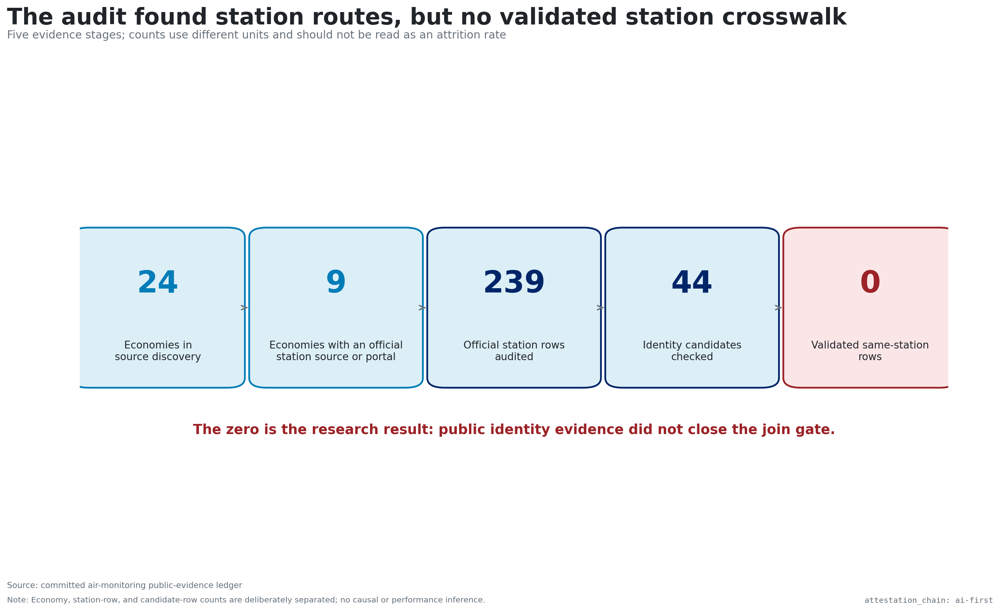
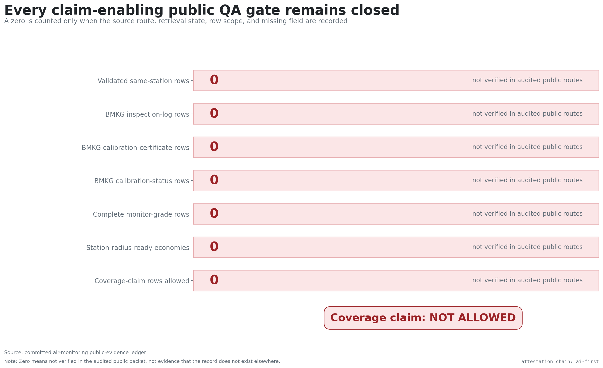
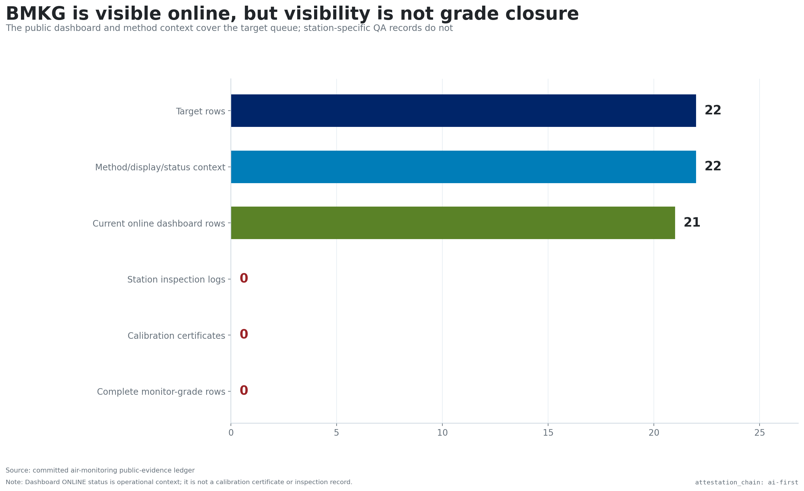
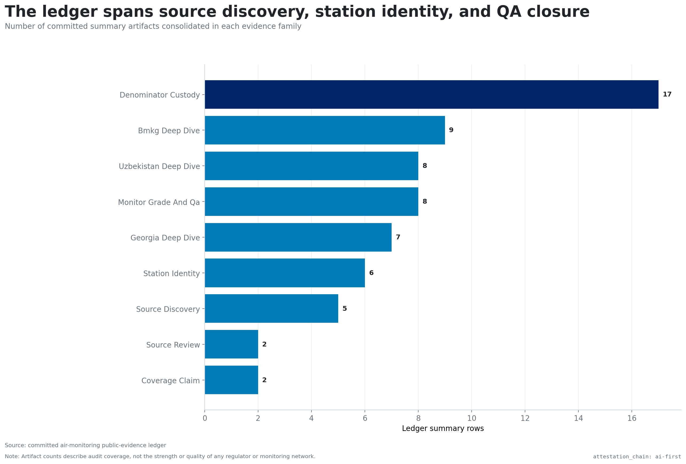
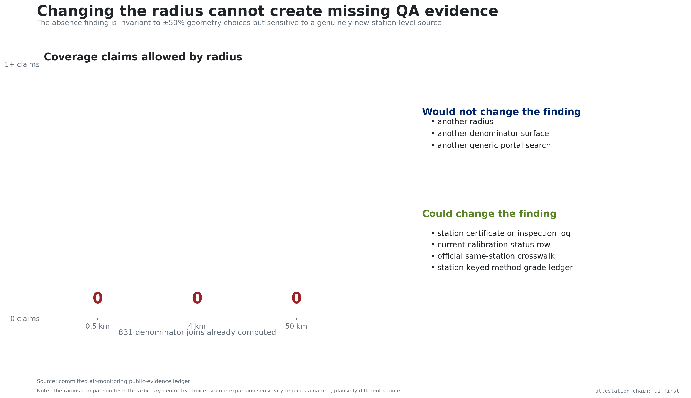
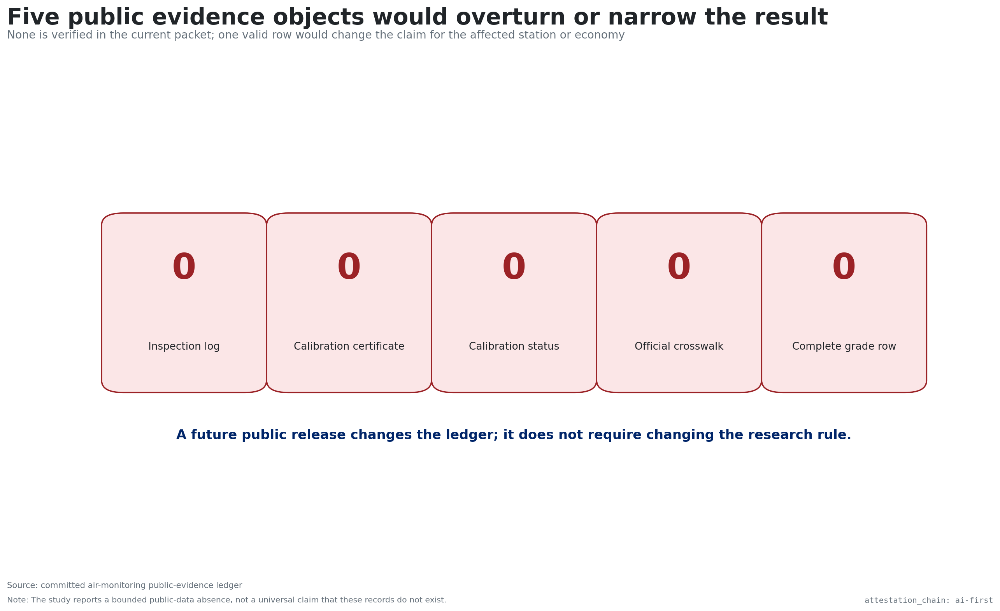
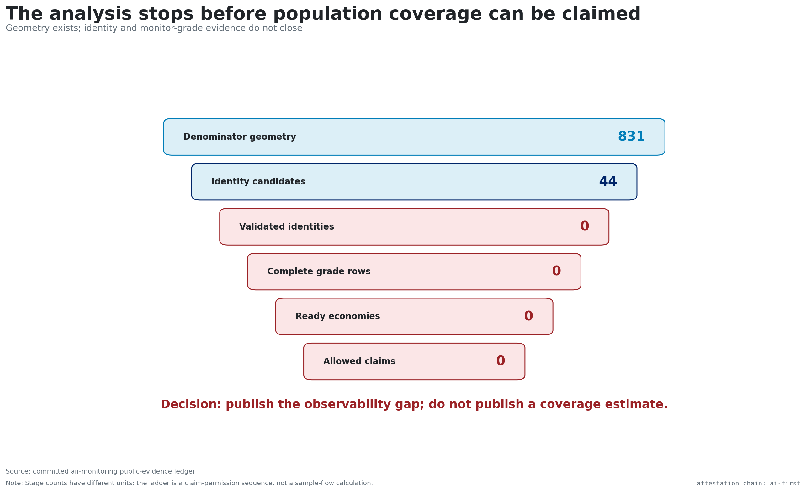

# Public routes exist; coverage claims stop short

{width=100%}

# Public evidence lanes differ across 24 economies

{width=100%}

# Finding a source is not confirming the same station

{width=100%}

# No public quality record clears a coverage claim

{width=100%}

# Online status is not a certified monitor grade

{width=100%}

# Many evidence types; none complete the chain

{width=100%}

# Changing the search radius still finds no quality proof

{width=100%}

# Five public evidence objects would change the result

{width=100%}

# Publish the observability gap; withhold coverage

{width=100%}
