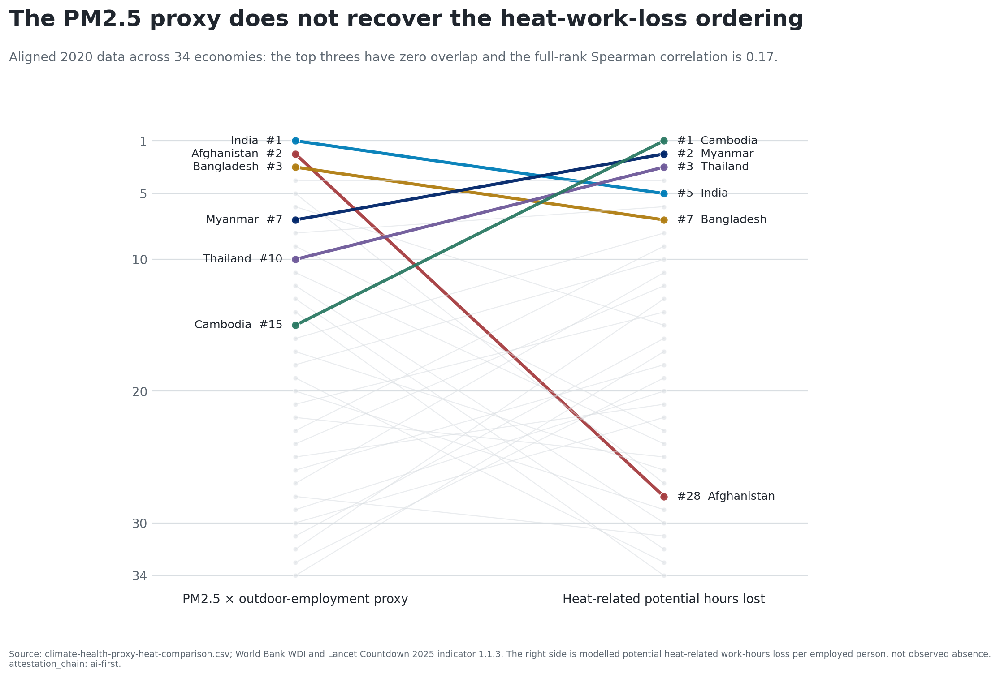
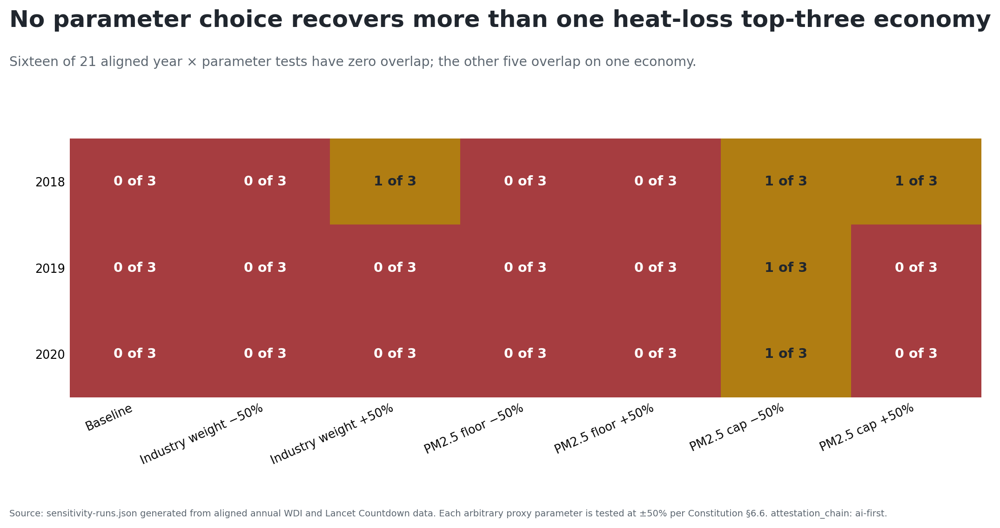
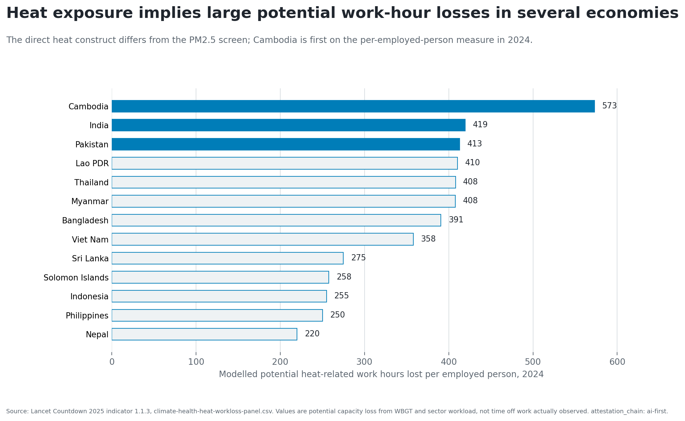
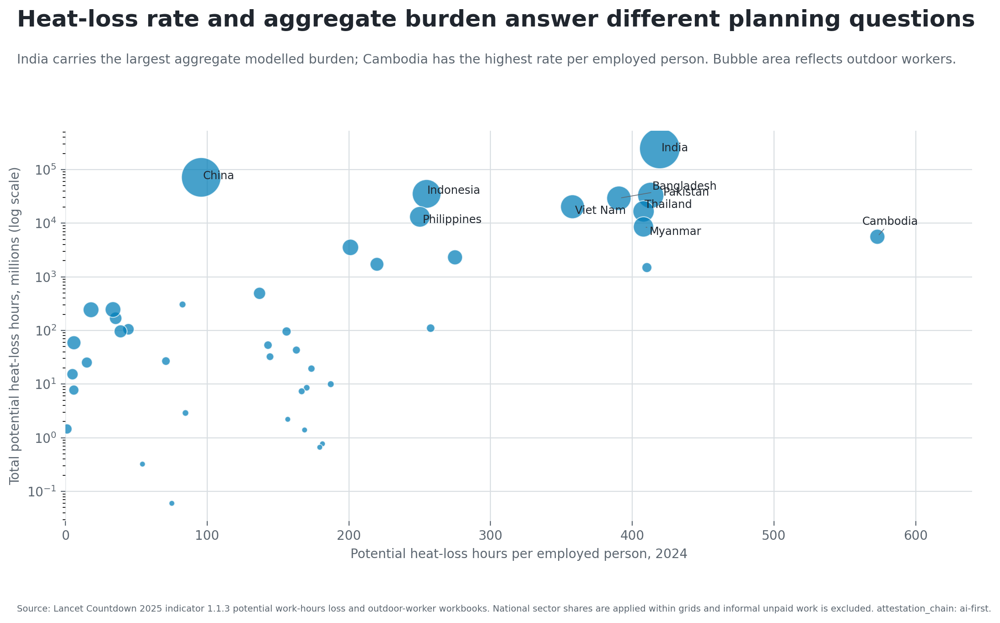
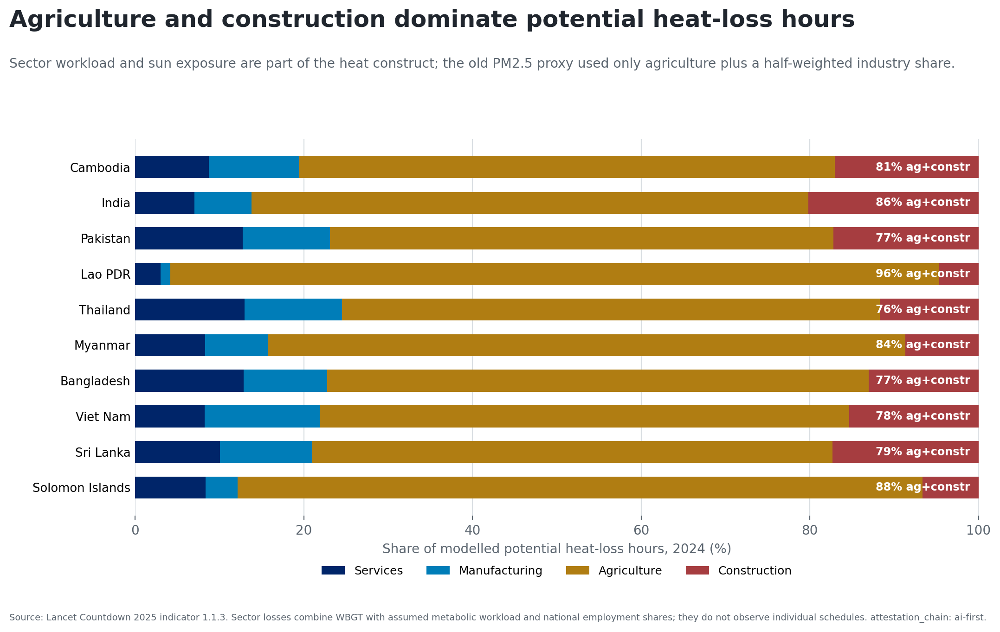
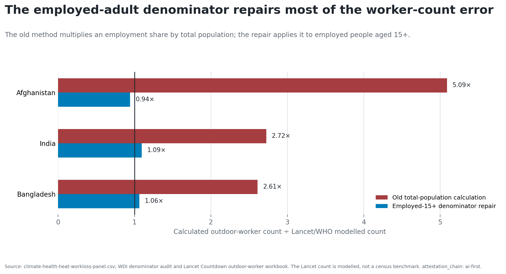
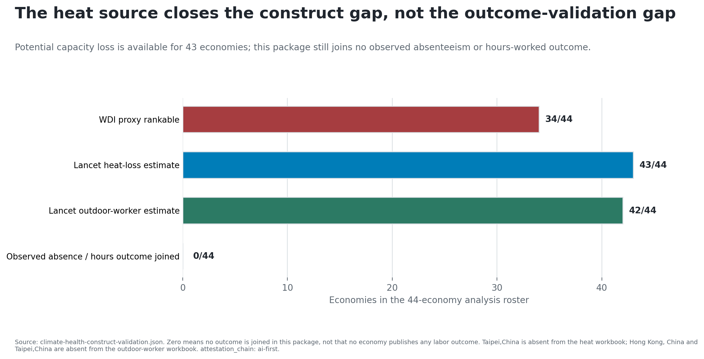

# The old result passed the wrong test

The inherited proxy multiplied agriculture plus half of industry employment by
a national PM2.5 pressure transformation.

- Its leading set survived ±50% parameter changes.
- It contained no temperature, humidity, workload, or labor outcome.
- Internal stability did not establish heat-work-loss validity.

**Question: does the proxy recover a documented direct heat-labor construct?**

# The aligned 2020 top threes have zero overlap

{width=100%}

# The disagreement persists across all 21 tests

{width=100%}

# Direct heat loss points to a different profile

{width=100%}

# Rate and aggregate scale answer different questions

{width=100%}

# Sector workload is part of the direct construct

{width=100%}

# The old worker denominator was also overstated

{width=100%}

# Observed labor outcomes are still missing

{width=100%}

# Replace the ranking with four research rules

1. Test external construct validity, not only internal parameter stability.
2. Keep heat and PM2.5 as separate mechanisms unless a joint design identifies
   both.
3. Use an employed-population denominator for worker counts.
4. Do not report modelled potential capacity loss as observed absence.

**Next object:** observed hours, absence, output, or labor supply aligned with
workplace or subnational exposure.
