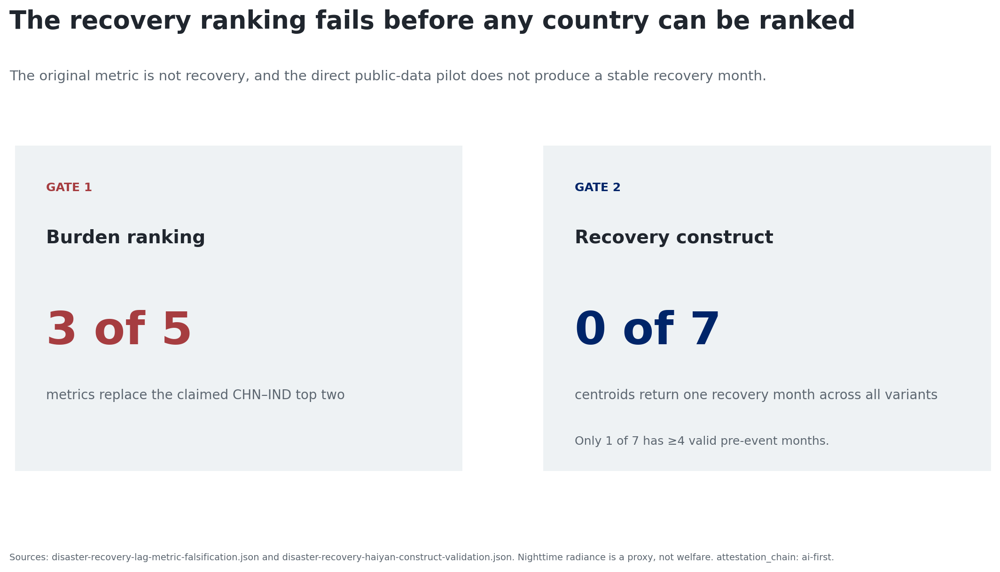
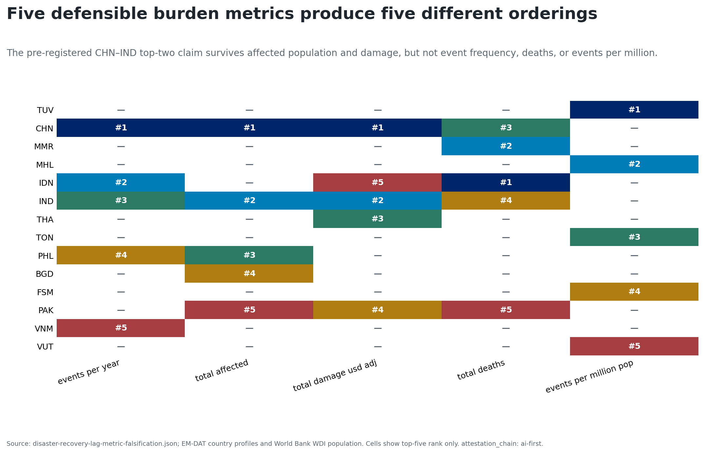
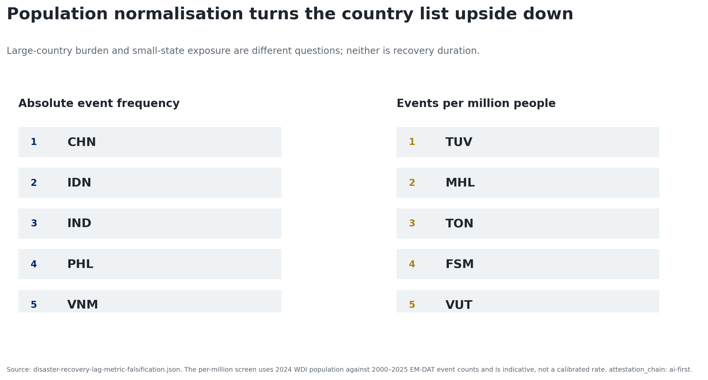
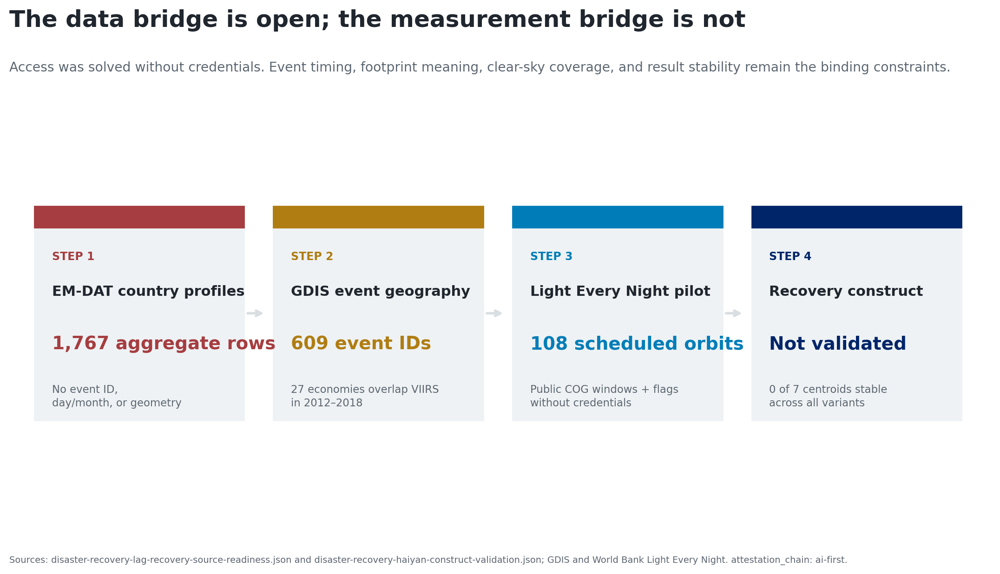
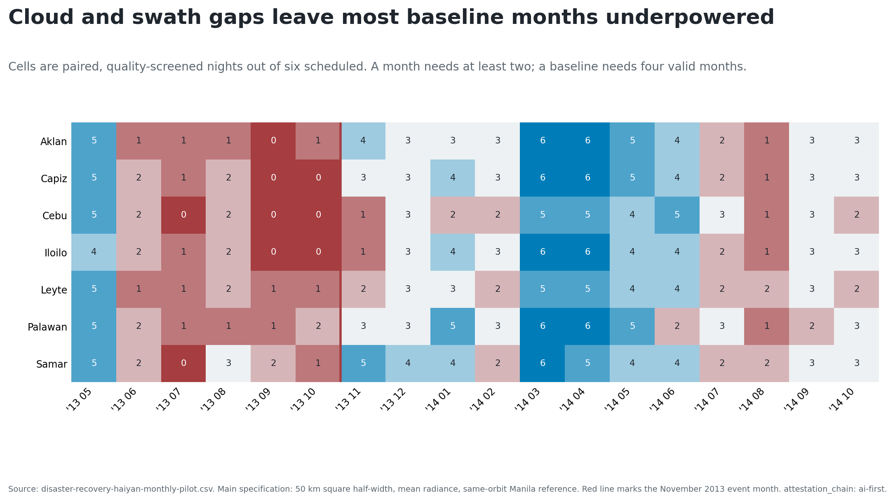
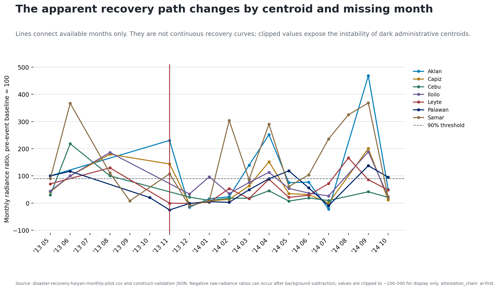
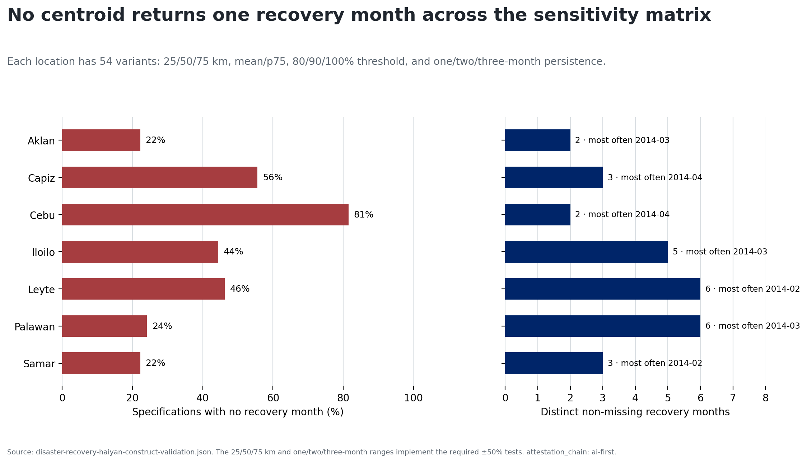
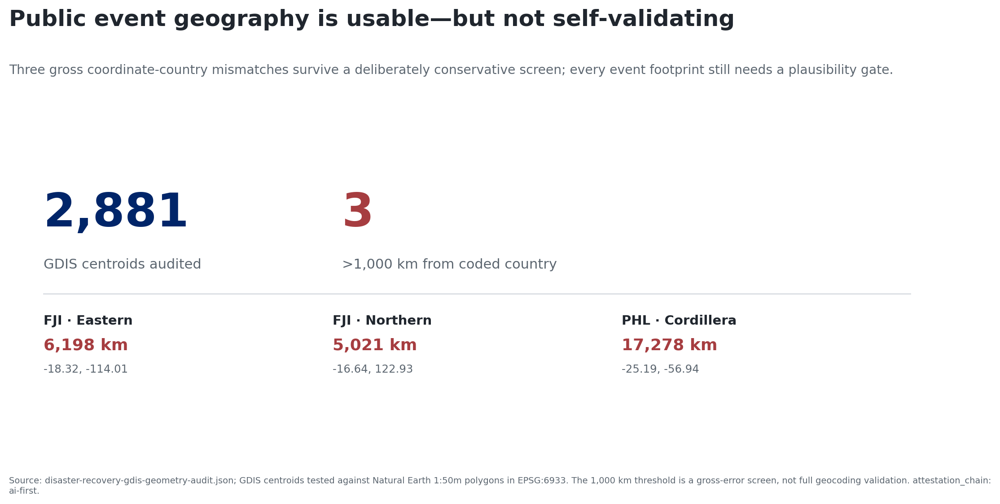

# The measurement chain fails twice

{width=100%}

# Burden changes when the outcome changes

{width=100%}

# Scale reversal is part of the result

{width=100%}

# Public access is only one gate

{width=100%}

# The frozen Haiyan pilot

- Seven GDIS administrative centroids; event date 8 November 2013.
- Six fixed dates per month, May 2013–October 2014: 108 scheduled orbits.
- Clear, nighttime, valid radiance paired to a same-orbit Manila reference.
- Main rule: 50 km, mean, 90% of baseline, two-month persistence.
- Full matrix: 25/50/75 km × mean/p75 × 80/90/100% × 1/2/3 months.

# Baseline coverage is thin

{width=100%}

# Main dates are candidates, not the finding

{width=100%}

# Zero of seven centroids retain one month

{width=100%}

# Geography also needs validation

{width=100%}

# Keep the pipeline; retire the claim

**Decision:** the public archive is scalable; the recovery construct is not yet
validated.

Next design:

- verified event footprints;
- longer, settlement-aware baselines;
- credible comparison areas; and
- independent service or household outcomes.

*Radiance is a proxy—not welfare or a causal recovery estimate.*
