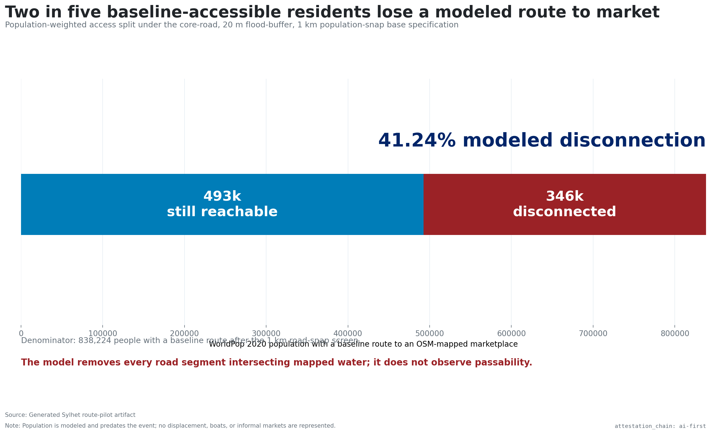
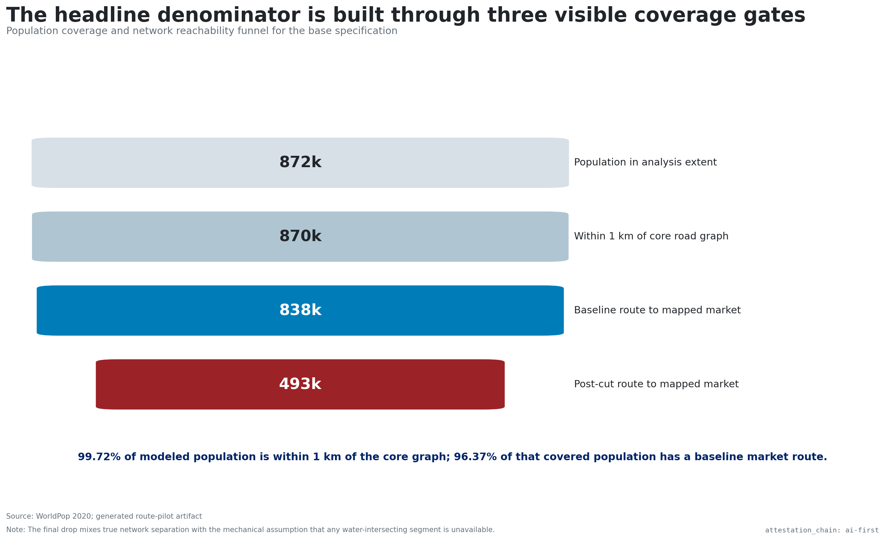
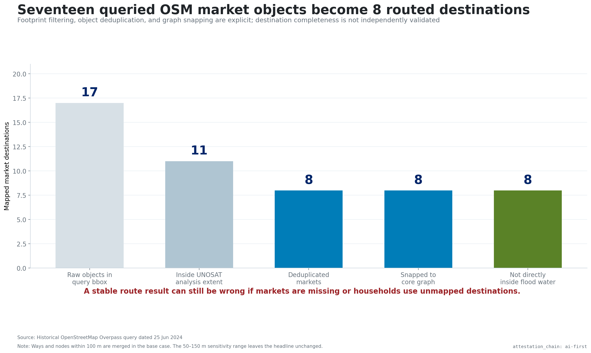
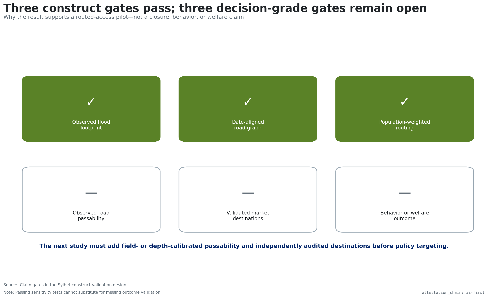

# The observed flood footprint cuts modeled routes

{width=100%}

# About two in five baseline-accessible residents are disconnected

{width=100%}

# The finding survives all 54 variants

{width=100%}

# The headline denominator passes three visible checks

{width=100%}

# Seventeen queried market objects become eight destinations

{width=100%}

# Source objects disagree—and are not interchangeable

{width=100%}

# Road definition changes cut length more than access

{width=100%}

# A lower survivor median is not an improvement

{width=100%}

# Road passability and market identity remain open

{width=100%}
