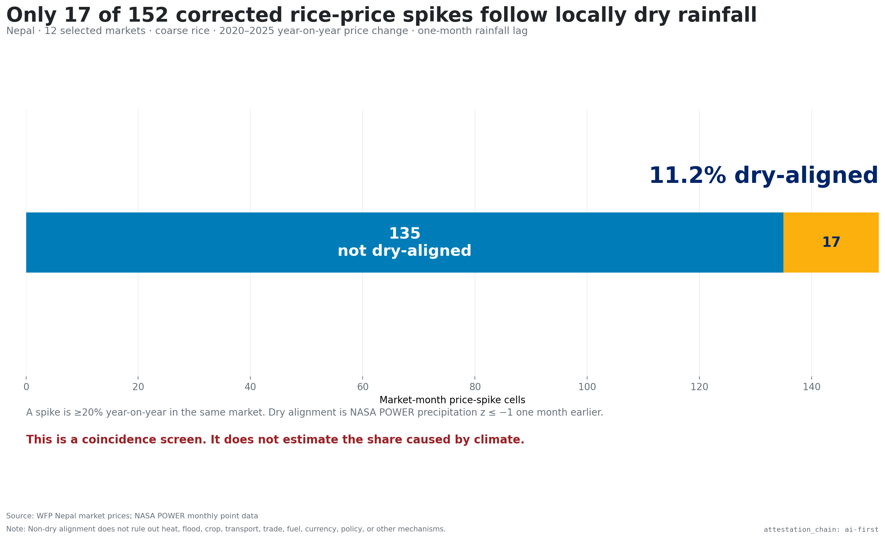
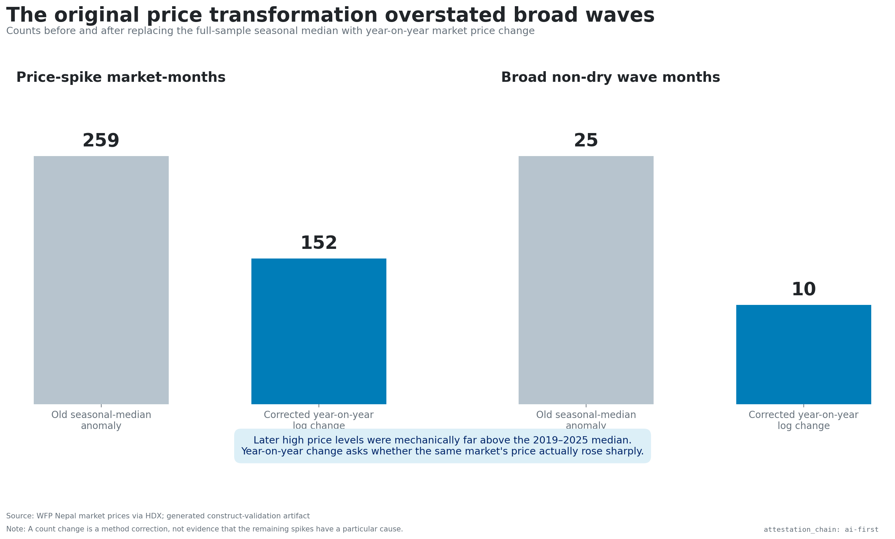
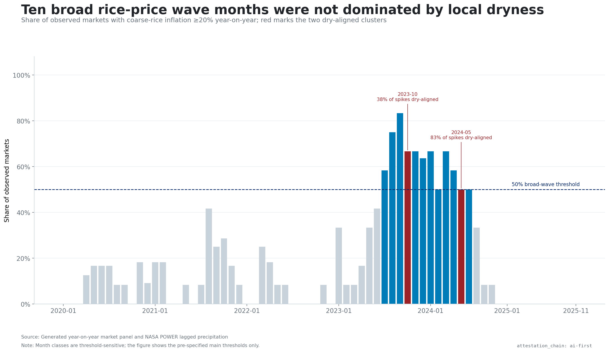
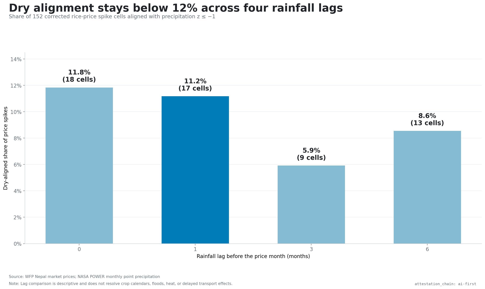
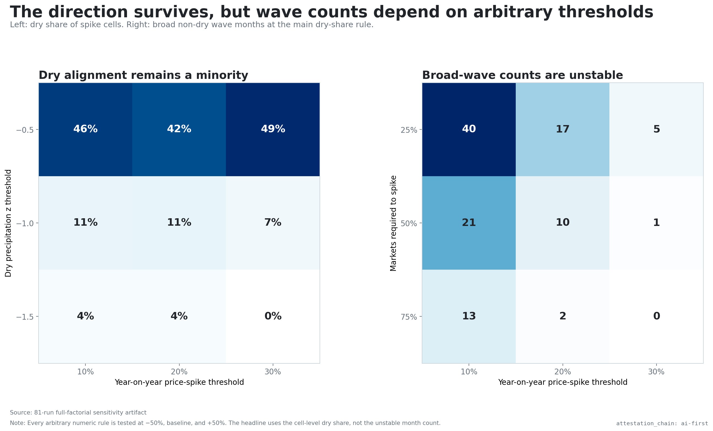
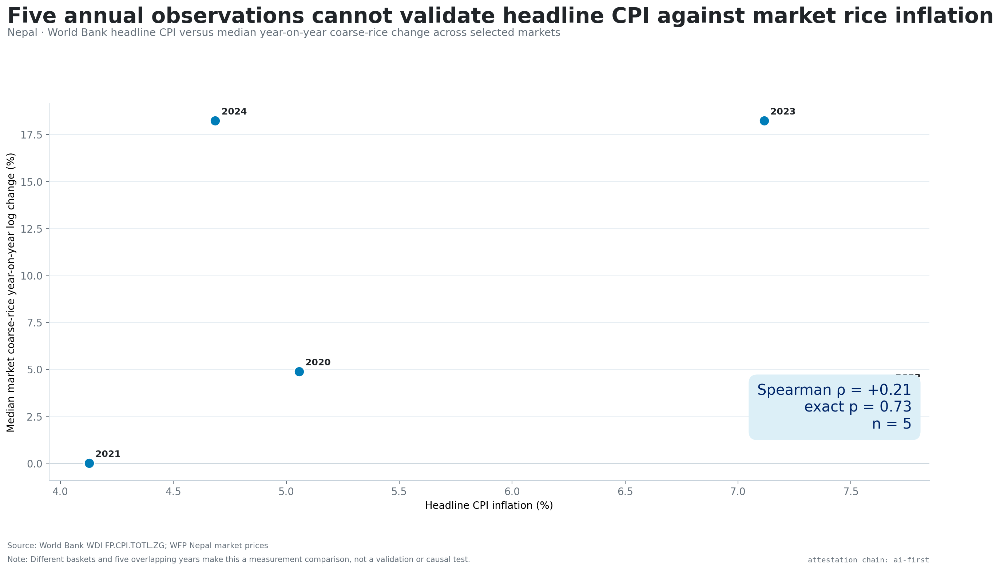
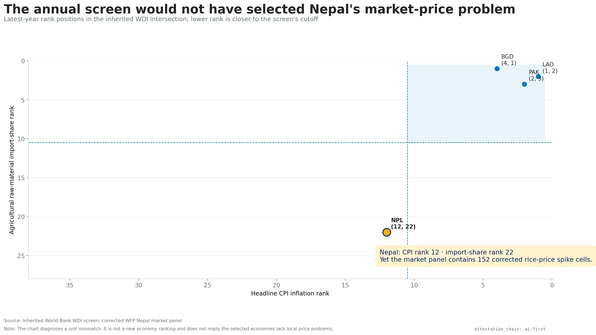
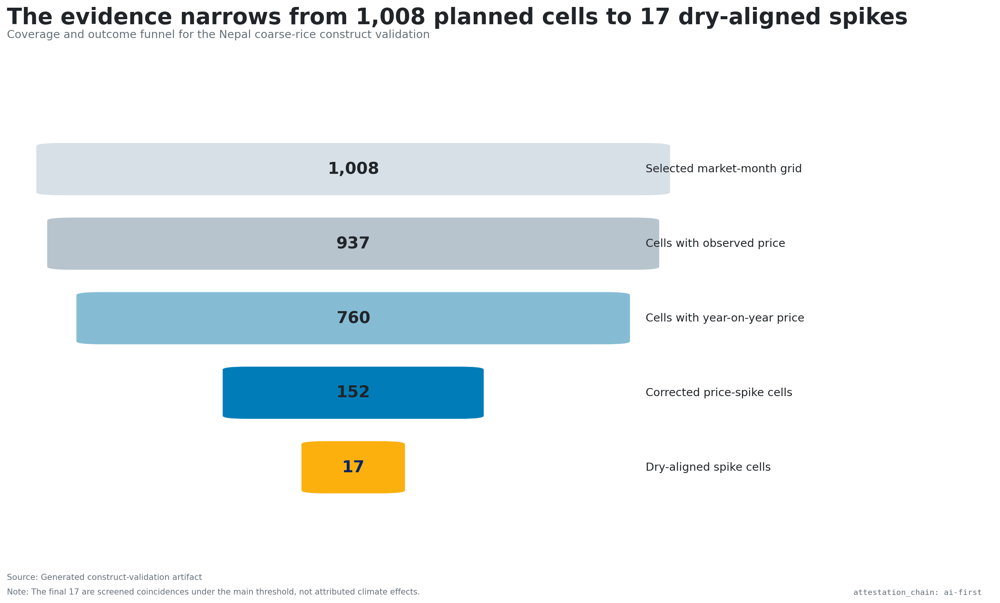
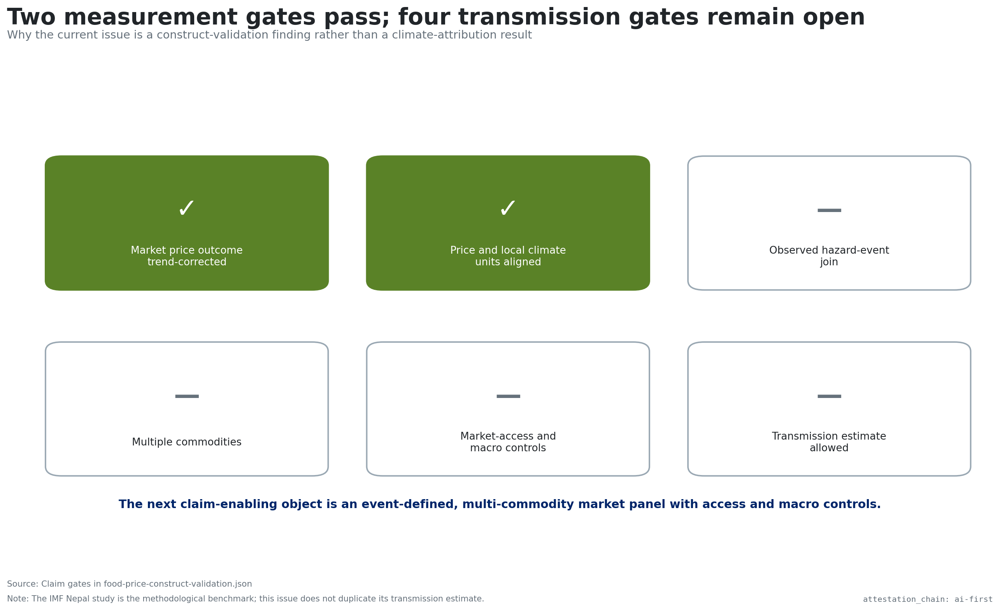

# The corrected finding is 17 of 152

{width=100%}

# The old price method inflated the wave count

{width=100%}

# A broad 2023–2024 wave remains visible

{width=100%}

# Local dryness stays minor across lags

{width=100%}

# The direction survives all 81 threshold runs

{width=100%}

# Annual CPI does not validate market rice prices

{width=100%}

# The annual qualifier would not select Nepal

{width=100%}

# The evidence narrows to 760 aligned cells

{width=100%}

# Cause remains unproven

{width=100%}
