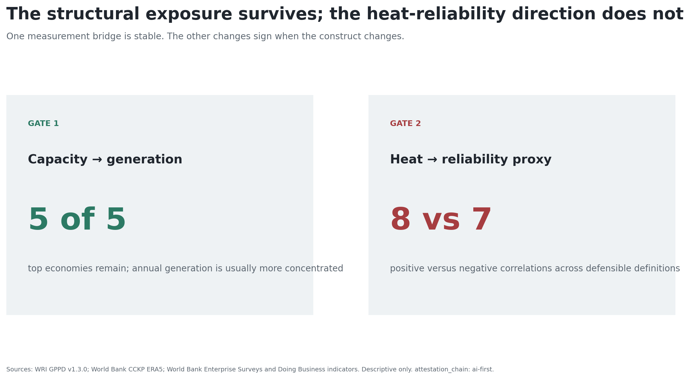
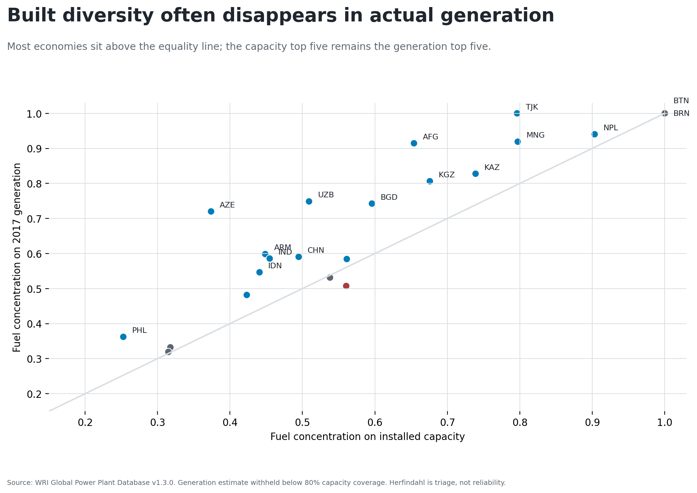
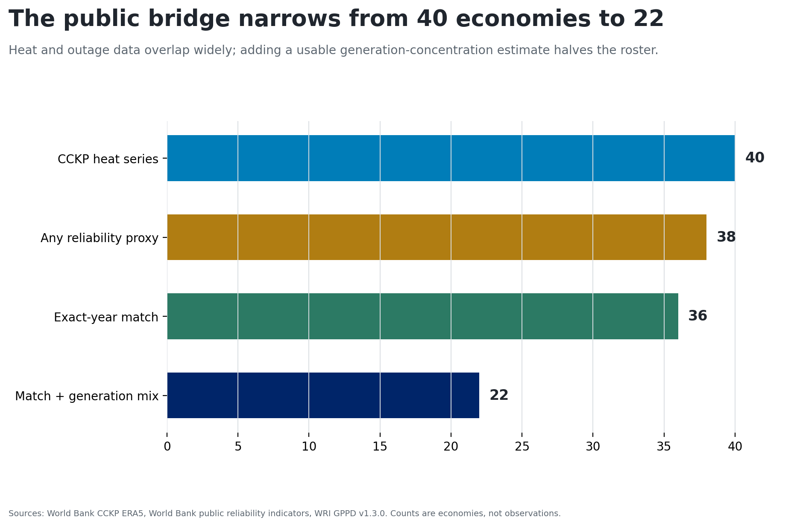
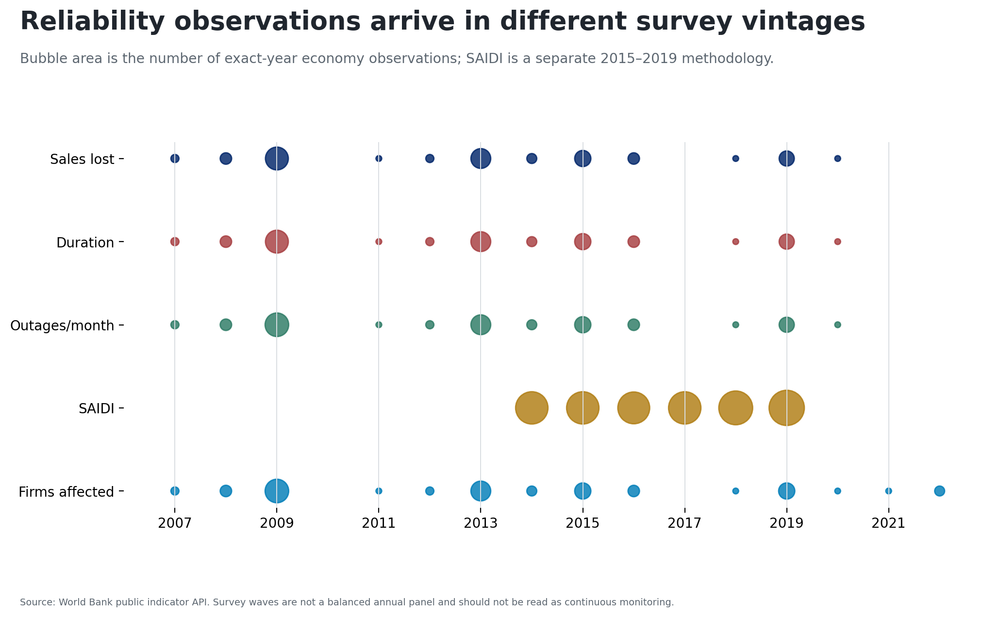
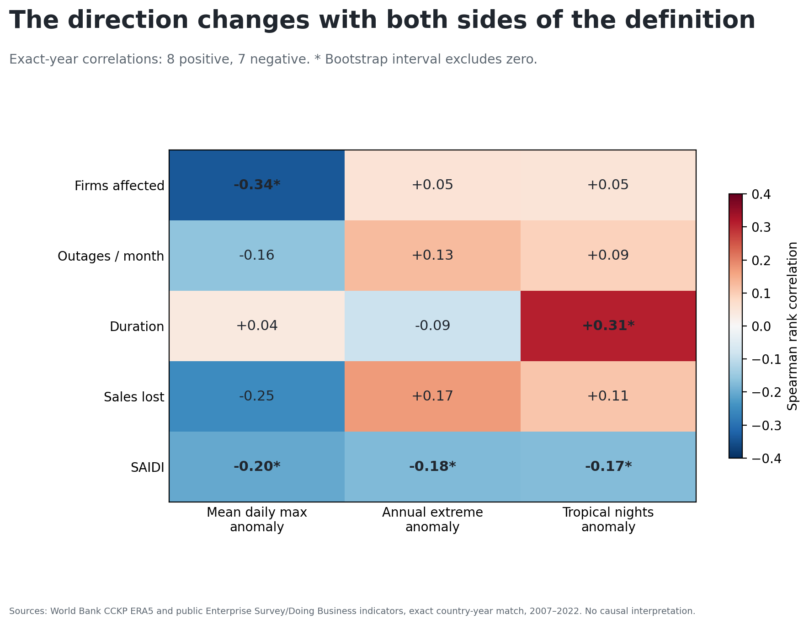
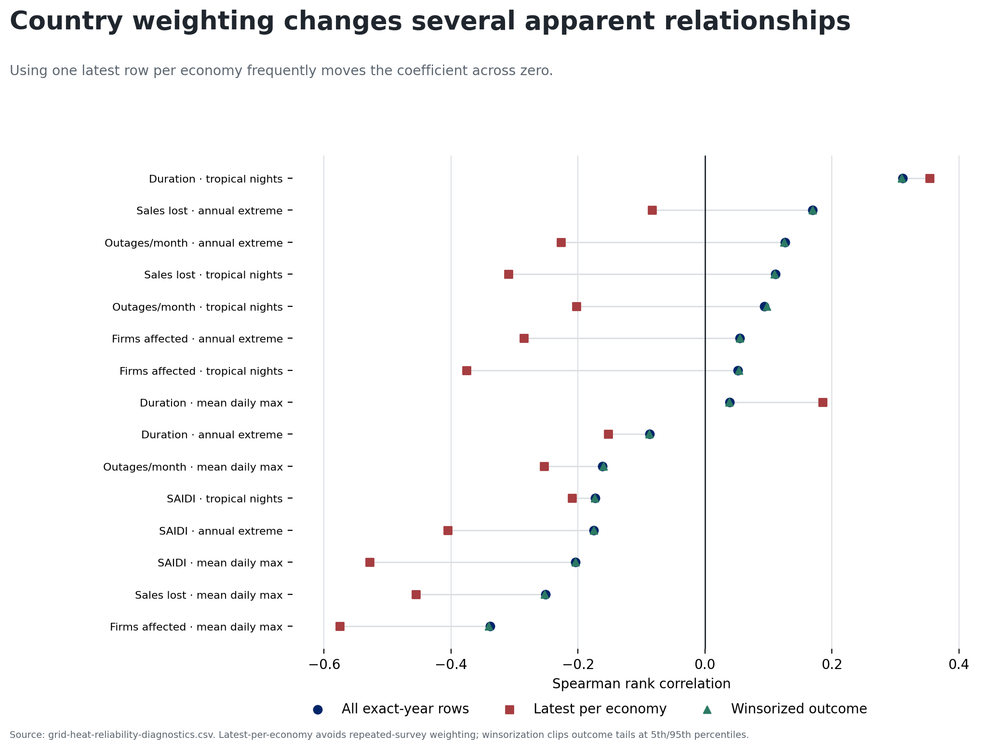
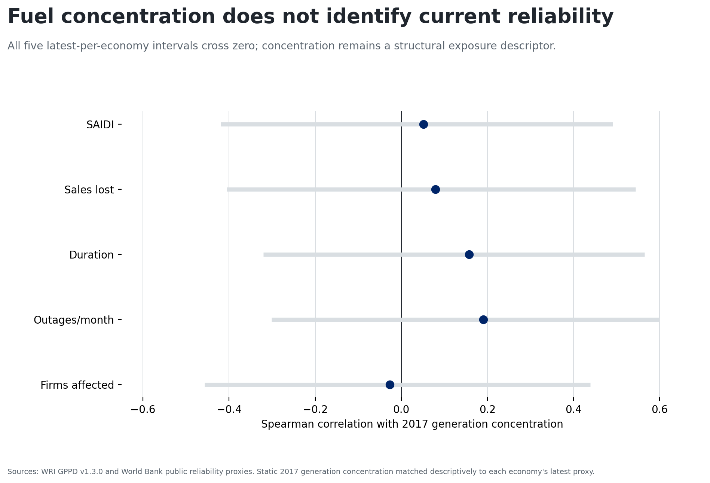

# One result survives; one does not

{width=100%}

# Built diversity can disappear in generation

{width=100%}

# The public bridge is real but narrow

{width=100%}

# Exact-year does not mean comparable

- 451 country-year-outcome rows across 36 economies, 2007–2022.
- Three heat definitions; five reliability outcomes.
- Firm surveys arrive in waves; Doing Business SAIDI is a separate method.
- Annual country heat does not observe event timing or service territory.

# Reliability proxies arrive in different vintages

{width=100%}

# The direction changes with the construct

{width=100%}

# Country weighting changes apparent relationships

{width=100%}

# Fuel concentration is not current reliability

{width=100%}

# Publish the boundary, not a ranking

**Supported:** the same five economies top capacity- and generation-based fuel concentration.

**Not supported:** a directional regional heat–reliability association or vulnerability leaderboard.

**Next object:** interruption timing, customers or load affected, daily/hourly heat, demand, available generation, imports, maintenance, and network conditions at a common service territory.
