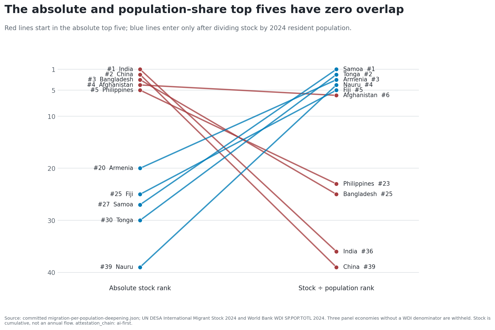
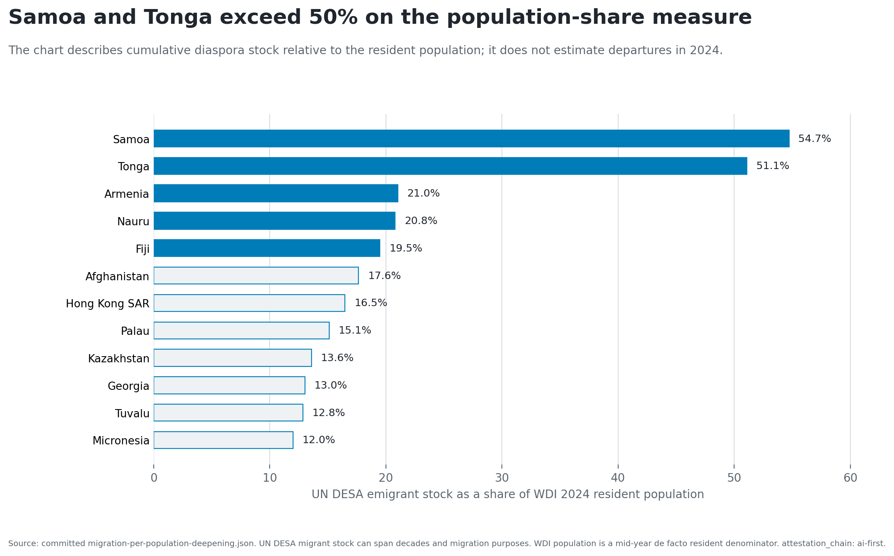
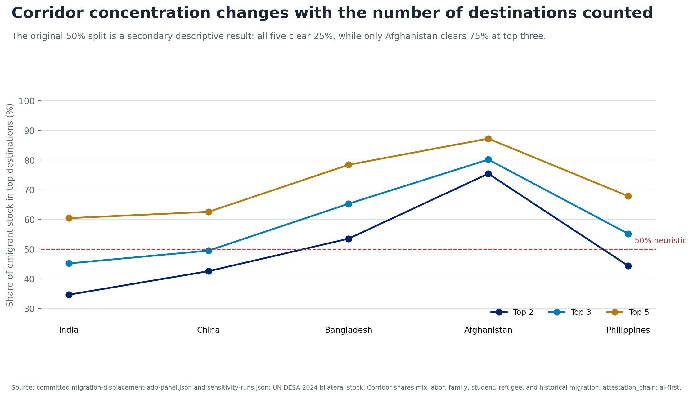
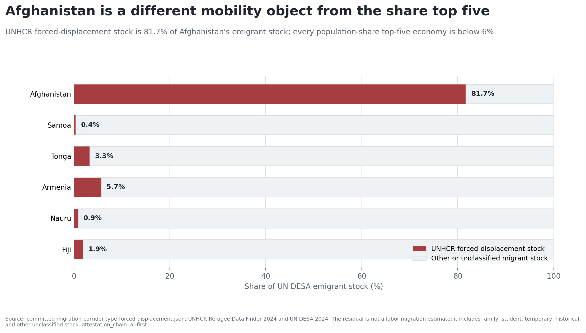
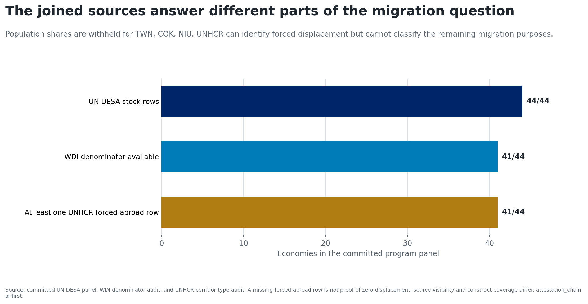

# One stock measure cannot answer two migration questions

A 44-economy panel ranks UN DESA 2024 emigrant stock by origin.

- Useful for diaspora scale and service-population questions.
- Not a current flow, migration rate, or individual propensity.
- Test: divide the same stock by WDI 2024 resident population.

**Separate scale, population-relative stock, and forced displacement before
reading an origin ranking.**

`attestation_chain: ai-first`; current maturity PP.

# India and China lead by scale; Samoa and Tonga after normalization

{width=91%}

# Samoa and Tonga exceed 50%; three denominators are withheld

{width=91%}

# The leaders barely overlap under every ranking width tested

- **Top 3:** no shared origins; 0% overlap.
- **Top 5:** no shared origins; 0% overlap.
- **Top 8:** Afghanistan only; 12.5% overlap.

The result remains material at overlap thresholds of **25%, 50%, and 75%**.

**Decision: retire the absolute-stock intensity headline.**

# Top-three corridor shares range from 45.15% to 80.15%

{width=91%}

# Afghanistan is a forced-displacement-majority exception

{width=91%}

# No source in the spine classifies every migration purpose

{width=91%}

# Match the denominator to the decision

1. Use absolute stock for diaspora scale and service populations.
2. Use stock relative to resident population for population-relative exposure.
3. Use UNHCR categories to identify forced-displacement cases.
4. For labor mobility or current flows, obtain annual flow, visa, recruitment,
   return, or household data.

Every number traces to committed evidence. `attestation_chain: ai-first`;
human-final requires owner re-attestation and named expert review.
