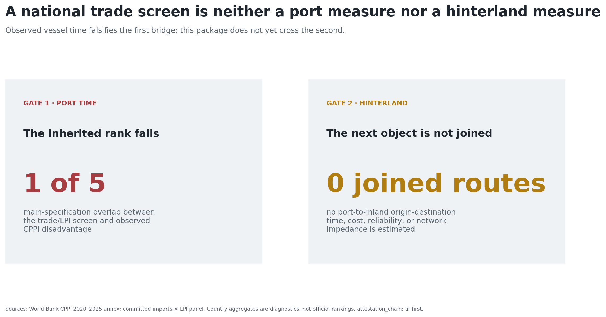
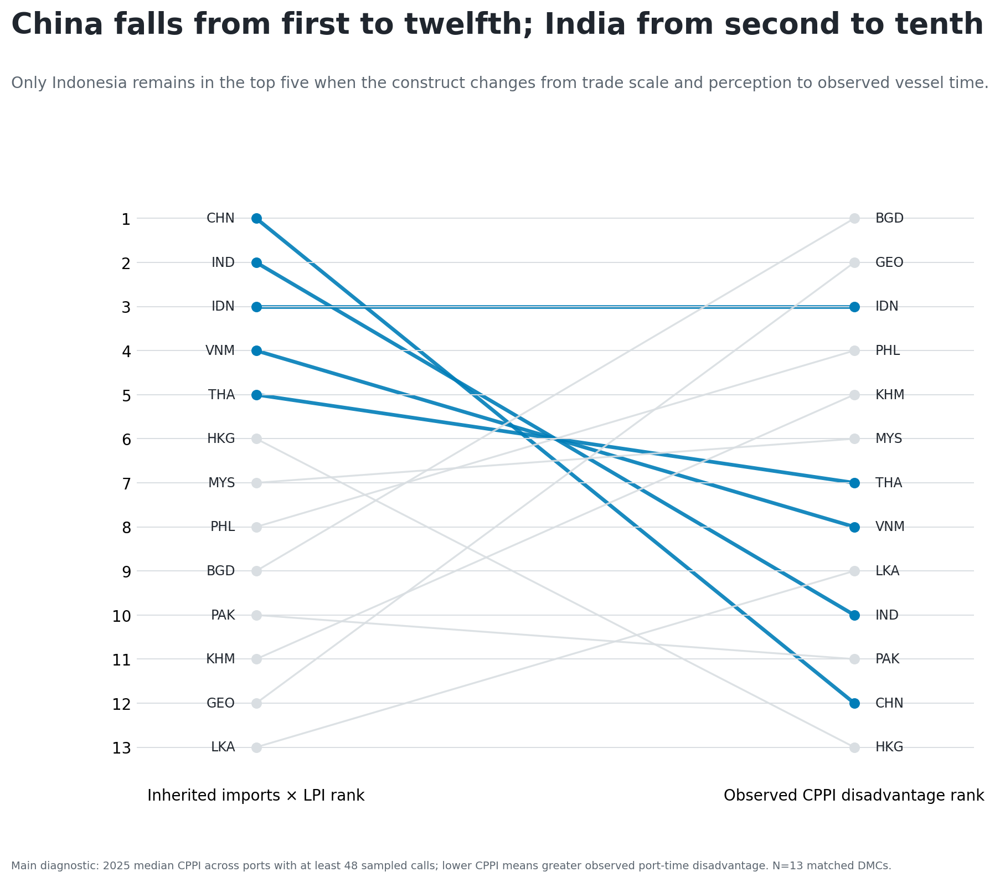
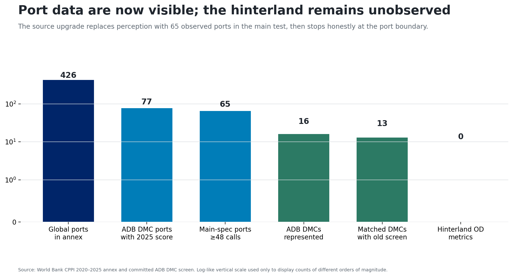
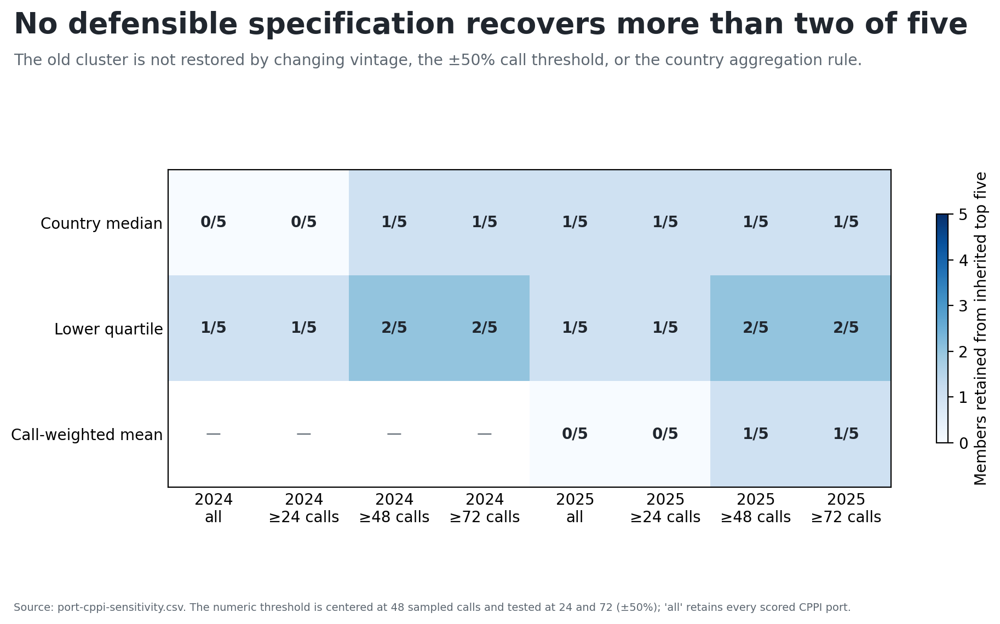
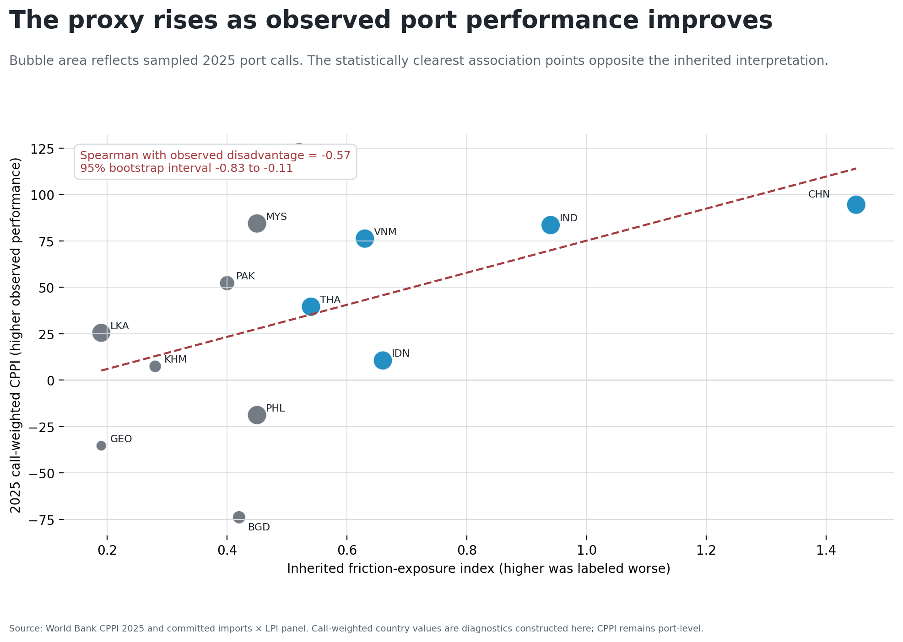
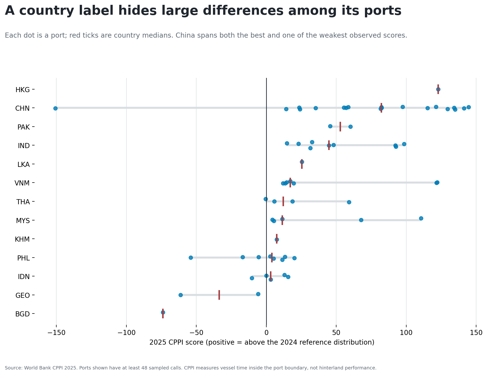

# The national screen fails at the port boundary

Can imports × perceived national logistics performance stand in for observed
port-hinterland friction?

**Finding: only 1 of 5 inherited top-five members remains in the main CPPI
port-time diagnostic.**

{width=88%}

# China and India fall sharply in the direct test

China moves from inherited rank 1 to observed-disadvantage rank 12; India from
2 to 10.

{width=88%}

# The common sample contains 65 observed ports

- World Bank CPPI 2025 annex: 426 ports.
- ADB developing member economies with 2025 scores: 16.
- Main common diagnostic: 65 ports in 13 economies.

{width=88%}

# The test varies the observed-data choices

1. Keep 2025 ports with at least 48 sampled calls.
2. Take the country median CPPI as a diagnostic.
3. Compare top-five membership with the inherited screen.
4. Vary year, call threshold, and aggregation.
5. Bootstrap rank correlations with 2,000 deterministic draws.

# No specification recovers more than two of five

Top-five overlap ranges from zero to two. Four variants have zero overlap.

{width=88%}

# The strongest association points the other way

Call-weighted Spearman association: **−0.57**

95% bootstrap interval: **−0.83 to −0.11**

{width=88%}

# Country summaries hide operating differences

A national trade or survey score cannot identify which port is the operating
bottleneck.

{width=88%}

# Retire the proxy; keep the evidence boundary

**Use:** retire the inherited proxy; use CPPI for port-boundary diagnostics.

**Do not claim:** an official economy ranking, corridor delay, customs
performance, inland reliability, logistics cost, or causal effects.

# The next valid upgrade is shipment-level

Join the official World Bank LPI 2.0 shipment file to the CPPI port layer.
Preserve route, vintage, sample, and coverage limits.

The interactive file is currently access-blocked; do not substitute another
national proxy.

*AI-first prepared pipeline; not externally reviewed.*
