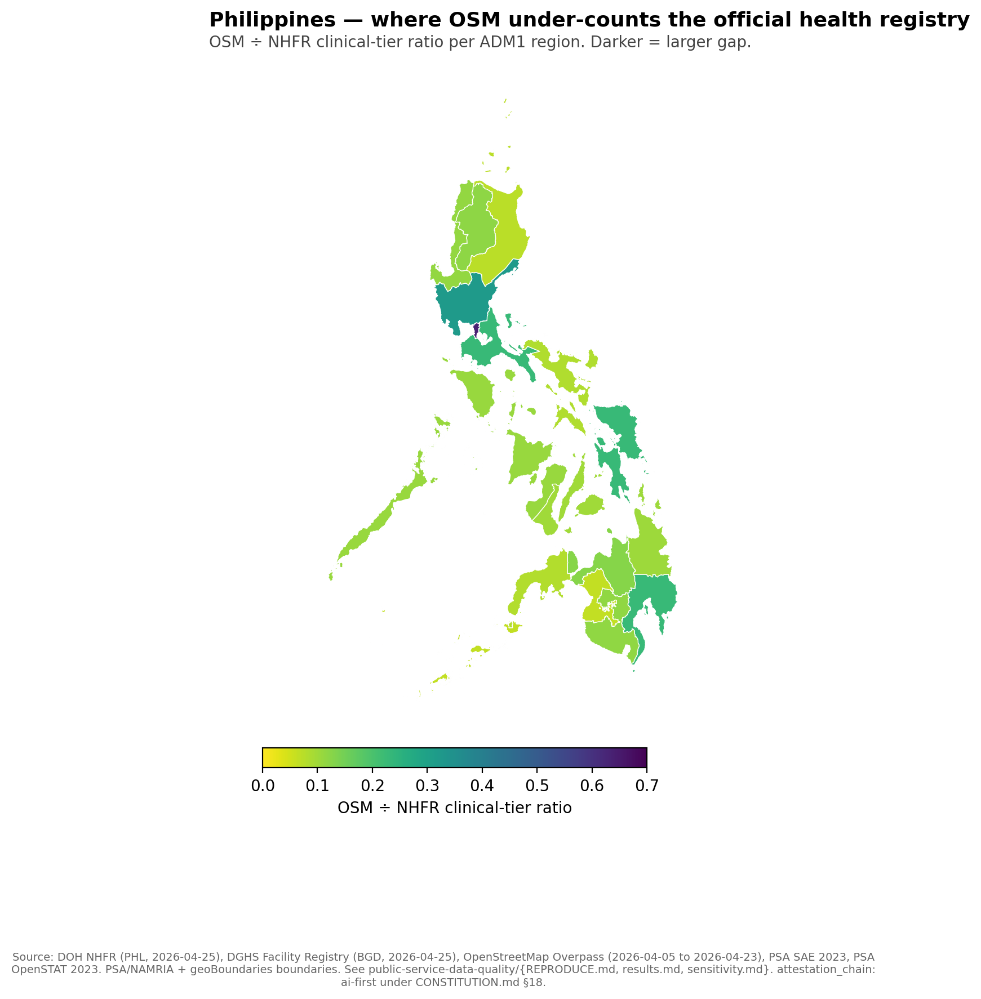
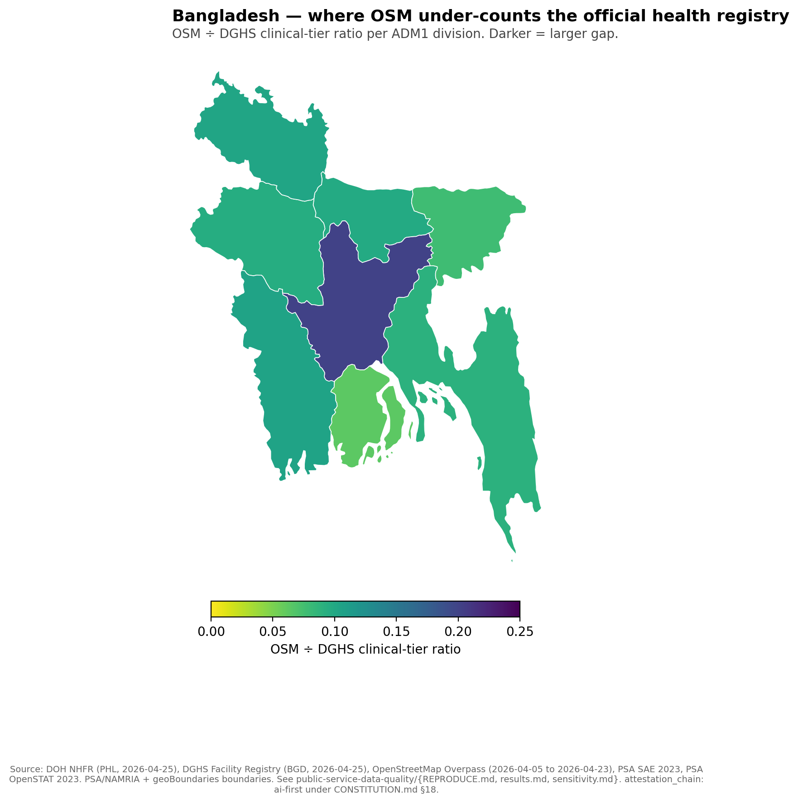

# The question

## Two maps of the same country, two answers

When a planner asks *how many health facilities serve this district*, two
reasonable public sources answer differently:

- **OpenStreetMap** — volunteer-edited, open, frequently used in
  spatial-analysis pipelines.
- **The official national registry** — administrative record kept by
  the health ministry, used for licensing and reporting.

Both are public. Both are used. They disagree, and the disagreement is
**systematic**, not random.

This deck reports the first methodologically careful version of that
finding for two ADB developing member economies. It carries an
`ai-first` attestation chain under `CONSTITUTION.md` §18.

# The headline

## OpenStreetMap captures a small share of the official registry

| Country | Source | Active facilities | OSM matches | OSM ÷ clinical |
|---|---|---:|---:|---:|
| **Philippines** | DOH NHFR v2.0 | 44,267 | 6,401 | **17.1%** |
| **Bangladesh** | DGHS Facility Registry | 39,421 | 3,298 | **11.8%** |

Both ratios fall below the 30% fit-for-planning threshold from the
methodological literature on African MOH systems.

# The pattern

## Philippines — 9.8× rural-urban gradient

{width=70%}

NCR **63.5%** → BARMM **6.5%**. Every region disagrees with OSM by more
than ±10%.

## Bangladesh — same direction at smaller scale

{width=70%}

Dhaka **20.1%** → Barisal **6.2%**. Different country, different
registry, different volunteer community, **same direction** of gradient.

# Robustness

## The pattern survives every parameter at ±50%

Per `CONSTITUTION.md` §6.6, every arbitrary numeric was tested at ±50%:

- **Factype set cardinality** (PHL 19→10 or 19→28; BGD keyword sets):
  ratio range 14.5%–17.3% (PHL), 11.6%–11.8% (BGD).
- **Rural-urban gradient quintile size** (20%→10% or 20%→30%): gradient
  ranges 4.0×–7.0× (PHL), 2.18×–3.21× (BGD).
- **Falsification threshold** (±5%, ±10%, ±15%): zero of 17 PHL ADM1
  units within tolerance at any threshold.

**No row flips the §8 decision rule in either country.**

# The granularity upgrade

## Philippines — at city/municipality level (1,632 of 1,642)

{width=65%}

Owner-downloaded PSA 2023 SAE workbook + PSA OpenSTAT direct estimates.
**10 polygons remain explicitly source-missing rather than imputed.**

# Why this matters for project preparation

## Project pipelines that read OSM alone misread service supply

A planner reading the public map alone reads a different country than a
planner reading the registry alone. The miscount is not uniform:

- It is **largest in rural and conflict-affected** admin units.
- It is **smallest in capital regions**.

So OSM-only denominators systematically under-state facility density
**exactly where additional access most matters**. This is a
methodological finding about data infrastructure, not a quality
judgment about countries.

The same logic applies to schools, markets, and other public-service
amenities visible in OpenStreetMap.

# Honest limits

## What this deck does NOT claim

- It does **not** claim OSM is wrong. Without a third independent
  source we cannot adjudicate which map is closer to ground truth.
- It does **not** rank countries. Registry definitions differ; the
  cross-country ratios are not directly comparable. The within-country
  gradient is the comparable quantity.
- It does **not** establish causal mechanisms. Volunteer behaviour,
  registry incentives, and conflict exposure all plausibly contribute
  in ways we have not separated.
- It is **not** human-final. Under §18, this artifact is AI-attested.
  Owner attestation, line-by-line paper reading, and contact with
  external reviewers (Macharia, Zipf, PIDS, BIDS) are pre-conditions
  for a human-final upgrade.

# Reproducibility

## Every number traces to a committed script

- **Working paper:** `articles/measurement-gap-philippines-bangladesh.md`
- **Brief:** `articles/_brief/public-service-data-quality.md`
- **Pipeline:** `public-service-data-quality/scripts/`
- **Sensitivity:** `public-service-data-quality/sensitivity.md`
- **Limitations:** `public-service-data-quality/limitations.md`
- **Evidence packet:** `/program/public-service-data-quality/evidence`
- **Charts:** rendered by `build-choropleth.py` from
  `generated/public-service-data-quality-{PHL,BGD}.csv` and
  `generated/psdq-phl-admin3-poverty-context.csv`.

## Attestation chain

This deck is `attestation_chain: ai-first` under `CONSTITUTION.md` §18.

Path to human-final:

1. Owner reads each cited paper line-by-line.
2. Owner runs internal review with co-author Arturo Martinez Jr.
3. Owner contacts at least one external reviewer
   (Macharia / Zipf / PIDS / BIDS) and replaces the AI-synthesized
   `review-external.md` §3 with the actual feedback.
4. Owner-signed commit promotes the artifact to `human-final`.
