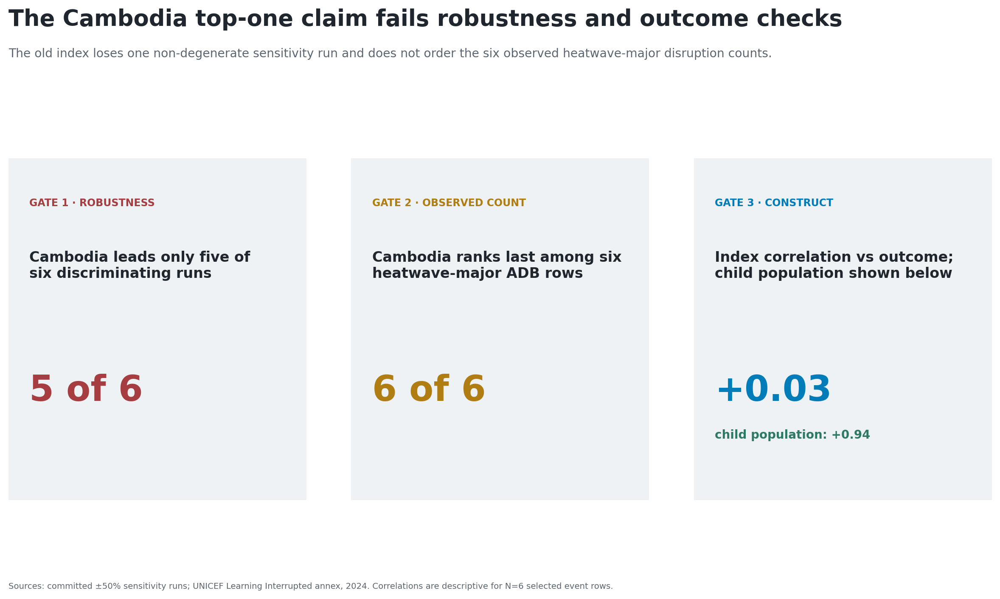
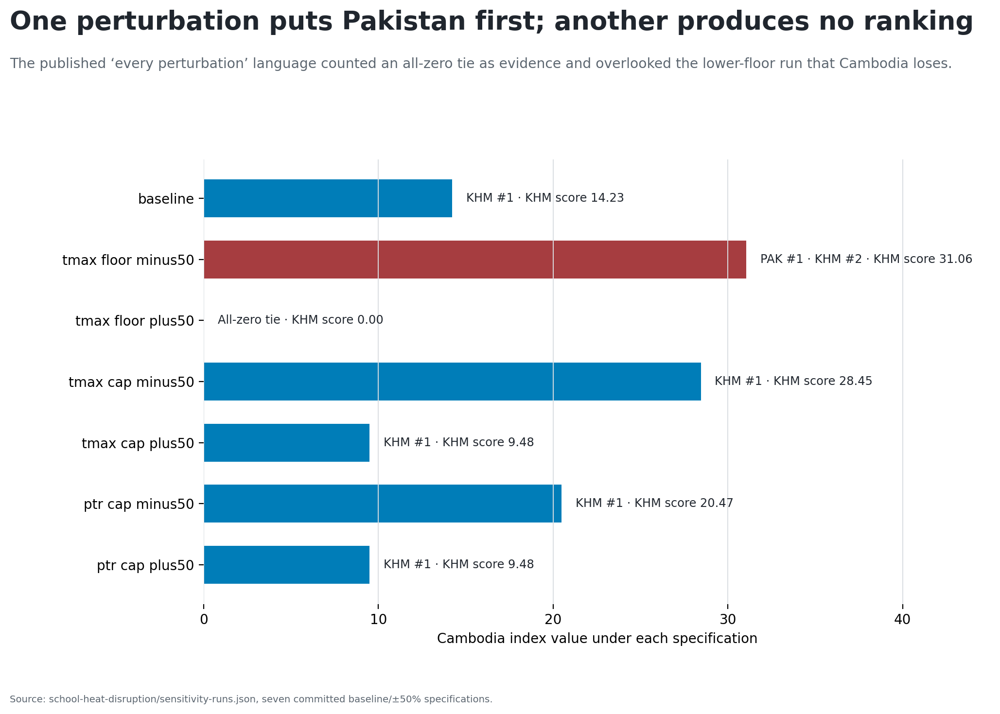
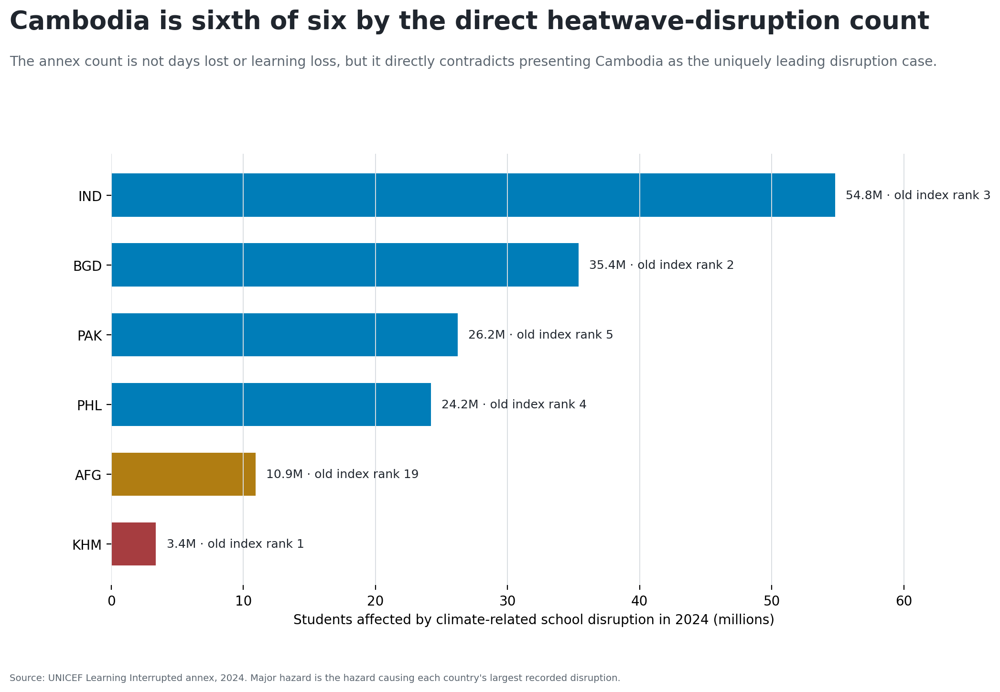
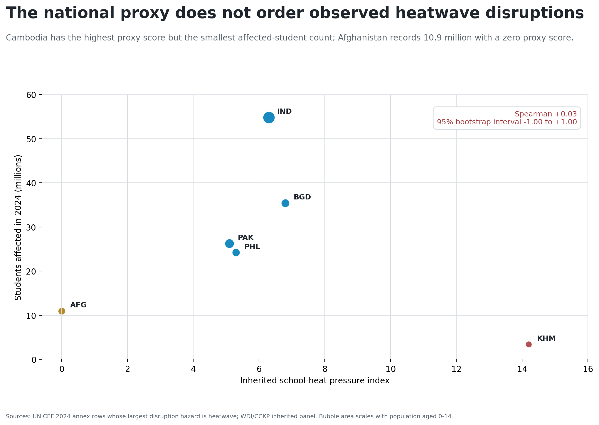
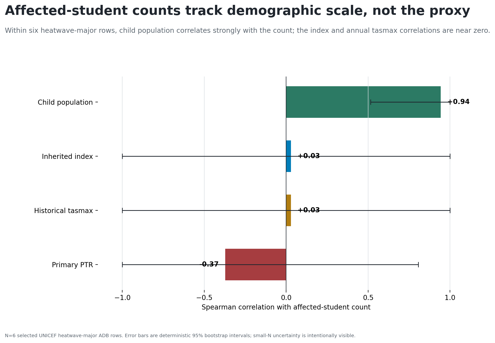
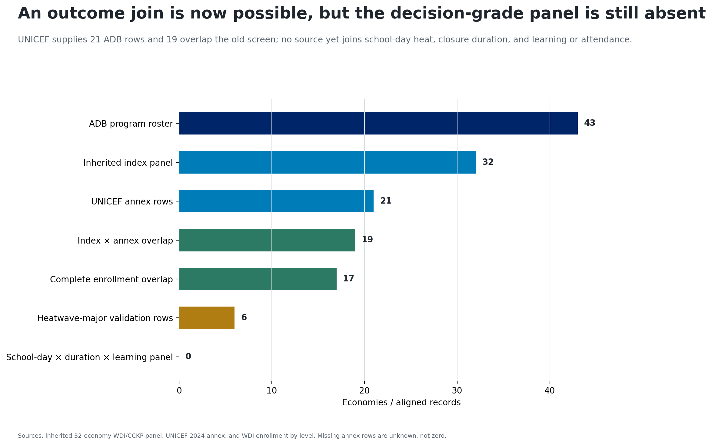
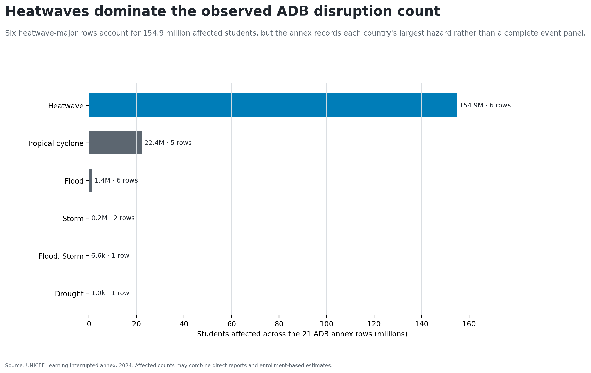
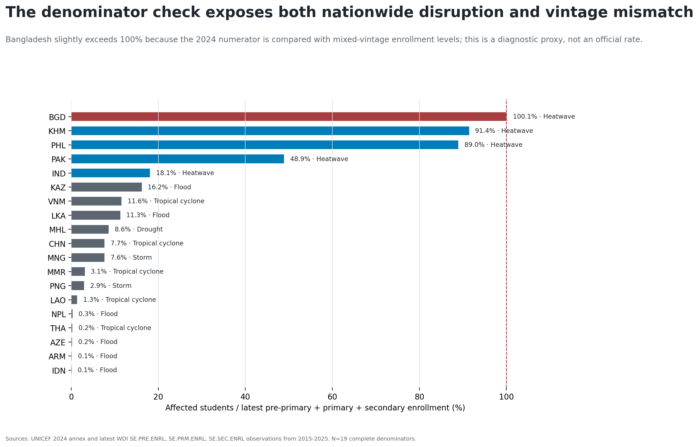
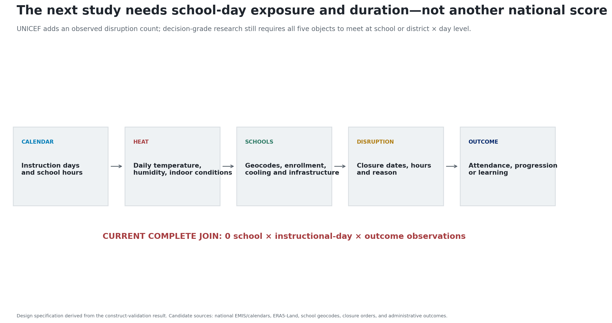

# The inherited claim fails three validity gates

{width=100%}

# “First in every perturbation” is false

{width=100%}

# The observed outcome reverses the order

{width=100%}

# The proxy does not order the counts

{width=100%}

# Child population carries the count order

{width=100%}

# The direct source covers only part of the roster

{width=100%}

# Heatwaves dominate the selected annex

{width=100%}

# Enrollment ratios expose vintage mismatch

{width=100%}

# Retire the ranking; build the school-day object

{width=100%}
