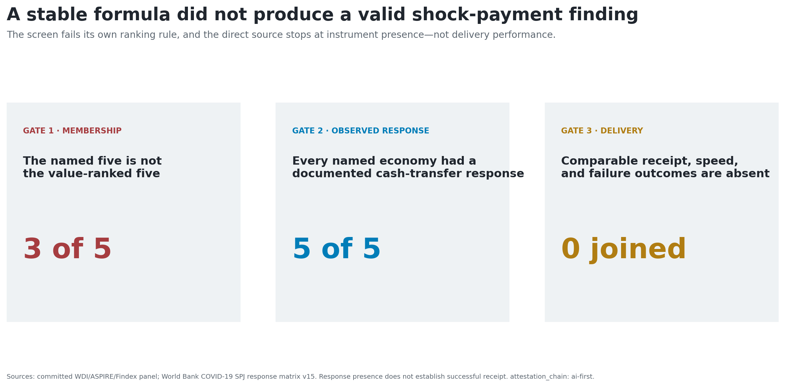
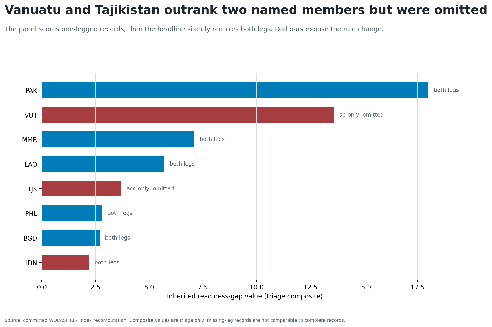
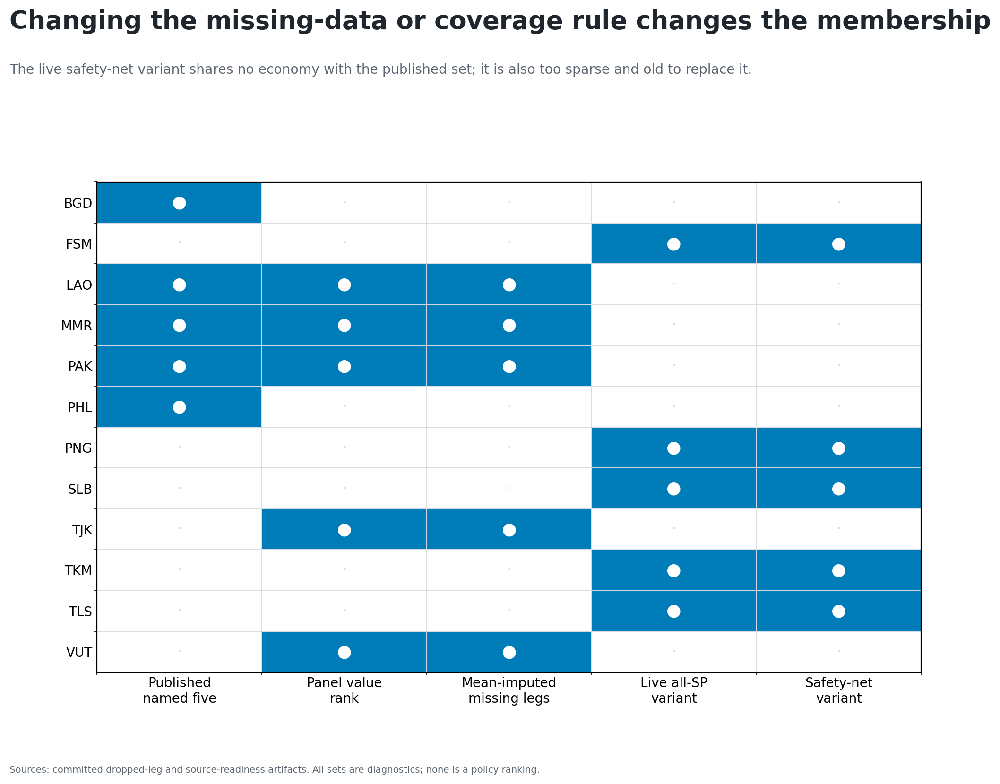
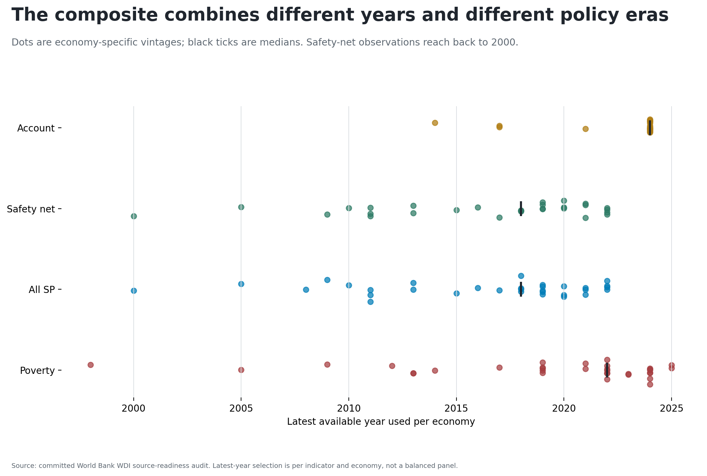
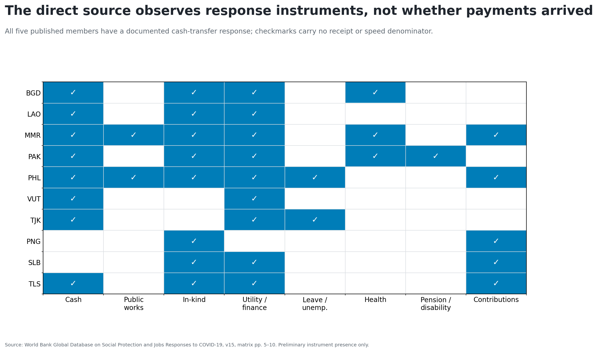
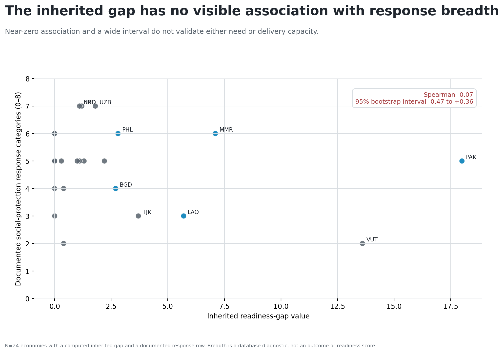
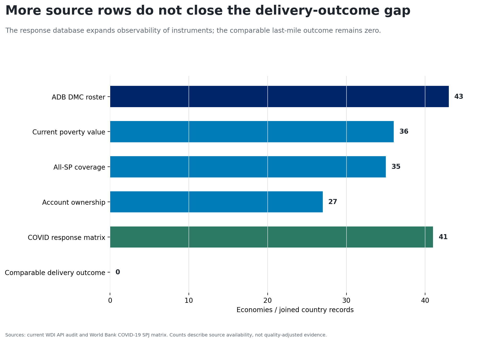

# The published set fails three independent checks

{width=100%}

# The panel's own value order changes two members

{width=100%}

# Mean imputation does not restore the published set

- Vanuatu: 13.6 committed; 10.4 after mean-imputing account ownership.
- Tajikistan: 3.7 committed; 3.3 after mean-imputing all-SP coverage.
- Both remain above the Philippines at 2.8 and Bangladesh at 2.7.
- This is a falsification diagnostic, not an endorsed imputation model.

# Changing the coverage construct changes the membership

{width=100%}

# The variant also mixes different policy eras

{width=100%}

# The direct source records instruments, not receipt

{width=100%}

# The composite does not align with response breadth

{width=100%}

# More rows do not close the outcome gap

{width=100%}

# Drop the ranking; specify the payment object

The next study begins with an event-level public table:

1. shock and reference date;
2. affected or eligible population;
3. planned and actual recipients;
4. successful and failed payments;
5. initiation and receipt timestamps;
6. amount, channel, geography, and program identifier.

**Decision:** no replacement readiness ranking from the current source stack.
