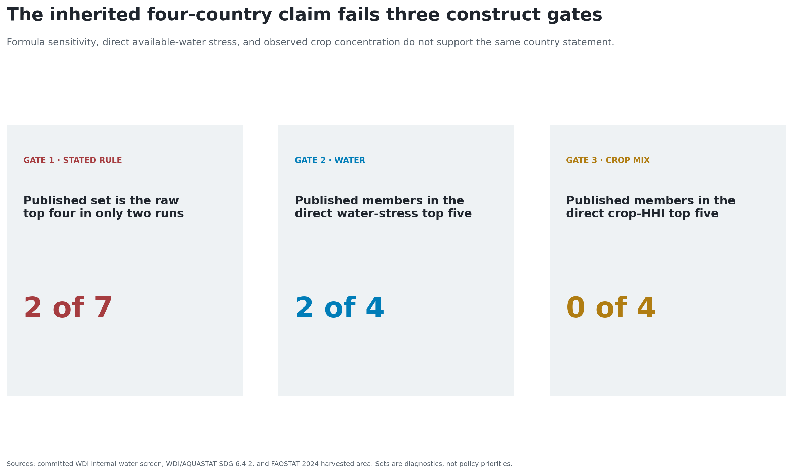
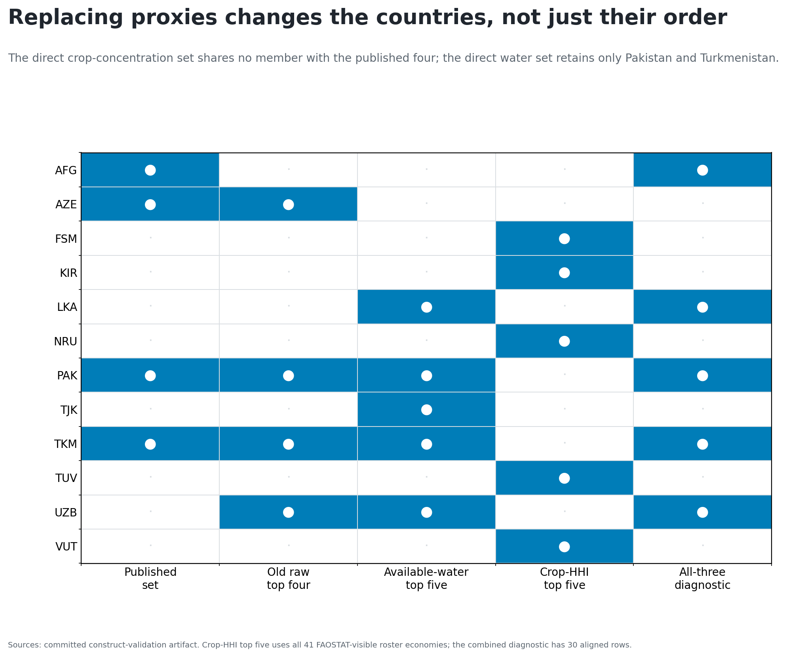
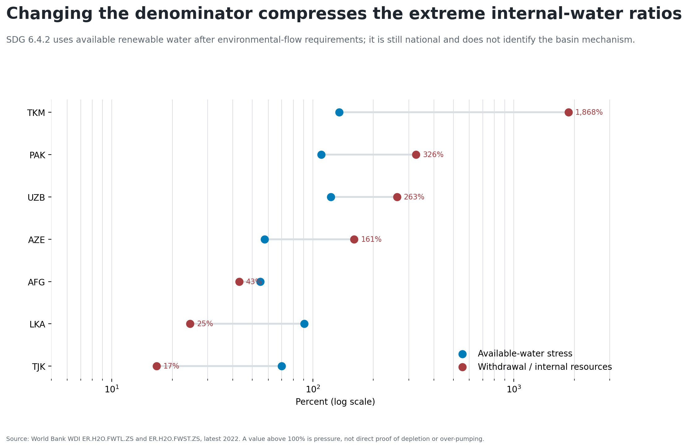
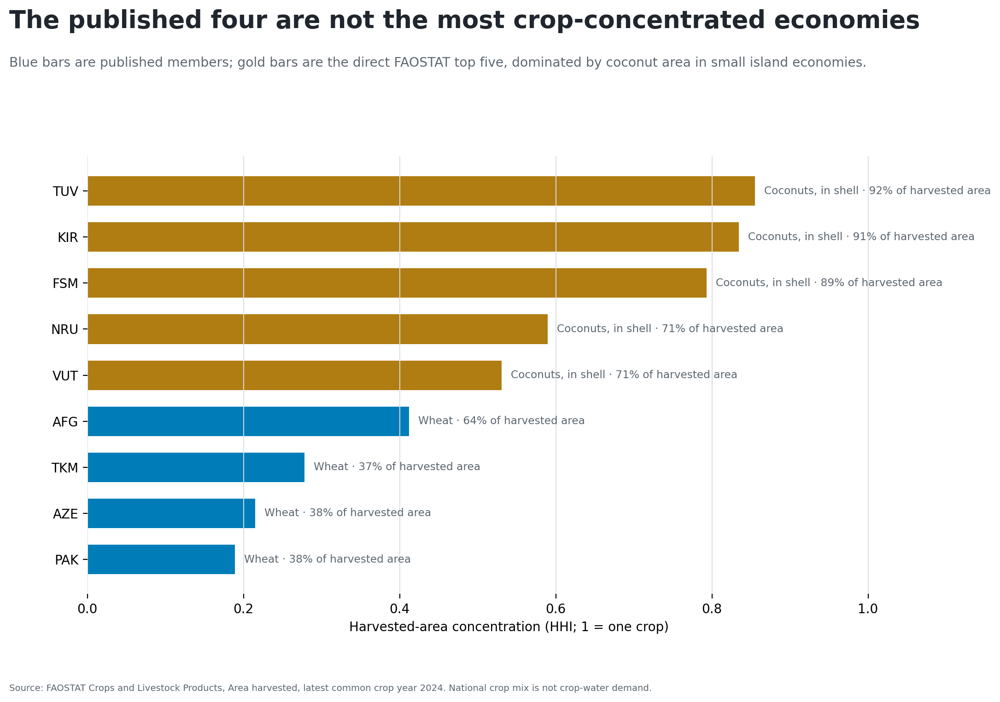
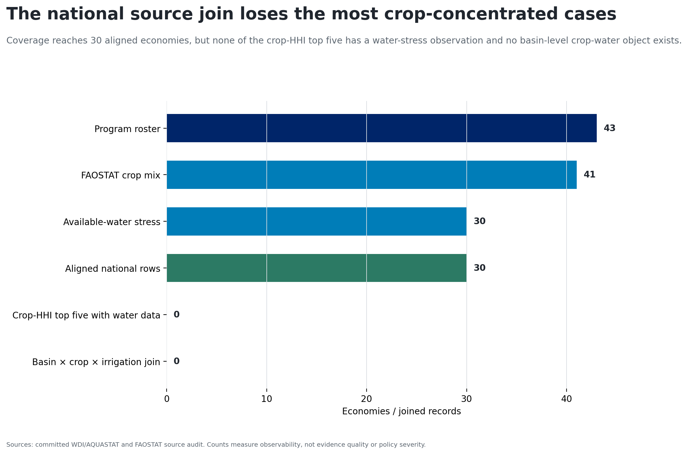
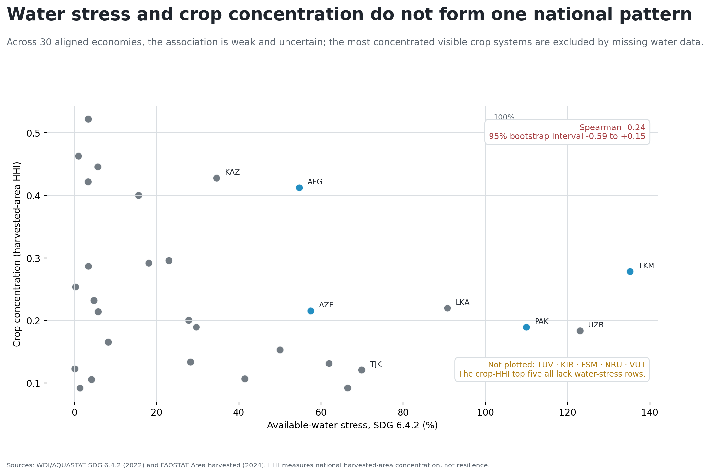
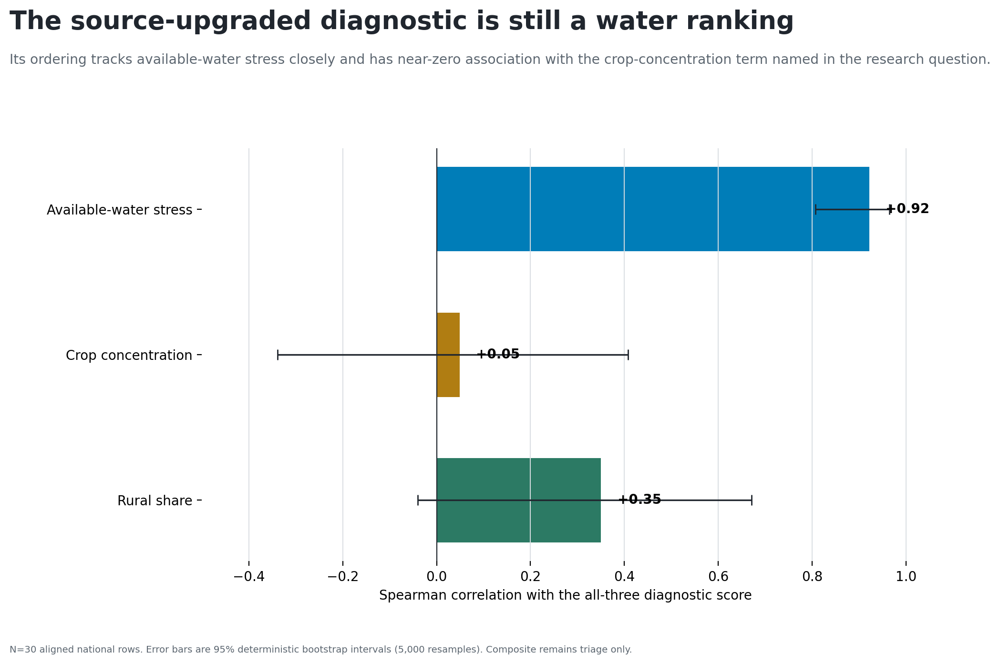
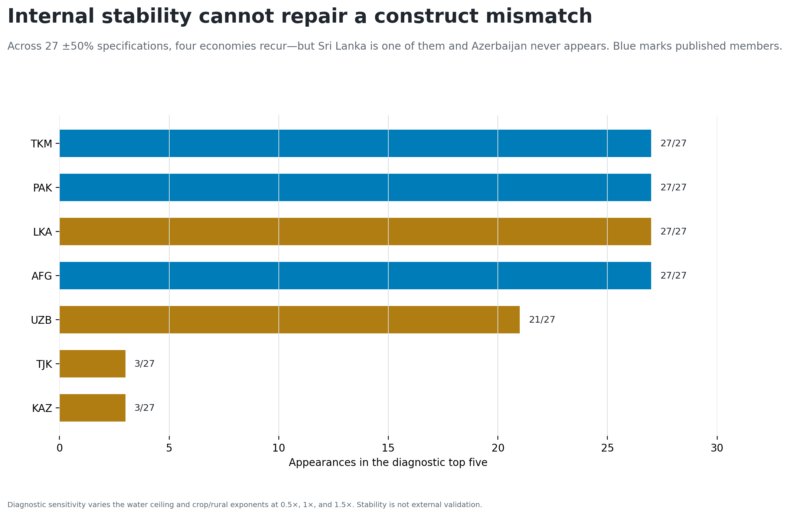
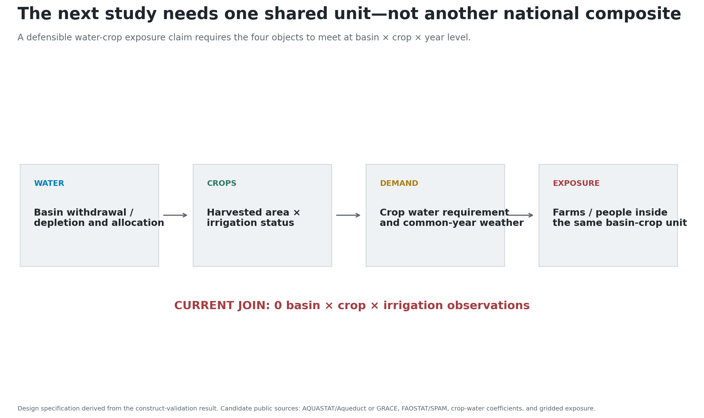

# The claim fails three independent checks

{width=100%}

# Replacing proxies changes the countries

{width=100%}

# The old denominator created extreme but flat water terms

{width=100%}

# Direct crop concentration selects a different set

{width=100%}

# Coverage removes all five crop-HHI leaders

{width=100%}

# Water and crop concentration do not align nationally

{width=100%}

# The replacement diagnostic is still water-dominated

{width=100%}

# Internal stability does not establish construct validity

{width=100%}

# Drop the ranking; build the shared unit

{width=100%}

**Decision:** no replacement country ranking from the current national source
stack. The next qualified object is basin × crop × irrigation × year with an
observed outcome.
