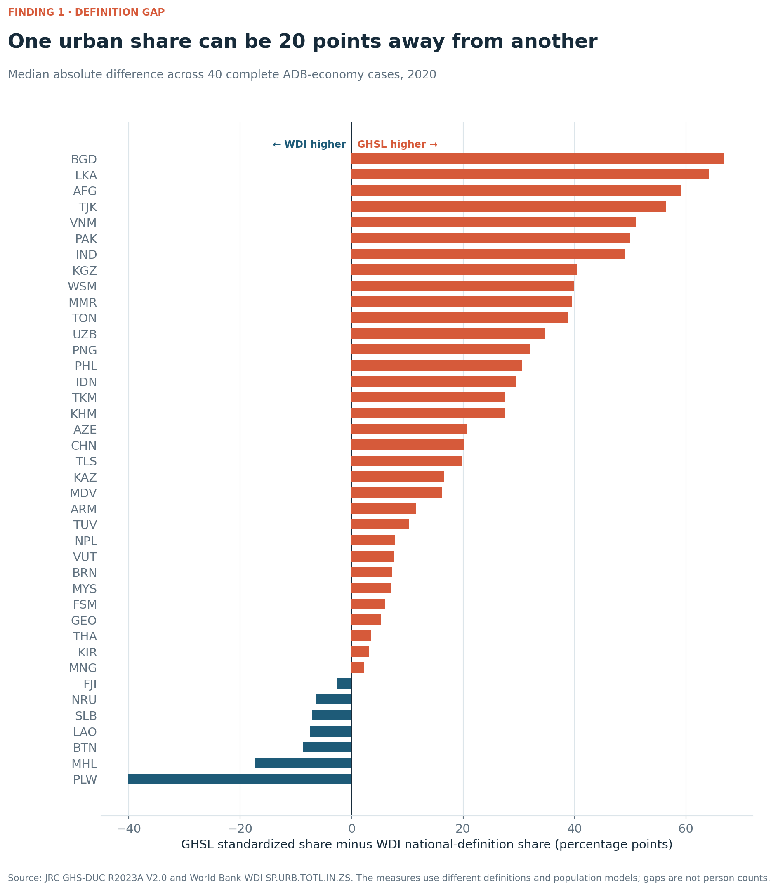

# When urbanization depends on the definition

`attestation_chain: ai-first` · PP measurement study

## Finding

Across 40 ADB developing-economy cases with both measures in 2020, the median
absolute difference between the GHSL standardized urban share and the WDI
national-definition share is **20.0 percentage points**. GHSL is higher in 33
cases and WDI is higher in seven. The measures answer different questions; the
gap is a measurement result, not a verdict that either series is wrong.



The administrative diagnostic adds a second finding. Among the same 13
economies observable at GADM levels 1, 2, and 3, the 2020 share of GHSL
urban-cell population inside rural-classified units rises from **0.6%** at
level 1 to **1.9%** at level 2 and **2.8%** at level 3. The quantity described
as “hidden” is therefore partly produced by the scale of the administrative
unit.

## Data objects

- **GHS-DUC R2023A V2.0:** 72 public CSV tables classifying GADM 4.1
  administrative units at levels 0–5 for 1975–2030 [@jrc2026ghsduc].
- **WDI `SP.URB.TOTL.IN.ZS`:** the country urban-population share based on
  national definitions.
- **Transition panel:** 7,918 matched GADM level-2 units followed over 10-,
  20-, and 30-year windows ending in 2020.

Raw source files are checksum-recorded and cached outside Git. Derived panels,
figures, source inventories, and the complete scripts are committed.

## Reproduce

```powershell
python invisible-urbanization/scripts/acquire-ghsl-duc.py
python invisible-urbanization/scripts/build-definition-gap-object.py
python invisible-urbanization/scripts/build-transition-diagnostics.py
python invisible-urbanization/scripts/build-figure-dossier.py
```

See `REPRODUCE.md` for dependencies, outputs, and validation checks.

## Claim boundary

This study does not observe national legal classifications, local-government
jurisdiction, service access, fiscal transfers, lived urban identity, or
welfare. It does not convert percentage-point differences between the two
sources into people because their population models differ. GHS-DUC is a
harmonized comparison tool designed to complement, not replace, national
definitions [@oecd2021degurba].

