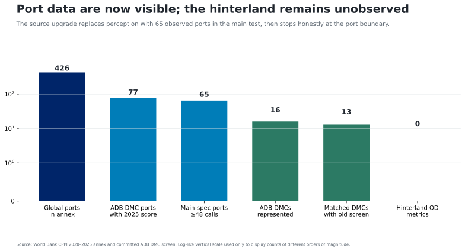

# Data sources and coverage

`attestation_chain: ai-first`

The direct object is the World Bank CPPI 2025 annex: 426 port rows with
standardized annual scores for 2020–2025. Seventy-seven ports have a 2025 score
in 16 ADB developing member economies. The main common diagnostic sample
contains 65 ports in 13 economies after matching the inherited national panel
and requiring at least 48 sampled calls per port.

*Coverage funnel. Unit: port rows and matched ADB developing member economies.
Source: World Bank CPPI annex plus the committed WDI imports/LPI panel.*

The country summaries are analysis diagnostics, not official World Bank
country scores. Ports are nested within economies, coverage differs by year,
and the row count is not the unit of inference. The exact port rows, country
diagnostics, source ledger, and retrieval records are in `generated/` and
`versions.json`.

No current artifact measures port-exit-to-destination time, cost, reliability,
customs release, or road/rail impedance. The official LPI 2.0 shipment file is
the named hinterland source but remains behind an access challenge in this
environment.

