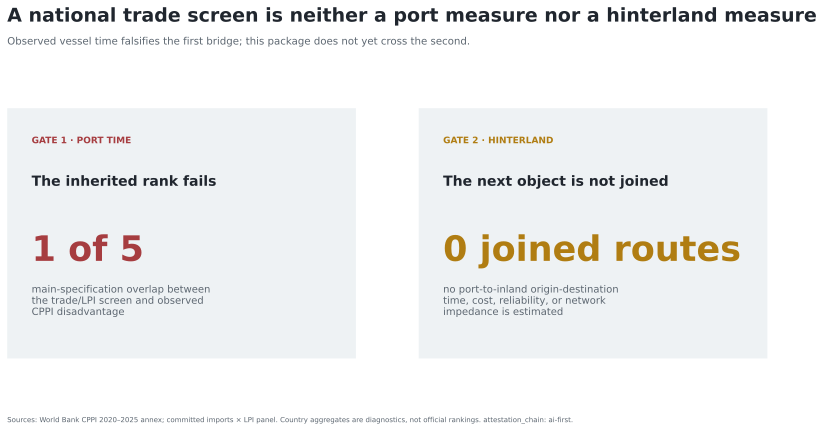

# Methodology and claim test

`attestation_chain: ai-first`

The main specification takes the median 2025 CPPI score across ports with at
least 48 sampled calls in each matched economy. Lower CPPI values indicate
greater observed port-time disadvantage. The test compares the inherited top
five with the five lowest country diagnostic medians.

*The first gate is an observed vessel-time construct test. The second requires
port-to-inland evidence and is not crossed by CPPI.*

Robustness changes the CPPI year (2024 or 2025), minimum sampled calls
(unrestricted, 24, 48, or 72), and country aggregation (median, lower quartile,
or a 2025 call-weighted mean). The 24- and 72-call variants are the required
±50% checks around the main threshold. Spearman correlations compare the
inherited score with observed disadvantage, and 2,000 deterministic bootstrap
draws produce 95% intervals.

The inherited construct is rejected if reasonable direct-measure
specifications do not preserve its ordering. It is not rescued merely because
its own formula is stable under perturbation.

