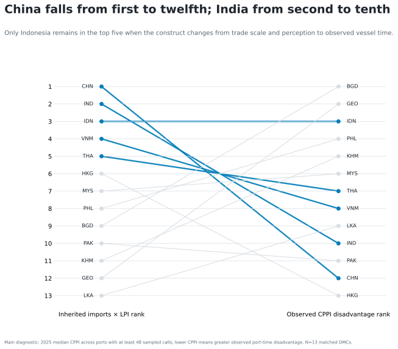
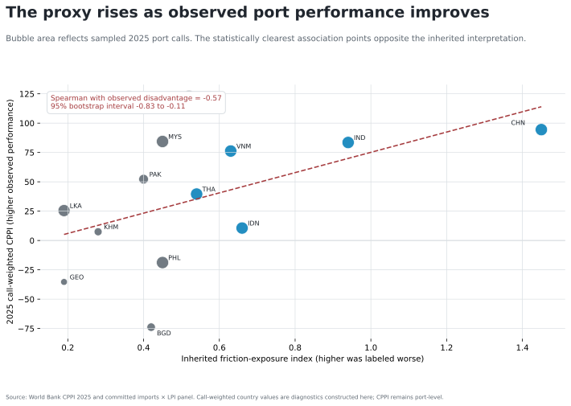
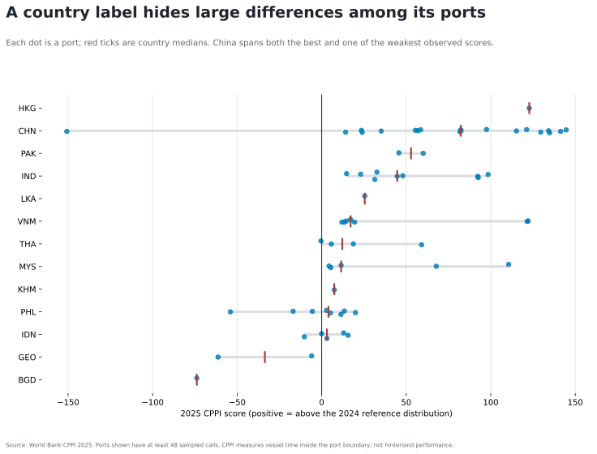
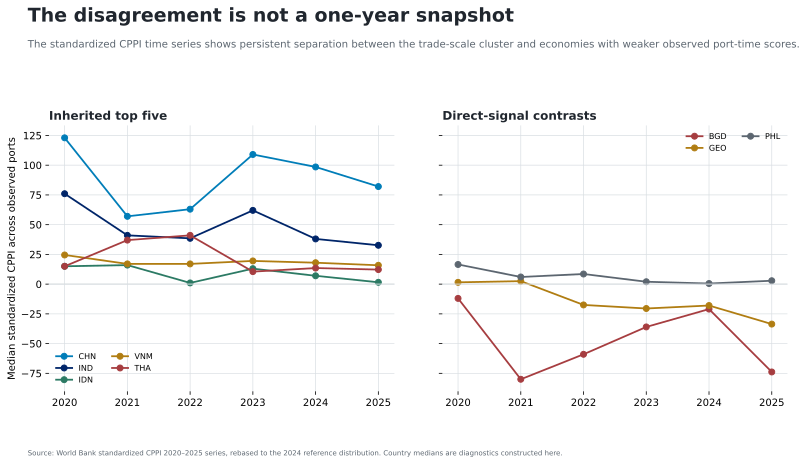

# Results

`attestation_chain: ai-first`

The inherited top five are China, India, Indonesia, Viet Nam, and Thailand.
The main 2025 CPPI-disadvantage diagnostic identifies Bangladesh, Georgia,
Indonesia, the Philippines, and Cambodia. Indonesia is the only shared member.

*Main specification: 65 ports in 13 matched developing member economies, at
least 48 sampled calls per port. The CPPI country values are study diagnostics,
not an official ranking.*

Across 20 specifications, top-five overlap ranges from zero to two; four
specifications have zero overlap. The correlation evidence does not restore
the construct. Median and lower-quartile intervals cross zero. The
call-weighted diagnostic is negative: Spearman −0.57 with a 95% bootstrap
interval from −0.83 to −0.11. The clearest relationship therefore points
opposite the inherited label—the score rises as observed port performance
improves.

*Matched-economy association with 2,000 deterministic bootstrap draws. The
figure tests construct direction; it is not a causal estimate.*

National summaries also hide material port-level heterogeneity.

*Each mark is an eligible port. Within-economy spread shows why a national
trade or perception score cannot identify an operating bottleneck.*

The standardized series shows that the mismatch is not only a one-year
ordering accident, although changing port coverage limits longitudinal claims.

The evidence supports one decision: retire the national imports × LPI ranking
as a port or hinterland measure. It does not authorize a new official economy
ranking.

