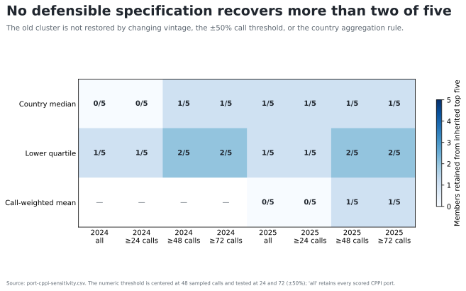

# Sensitivity and robustness

`attestation_chain: ai-first`

The construct failure persists across 20 year, call-threshold, and aggregation
specifications. Overlap with the inherited top five never exceeds two and is
zero in four variants. The main specification retains one member.

*Specifications vary CPPI year, minimum sampled calls, and country diagnostic.
The 24- and 72-call thresholds implement the ±50% test around 48 calls.*

The 2025 median association is −0.36 with a 95% bootstrap interval from −0.79
to 0.21; the lower-quartile association is −0.26 with an interval from −0.76
to 0.29. The call-weighted association is −0.57 with an interval from −0.83 to
−0.11. Results that cross zero are treated as uncertain, while the one interval
excluding zero points opposite the inherited interpretation.

The sensitivity suite evaluates the direct CPPI test. It does not make the
hinterland leg observable, and no parameter adjustment can substitute for the
missing route-level shipment object.

Evidence: `generated/port-cppi-construct-validation.json` and
`generated/port-cppi-sensitivity.csv`.

