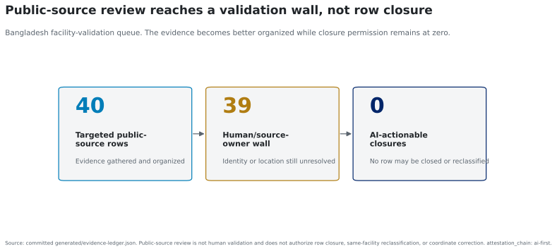

# What this result does not mean

`attestation_chain: ai-first`

First, disagreement is not proof that OpenStreetMap is wrong or that the
official registry is complete. Registry incentives, stale records, duplicate
facilities, and map omissions can all contribute. A third independently
validated facility list would be needed to attribute the gap to one source.

Second, counts are not access. The analysis does not estimate whether a
facility is open, adequately staffed, reachable, or capable of delivering a
specific service. Open Buildings and poverty layers provide validation
priority context only; they are not population served, demand, welfare loss,
or facility quality.

Third, the pilot economies are not ranked. Their registry taxonomies and
administrative units differ, and Bangladesh has only eight first-level units.
The comparison establishes that source disagreement matters in both pilots,
not that one economy has a better information system.

Fourth, public-source review did not resolve the row-level identity wall.
Forty targeted Bangladesh rows were organized for review, 39 remain at a
human or source-owner wall, and zero may be closed or reclassified by the
AI-only process. Eight Philippine NHFR records also remain unresolved at the
city/municipality level, and ten Philippine poverty-context polygons remain
source-missing rather than imputed.

*The infographic reports closure permission, not facility truth. No individual
reviewer or source owner was contacted under §18.*

Finally, this is an AI-first artifact and has not received actual external
review. Detailed source, geometry, taxonomy, small-sample, and publication-tier
limitations remain in `limitations.md` and the Mode-A critiques.
