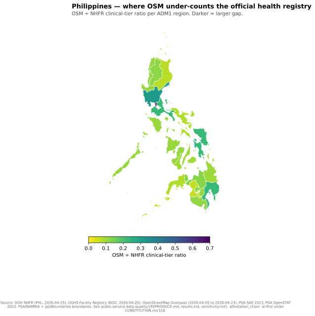
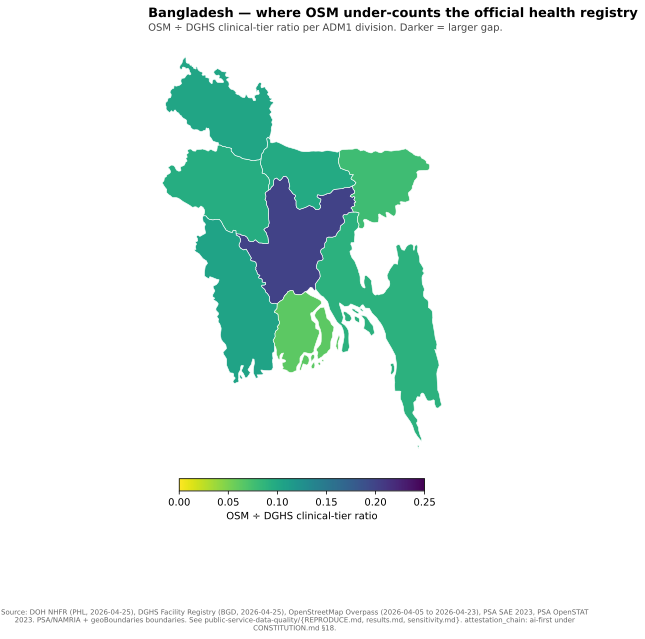

# Results

`attestation_chain: ai-first`

The two pilots show large count disagreement at the clinical-facility tier.
OpenStreetMap contains 6,401 health features against 37,392 Philippine
clinical-tier registry facilities, a ratio of 17.1%. Bangladesh contains 3,298
features against 27,992 clinical-tier registry facilities, a ratio of 11.8%.

| Economy | Official active records | Clinical-tier denominator | OSM health features | OSM / clinical registry |
|---|---:|---:|---:|---:|
| Philippines | 44,267 | 37,392 | 6,401 | **17.1%** |
| Bangladesh | 39,421 | 27,992 | 3,298 | **11.8%** |

*Philippines, 17 regions. Unit: OpenStreetMap health features divided by DOH
NHFR clinical-tier facilities. Source: committed country CSV generated by the
multi-country pipeline.*

The Philippine ratio ranges from 6.5% in BARMM to 63.5% in NCR. That spread
means a national adjustment factor would still misstate local map
observability. Every region has observations in both sources; the low ratios
are not blank administrative rows.

*Bangladesh, eight divisions. Unit: OpenStreetMap health features divided by
DGHS clinical-tier facilities. Source: committed country CSV generated by the
multi-country pipeline.*

The Bangladesh ratio ranges from 6.2% in Barisal to 20.1% in Dhaka. The
direction is similar to the Philippine pilot, but the small number of divisions
and different registry taxonomy rule out a cross-economy quality ranking.

Granular modules reinforce the source-QA interpretation. In the Philippines,
1,632 of 1,642 city/municipality polygons join to an official 2023 poverty
estimate and ten remain explicitly source-missing. In Bangladesh, 115 of 572
registry upazila rows contain zero joined OpenStreetMap health features, while
21 rows have OpenStreetMap counts equal to or above the registry. That
two-sided disagreement is why the study reports source comparison, not a
simple OpenStreetMap undercount.

The detailed administrative tables and original exploratory output remain in
`results.md`; the canonical working paper interprets the complete figure spine.

