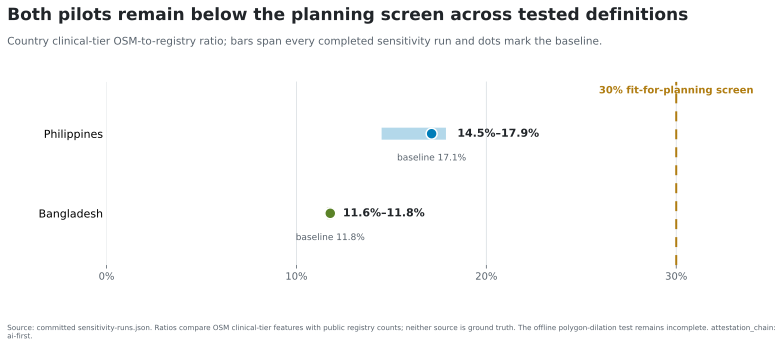

# Sensitivity and robustness

`attestation_chain: ai-first`

The central result is not produced by a single facility-type definition. Nine
completed Philippine runs place the clinical-tier OpenStreetMap/registry ratio
between 14.5% and 17.9%; ten Bangladesh runs place it between 11.6% and 11.8%.
Every completed run remains below the 30% planning screen.

*Country clinical-tier ratios across completed definition changes. Source:
`sensitivity-runs.json`; the line is a planning screen, not a quality score.*

The within-economy gradient also preserves its direction when the tail-group
size changes by ±50%. In the Philippines, the top-to-bottom rural-share group
ratio ranges from 4.1 to 7.0. In Bangladesh it ranges from 2.18 to 3.21. At
agreement thresholds of 5%, 10%, and 15%, zero of 17 Philippine regions and
zero of eight Bangladesh divisions meet the pre-registered agreement test.

Leave-one-out analysis shows that no single ADM1 unit explains the national
result. Dropping one Philippine region yields ratios from 14.9% to 17.9%; the
largest absolute change is 2.24 percentage points. Dropping one Bangladesh
division yields 9.3% to 12.4%; the largest absolute change is 2.51 points.

The strict zero-buffer administrative assignment is the estimand, not an
arbitrary positive distance threshold: ±50% of zero remains zero. Adding a
nonzero boundary buffer would answer a different geographic-assignment
question and requires a newly pinned OpenStreetMap snapshot. It is therefore
an upgrade study, not an unreported member of the current sensitivity suite.

Evidence: `sensitivity-runs.json`, `leave-one-out-runs.json`, and
`generated/psdq-figure-dossier-summary.json`.
