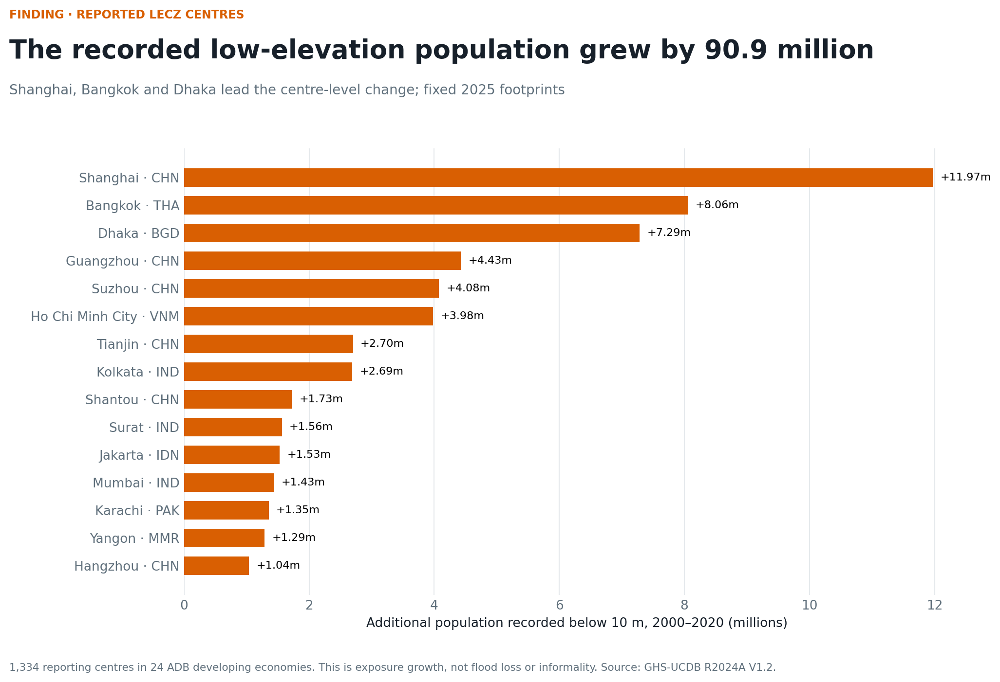

# Low-elevation urban growth in ADB developing economies

`attestation_chain: ai-first` · PP measurement study

## Finding

Across 1,334 GHS-UCDB urban centres with reported low-elevation fields in 24
ADB developing economies, the population recorded below 10 metres increased
from 237.3 million in 2000 to 328.2 million in 2020: a net change of **90.9
million**. Shanghai, Bangkok, and Dhaka have the largest centre-level increases.

This is a low-elevation settlement-growth result. It is not a flood-loss,
informality, deprivation, or adaptation ranking.

## Why the research changed shape

The inherited study multiplied national population, urban share, and mostly
imputed slum shares, then manually tagged coastal economies. That object
contained no coastline, elevation, city footprint, or hazard surface. Only two
of its top five economies remain in the top five after replacing it with
observed centre-level population change inside the Low Elevation Coastal Zone.

## Evidence object

The study uses the Exposure and General Characteristics themes of GHS-UCDB
R2024A V1.2 [@jrc2026ucdb]. Each epoch is summarized inside the same
quality-controlled 2025 urban-centre footprint. The primary measure adds the
population below 5 metres to the population between 5 and 10 metres, then
compares 2000 with 2020. Built-up surface provides an independent quantity for
corroboration.

## Coverage rule

The source contains 5,347 country-matched centres, but 4,013 leave the entire
LECZ block blank. Because the documentation does not define blank as zero, no
blank is imputed. The paper reports the full funnel and treats the result as a
reporting-subset total. See `protocol-deviation.md`.

## Research products

- `results.md` — numbered empirical findings;
- `literature.md` — evidence and construct positioning;
- `sensitivity.md` — 5/10 m and 10/20/30-year tests;
- `coverage.md` and `limitations.md` — denominators and claim limits;
- `generated/coastal-informal-risk-figure-dossier.json` — 12 figures;
- `REPRODUCE.md` — source custody and commands;
- `articles/coastal-informal-cluster.md` — public working paper.

