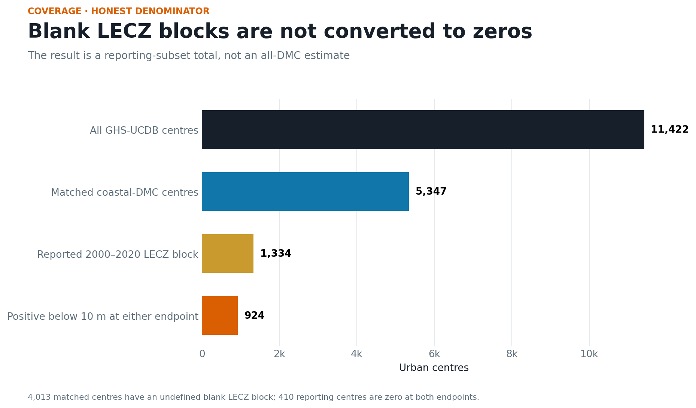

# Coverage — low-elevation urban growth

`attestation_chain: ai-first` · No missing value imputed

| Stage | Urban centres | Interpretation |
|---|---:|---|
| GHS-UCDB R2024A source | 11,422 | Quality-controlled global centres |
| Country-matched coastal-DMC roster | 5,347 | 24 represented economies |
| Reported 2000–2020 LECZ block | 1,334 | Analysis denominator |
| Positive below 10 m in either endpoint | 924 | Change-distribution denominator |
| Reported zero in both endpoints | 410 | Retained as observed zeros |
| Blank LECZ block | 4,013 | Excluded; never converted to zero |

Seven coastal-roster economies have no separately eligible UCDB centre:
Micronesia, Hong Kong, China, Kiribati, the Marshall Islands, Nauru, Palau, and
Tuvalu. Several are below the UCDB urban-centre size threshold. Hong Kong,
China is not separable from the source's China country assignment. Their
absence makes this object unsuitable for an all-DMC or small-island conclusion.

The frozen 75% completeness gate fails when all 5,347 matched centres are used
as the denominator. `protocol-deviation.md` records the post-pull repair.

