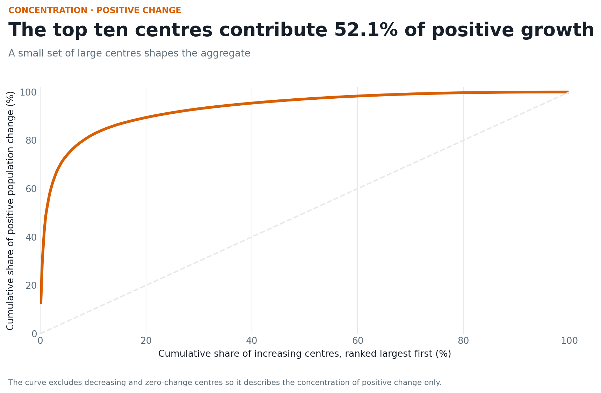
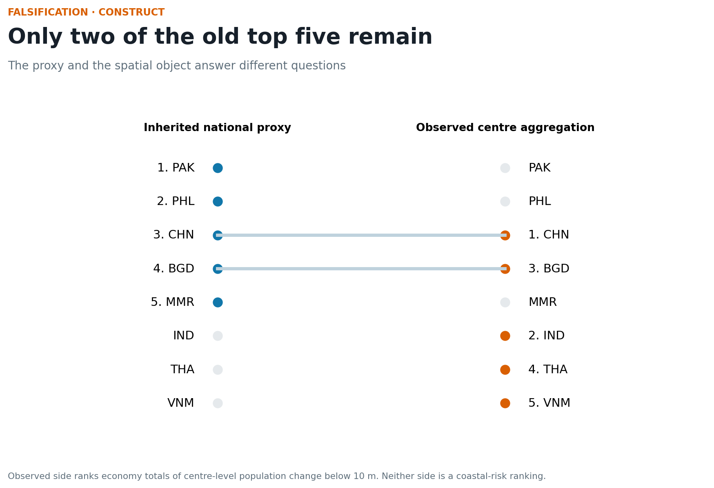
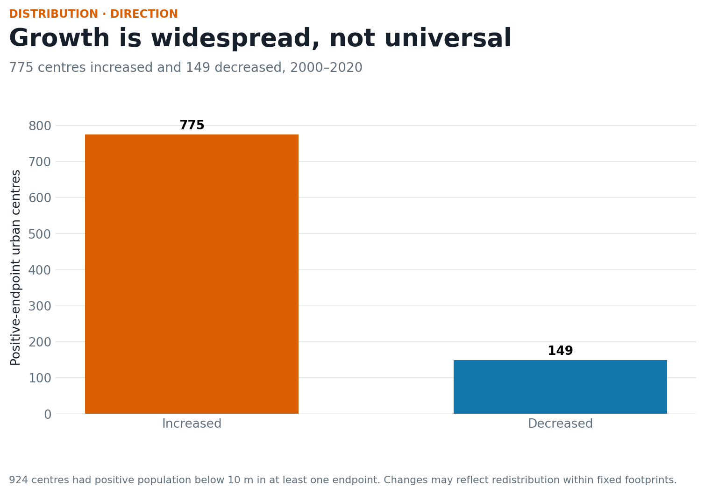
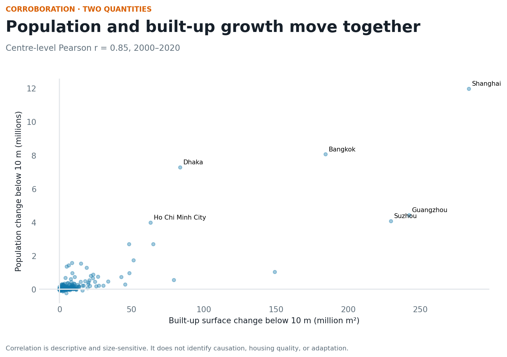
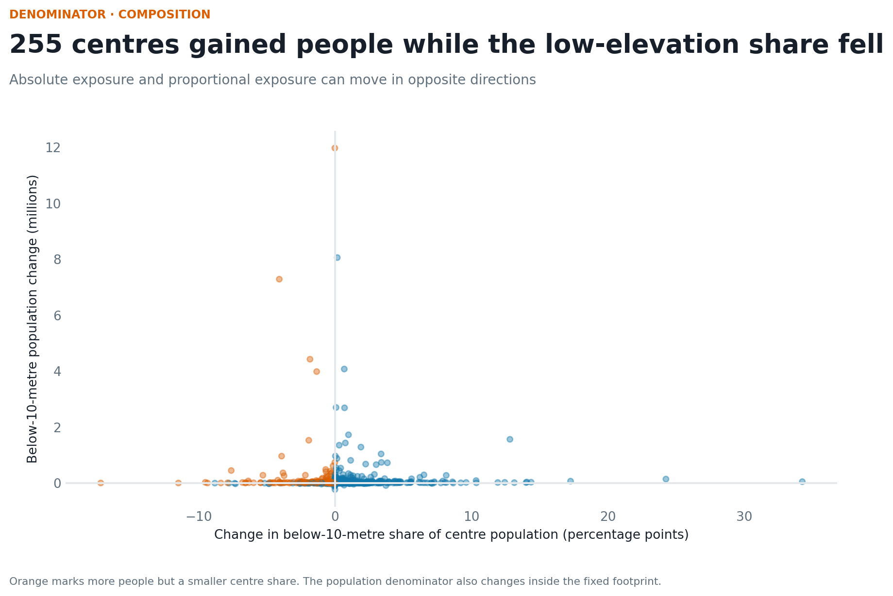
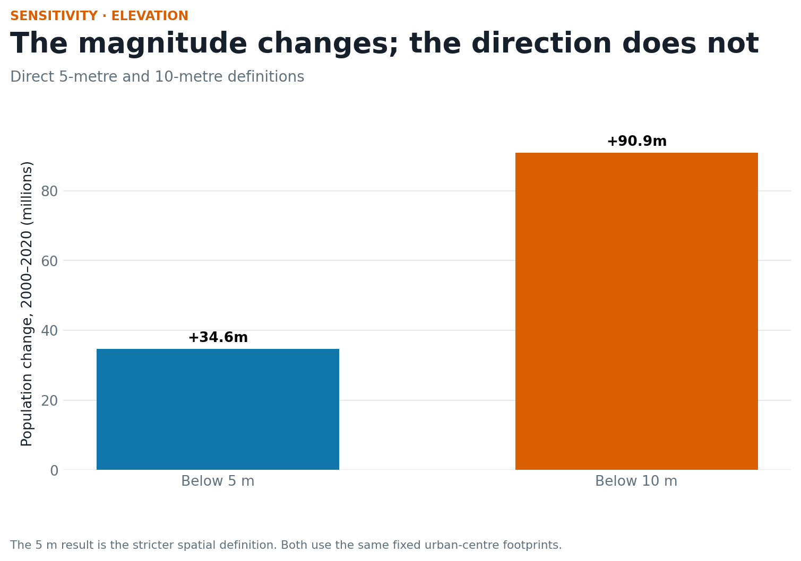
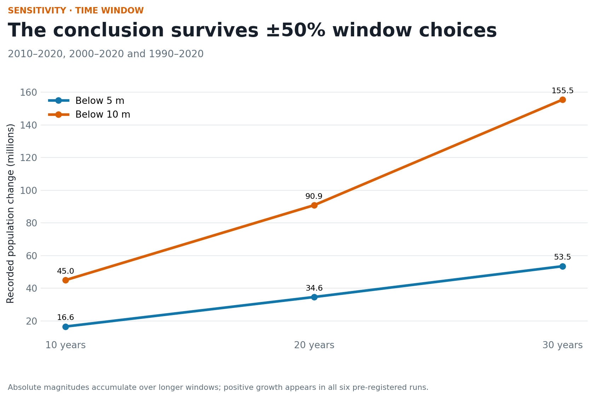

# Results — Low-elevation growth is concentrated in urban centres

`attestation_chain: ai-first` · PP measurement study

## Result 1 — The reporting-subset population increased by 90.9 million

Across 1,334 centres with reported 2000 and 2020 LECZ fields, population below
10 metres increased from **237.3 million to 328.2 million**. The net change is
**+90.9 million**. Shanghai (+12.0 million), Bangkok (+8.1 million), and Dhaka
(+7.3 million) lead the centre-level result.

The top five centres contribute **38.5%** of all positive change; the top ten
contribute **52.1%**. The aggregate is therefore shaped by a small number of
large centres, not by a uniform regional process.

## Result 2 — The spatial object falsifies the inherited ranking

The inherited national proxy's top five were Pakistan, the Philippines, China,
Bangladesh, and Myanmar. Aggregating the observed centre changes produces
China, India, Bangladesh, Thailand, and Viet Nam. Only China and Bangladesh
overlap.

The old object did not fail because of a minor weighting choice. It failed
because it answered a different question: population scale multiplied by urban
and mostly imputed slum shares, with a manual coastal flag.

## Result 3 — Growth is widespread but not universal

Among 924 centres with positive low-elevation population in at least one
endpoint, **775 increased and 149 decreased**. The median centre change was
+12,330 people. Khulna records the largest decrease (−230,734), followed by
Cilacap (−123,633) and Barishal (−99,319). These declines may reflect
redistribution within fixed 2025 boundaries and should not be read as retreat.

## Result 4 — Population and built-up change corroborate each other

Across the reporting centres, the correlation between 2000–2020 population
change and built-up-surface change below 10 metres is **0.85**. This supports
the interpretation that the population result is associated with physical
settlement expansion or intensification inside the same low-elevation mask.

The correlation is descriptive and dominated partly by centre scale. It does
not reveal building quality, tenure, protection, or causation.

## Result 5 — Absolute and proportional exposure can diverge

In **255 of 1,334** share-complete centres, the number of people below 10
metres increased while their share of the centre's population decreased.
Dhaka, for example, added 7.3 million people below 10 metres while its
low-elevation share fell by 4.08 percentage points.

This denominator result matters for policy communication: a falling share does
not necessarily mean fewer people are in the low-elevation zone.

## Result 6 — The finding survives the pre-registered sensitivities

The 2000–2020 net change is +34.6 million below 5 metres and +90.9 million
below 10 metres. Across 10-, 20-, and 30-year windows, all six threshold-window
combinations are positive. The 10-metre economy top five changes slightly in
the 10-year window, but the 20- and 30-year sets are identical.

## Interpretation

The strongest defensible result is that recorded low-elevation urban exposure
grew substantially and was concentrated in identifiable centres. That is a
better starting point for city-level coastal research than a national proxy.
It is not yet a claim about flood loss, informal settlement, adaptation need,
or policy performance.

