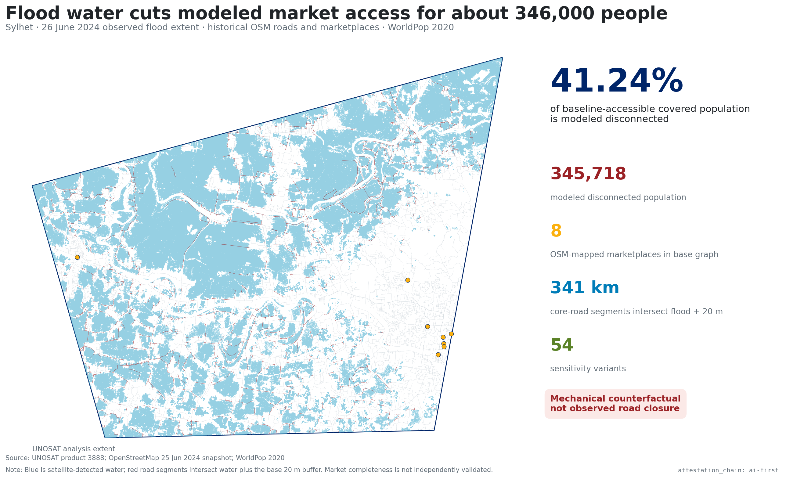

# Flooded routes to market in Sylhet

`attestation_chain: ai-first` · PP construct-validation pilot

## Finding

When every core-road segment intersecting the UNOSAT flood footprint plus a
20 m buffer is treated as unavailable, 345,718 modeled people lose a network
route to an OSM-mapped marketplace. That is 41.24% of the 838,224 people with a
baseline route in the covered population. Across 54 required sensitivity
variants, the share remains between 38.92% and 43.45%.

This is a routed-access result. It replaces the program's former national
`rural share × flood events × log(population)` ranking, which did not contain a
road, a market, or a route.



## What was joined

- UNOSAT product 3888: SAOCOM-1A satellite-detected water in Sylhet on
  26 June 2024 and the published analysis footprint.
- Historical OpenStreetMap through an Overpass `date` query for 25 June 2024:
  roads and `amenity=marketplace` objects.
- WorldPop Bangladesh 2020 unconstrained population at approximately 100 m.

Raw public files are checksum-recorded and cached outside git. The committed
script downloads them when absent and regenerates the derived tables.

## Reproduce

```powershell
python flood-market-access/scripts/build-sylhet-route-pilot.py
python flood-market-access/scripts/build-figure-dossier.py
```

Expected core runtime is about two minutes on the development machine after
source caching. The figure dossier adds about 40 seconds. See `REPRODUCE.md` for
dependencies, outputs, and failure checks.

## Research package

- `results.md` — finding-led results and interpretation
- `literature.md` — related evidence and contribution boundary
- `pre-registration.md` — retrospective design freeze and decision rules
- `sensitivity.md` — full ±50% and road-set robustness
- `coverage.md` — population, graph, and destination denominators
- `limitations.md` — closure, POI, population, and boundary limits
- `review-internal.md` — adversarial methods review
- `review-external.md` — owner-led review brief; no external contact made
- `NEGATIVE-RESULT.md` — retired national proxy and why it failed
- `generated/` — committed machine-readable results and figure outputs

## Claim boundary

The pilot does not observe road closure, flood depth, travel behavior, market
functionality, displacement, prices, food security, or welfare. It is not a
Bangladesh-wide estimate. The 41.24% result is conditional on a mechanical road
cut and on the completeness of eight routed OSM marketplace destinations.
