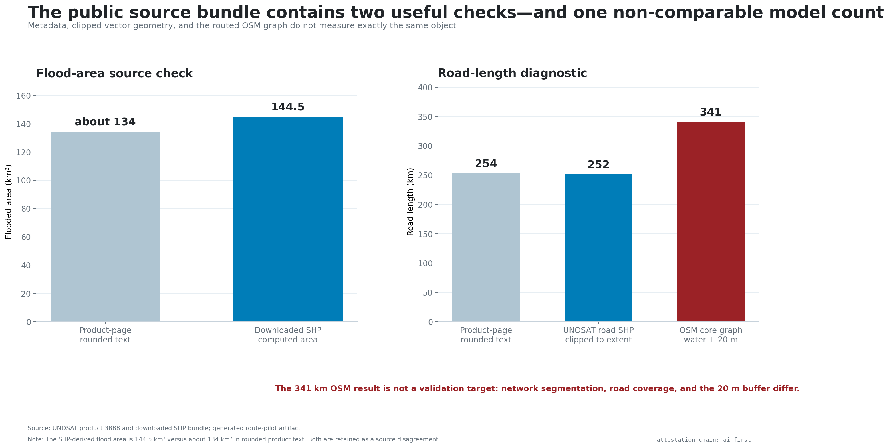
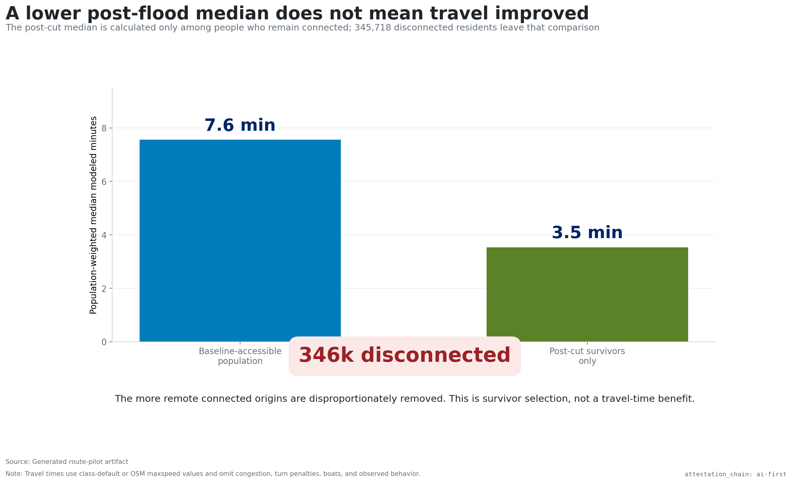

# Results — Sylhet observed-flood route pilot

`attestation_chain: ai-first` · PP construct-validation

## Main finding

The base graph contains 838,224 modeled people with a route to at least one of
eight mapped marketplaces. After removing every core-road segment that
intersects satellite-detected water plus 20 m, 492,505 remain connected and
345,718 do not. The modeled disconnected share is **41.24%**.

This is the program's first result in which “access” is calculated from origins,
destinations, and routes. The former national index is not used as supporting
evidence because it measured only rural share, flood-event frequency, and
population scale.

## Stability

The 54-variant range is 38.92%–43.45%. All variants produce positive
disconnection. At the base numeric settings, adding `service` and `track` roads
changes the disconnected share from 41.24% to 41.65%, even though the modeled
water-intersecting graph length rises materially.

The flood buffer is the most visible numeric driver: larger buffers remove more
segments and raise disconnection. Population snap distance has a smaller effect.
Market deduplication at 50, 100, and 150 m does not change the estimate because
the same routed destinations survive those radii.

## Coverage and destination gate

The UNOSAT footprint contains 872,293 modeled people. Of these, 869,817 (99.72%)
are within 1 km of the core road graph; 838,224 have a baseline route to a mapped
market. The headline denominator is therefore not the entire footprint.

The historical query returns 17 marketplace objects in the rectangular query
box. Eleven fall inside the tilted UNOSAT footprint; spatial deduplication leaves
eight, and all eight snap to the core graph. None of their representative points
falls directly inside the buffered flood geometry.

This market count is the largest unresolved validity risk. A stable graph result
can still misstate access if markets are missing, misclassified, closed, or not
the destinations residents use.

## Source checks

The downloaded flood shapefile covers 144.5 km², while the UNOSAT product page
reports about 134 km². The difference is preserved as a source disagreement.
The clipped UNOSAT potentially affected-road layer measures 252 km, close to the
page's rounded 254 km. The core OSM graph produces 341 km of water-plus-buffer
intersections, but that is not a validation target because the datasets differ
in network coverage, segmentation, and buffer treatment.

## A result that must not be misread

Among the post-cut survivors, the population-weighted median modeled travel time
is 3.5 minutes, below the 7.6-minute baseline median. That is not an improvement.
The flood cut disproportionately removes more distant connected origins from the
comparison. The decrease is survivor selection.

## Interpretation

The pilot supports one bounded statement: under a transparent all-intersecting-
segments-unavailable counterfactual, the observed flood footprint is capable of
fragmenting modeled routes to mapped markets for roughly two in five people who
had a baseline route. It does not establish which roads were impassable, whether
travelers rerouted by boat or foot, whether mapped markets operated, or whether
household welfare changed.
