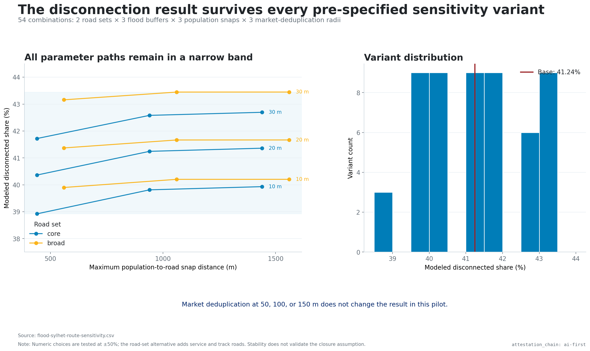
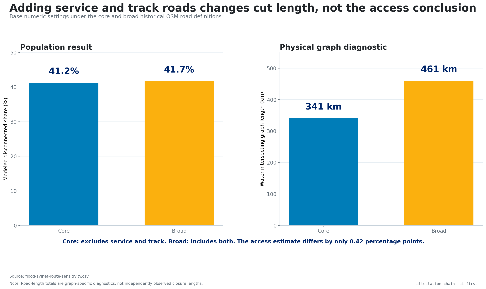

# Sensitivity — Sylhet observed-flood route pilot

`attestation_chain: ai-first`

## Required grid

| Dimension | Values | Base |
|---|---|---:|
| Road classes | core; broad adds `service`, `track` | core |
| Flood buffer | 10, 20, 30 m | 20 m |
| Population snap | 500, 1,000, 1,500 m | 1,000 m |
| Market deduplication | 50, 100, 150 m | 100 m |

The three numeric choices are tested at ±50%. Their full Cartesian product with
the two road sets yields 54 variants.

## Result

- Minimum disconnected share: **38.92%**
- Base disconnected share: **41.24%**
- Maximum disconnected share: **43.45%**
- Variants with positive disconnection: **54 of 54**

Mean disconnected shares rise from 39.83% at 10 m to 41.28% at 20 m and 42.84%
at 30 m. Increasing the population snap from 500 m to 1,000 m moves the mean
more than increasing it again to 1,500 m. Market deduplication does not alter the
result in this footprint.

At the base numeric settings, core roads yield 41.24%; the broad graph yields
41.67%. The broader graph contains more possible routes but also more segments
eligible for removal. The small population-result difference, despite a larger
cut-length difference, is the relevant robustness finding.

## What sensitivity does not solve

The grid tests arbitrary model choices. It does not validate the common
structural assumption that every intersecting road is unavailable. All 54 runs
can agree and still be jointly wrong if water depth, bridge elevation, road
surface, market completeness, or travel mode changes the real system.

Machine-readable results are in
`generated/flood-sylhet-route-sensitivity.csv`; the base and range summary is in
`generated/flood-sylhet-route-pilot.json`.
