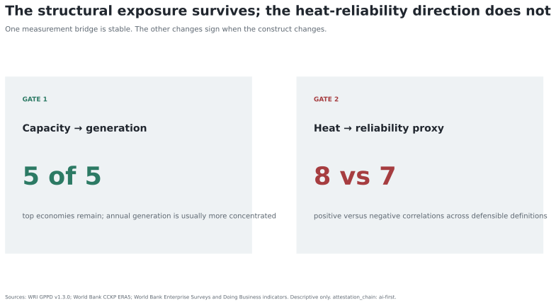

# Heat does not yet produce a regional reliability ranking

`attestation_chain: ai-first` · Prepared pipeline

## Finding

The structural exposure result survives a better denominator: the same five economies top fuel concentration on installed capacity and 2017 generation, and generation is usually more concentrated. The proposed heat–reliability result does not survive construct validation. Across 15 exact-year correlations formed from three World Bank CCKP heat measures and five public reliability proxies, eight are positive and seven are negative; 10 bootstrap intervals include zero.

The defensible output is therefore a measurement finding. Fuel concentration describes dependence on a narrow generation mix. It does not identify outages. Annual country heat measures joined to sporadic firm surveys and Doing Business indicators do not identify a stable regional heat–reliability direction.

## Research question

Can public regional data support a directional claim that hotter conditions and concentrated generation are associated with worse electricity reliability across ADB developing member economies?

## Answer

Not with this measurement chain. A public exact-year bridge exists for 36 economies and 451 country-year-outcome rows, but the direction changes with the heat variable, reliability proxy, and country weighting. Adding a usable WRI generation-concentration estimate narrows the joint economy roster to 22. All five latest-per-economy correlations between generation concentration and reliability proxies have intervals crossing zero.

## What remains useful

- Capacity can overstate fuel diversity; annual generation sharpens the structural-exposure screen.
- CCKP and World Bank reliability indicators can be joined exactly by country and year.
- The joined object is a source-readiness and construct-validation layer, not an outage model.
- The next claim-enabling object is high-frequency outage or interruption data joined to daily heat, demand, dispatch, and grid conditions at a common service territory.

## Reproduce

See [REPRODUCE.md](REPRODUCE.md). The full method, source limits, sensitivity results, literature, and conclusion are linked in the public research story.
