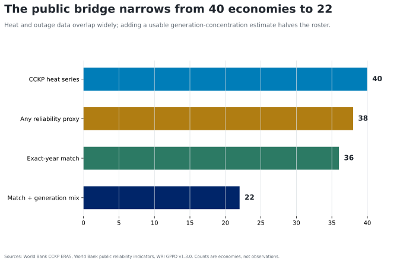

# Data sources and coverage

`attestation_chain: ai-first`

The construct-validation layer uses three public sources.

| Layer | Object | Coverage used | Role | Main limit |
|---|---|---:|---|---|
| Generation | WRI Global Power Plant Database v1.3.0 | 22 DMCs with ≥80% generation coverage | 2017 capacity-versus-generation fuel concentration | 2022-vintage plant inventory; annual generation; imports and seasonal dispatch absent |
| Heat | World Bank CCKP ERA5 0.25° | 40 DMCs, 1950–2022 | annual `tasmax`, `txx`, and tropical-night anomalies against 1991–2020 | country aggregation hides load centers and within-year timing |
| Reliability proxies | World Bank public indicator API | 38 DMCs with any proxy, 2007–2025 | firm outage exposure, outage frequency/duration/loss, and Doing Business SAIDI | sporadic survey waves; mixed respondent and utility constructs |

The exact-year join contains 451 country-year-outcome rows across 36 economies for 2007–2022. Of these, 323 rows in 22 economies can also be joined to a usable generation-concentration estimate. The 451 rows are not 451 independent economies: repeated Doing Business and survey observations make country weighting consequential.

All API responses are cached outside version control and recorded in `generated/grid-heat-reliability-source-ledger.json` with URL, retrieval mode, byte count, and SHA-256 hash. The derived crosswalk is committed.
