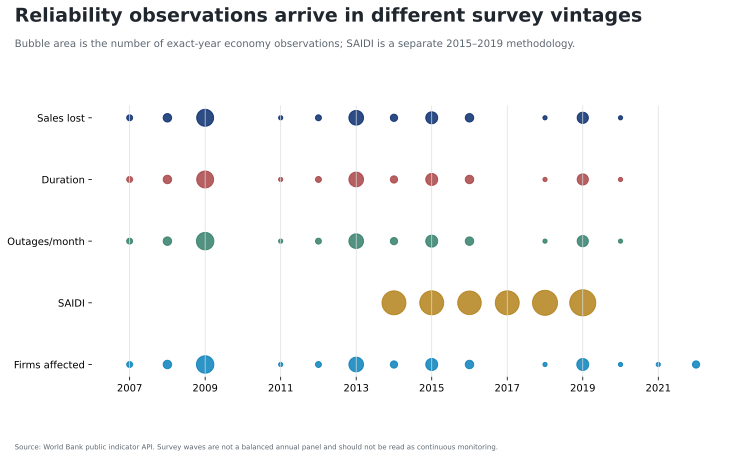

# Related literature and evidence gap

`attestation_chain: ai-first`

The literature makes the heat–reliability mechanism plausible but also clarifies why the regional public-data crosswalk is not enough.

Climate can affect supply through several channels. Higher air temperature can derate thermal generation and transmission, while heat and drought jointly constrain cooling water and hydropower. Plant-level and coupled hydrology–electricity studies model these mechanisms directly rather than infer them from national fuel shares [@bartos2015climatepower; @vanvliet2016power].

Heat can also affect reliability through demand and network stress. Recent China evidence joins high-frequency outage records to heatwaves and estimates changes in outage frequency and duration [@xu2025heatoutages]. That design aligns event timing and service outcomes. It is methodologically different from joining an annual national heat anomaly to a sporadic firm survey.

The sources used here are still valuable. WRI documents installed capacity and reported or modeled annual generation [@wri2022plants]. World Bank CCKP provides spatially aggregated ERA5 climate series and explicit API metadata [@worldbankcckp2026]. World Bank Enterprise Survey indicators measure what firms report about outages in a survey wave [@worldbankenterprisesurveys2026]. Each object is legitimate within its unit.

The gap is the bridge. No source in this package observes high-frequency heat, demand, available generation, network conditions, and interruption outcomes for a common regional service territory. The contribution is therefore not another vulnerability score. It is a falsification result showing that annual country constructs produce no stable regional direction and identifying the observation design required next.

