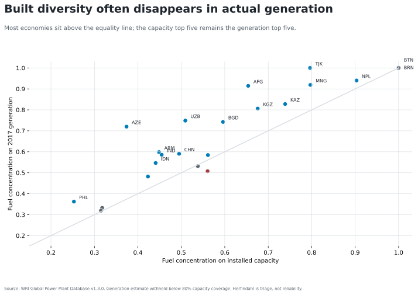
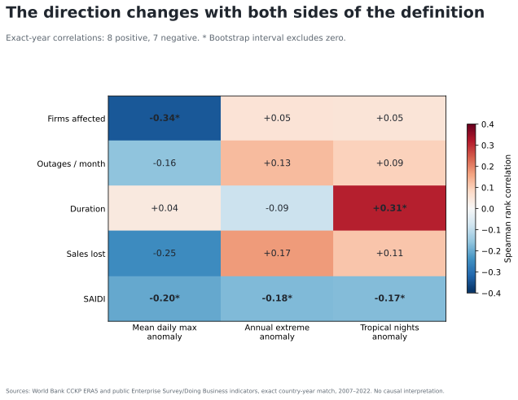
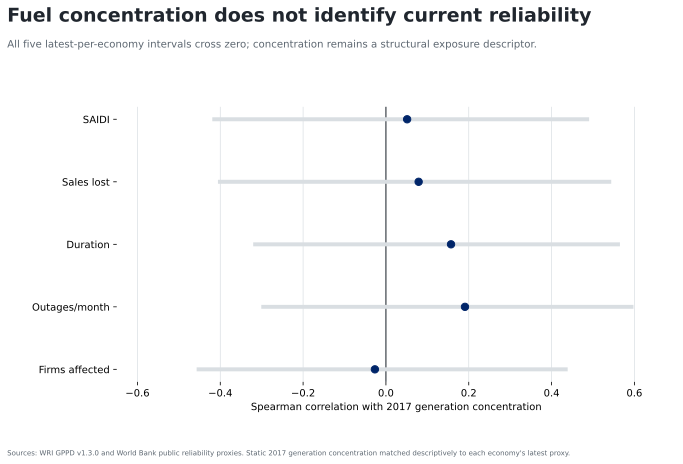

# Results

`attestation_chain: ai-first`

## Result 1: the structural exposure survives the denominator change

Bhutan, Brunei Darussalam, Nepal, Mongolia, and Tajikistan are the top five on both installed-capacity and 2017-generation fuel concentration. The order changes, and generation is more concentrated for most usable economies. Tajikistan rises from 0.796 on capacity to 1.000 on generation; Afghanistan rises from 0.654 to 0.915.

This supports a narrow statement: built backup capacity can make an annual system look more diverse than the generation it actually uses. It does not support a reliability ranking.

## Result 2: the heat–reliability direction fails

The 15 exact-year correlations split almost evenly: eight positive and seven negative. For the share of firms experiencing outages, the rank correlation is −0.34 with the average-maximum-temperature anomaly but +0.05 with the annual extreme and +0.05 with tropical nights. For typical outage duration, tropical nights give +0.31 while the annual extreme gives −0.09. SAIDI is negative under all three heat definitions.

Five intervals exclude zero, but they do not form one coherent direction: four are negative and one is positive. The appropriate conclusion is disagreement among constructs, not evidence that heat improves or worsens regional reliability.

## Result 3: generation concentration does not recover the missing relationship

Using one latest reliability observation per economy, correlations with 2017 generation concentration range from −0.03 to +0.19 across the five proxies. Every 95% bootstrap interval crosses zero.

Fuel concentration therefore remains a structural-exposure descriptor. It is not an observed measure of interruptions, adequacy, or heat sensitivity.
