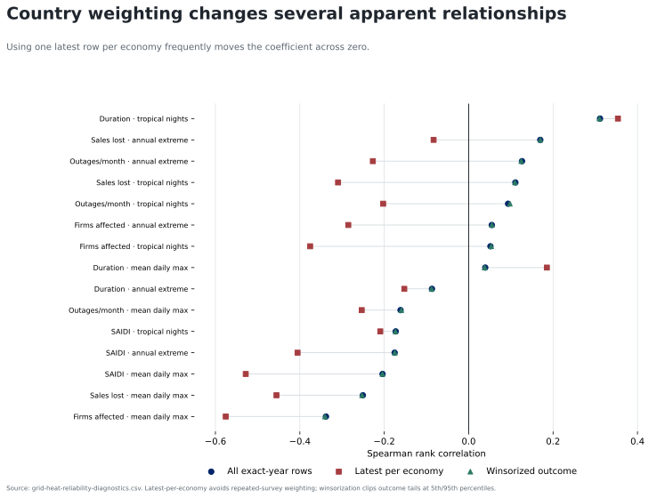

# Sensitivity and robustness

`attestation_chain: ai-first`

The negative finding is not that every coefficient is zero. It is that the sign and magnitude depend on reasonable measurement choices.

- **Country weighting.** Replacing all exact-year rows with one latest row per economy moves several coefficients across zero. The largest change is for firms affected × average maximum temperature, from −0.34 to −0.58; other positive all-row relationships become negative.
- **Outcome tails.** Winsorizing each outcome at the 5th and 95th percentiles barely changes the all-row coefficients, so extreme outcome values do not explain the sign disagreement.
- **Heat definition.** Average maximum temperature, the annual hottest daily maximum, and tropical nights encode different exposure channels; they produce different signs for four of five reliability outcomes.
- **Generation denominator.** The top-five economy set is stable between capacity and generation, but the level and order change. Generation coverage below 80% remains withheld; the floor is varied from 40% to 100% for the triage roster, not used to manufacture the headline.
- **Uncertainty.** Ten of 15 row-bootstrap intervals include zero. All five latest-per-economy generation–reliability intervals include zero.

The bootstrap resamples rows and does not solve repeated-country dependence. It is used as an uncertainty screen, not an inferential claim.
