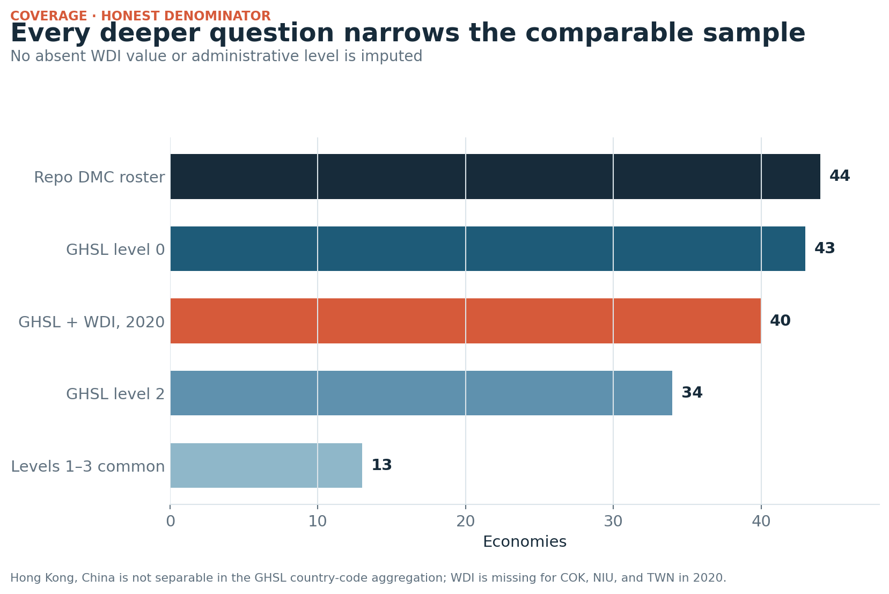

# Data sources and coverage

`attestation_chain: ai-first`

## Source custody

| Source | Role | Version / period | Retrieval record |
|---|---|---|---|
| JRC GHS-DUC | Standardized urban shares and administrative classifications | R2023A V2.0; 1975–2030; GADM 4.1 | 362,611,564 bytes; SHA-256 `4ac3eebb1674d7adce2391f223159ec1cbd20f2b88e794ab6c3f7b4b100c6a09` |
| World Bank WDI | National-definition urban share | `SP.URB.TOTL.IN.ZS`; 1975–2020 | URL, bytes, checksum, and retrieval mode in generated JSON |

The GHS-DUC archive contains one PDF, one Excel workbook, and 72 CSV files—one
for each of six GADM levels and 12 five-year epochs. The acquisition script
supports interrupted-download resume and keeps the 362.6 MB raw archive under
the repository-level `.cache`, outside Git and the deployed site.

## Analytical coverage

| Layer | Economies | Why the denominator changes |
|---|---:|---|
| Established repo roster | 44 | Starting scope |
| GHSL level 0, 2020 | 43 | Hong Kong, China is not separable after GHSL country-code aggregation |
| GHSL + WDI, 2020 | 40 | WDI has no 2020 value for Cook Islands, Niue, or Taipei,China in the fixed query |
| GHSL level 2 | 34 | Not every economy has a GADM level-2 layer |
| Common at levels 1–3 | 13 | Intersection used for scale sensitivity |

## Units

- Level 0: country-code aggregation after summing all GADM fragments assigned
  to the same `GID_0GHSL`.
- Levels 1–3: administrative units defined by GADM 4.1.
- Urban population: GHSL population in urban-centre or urban-cluster cells.
- Rural unit: GHS-DUC `DEGURBA_L1 = 1` at the stated administrative level.

No missing value or administrative layer is imputed.
