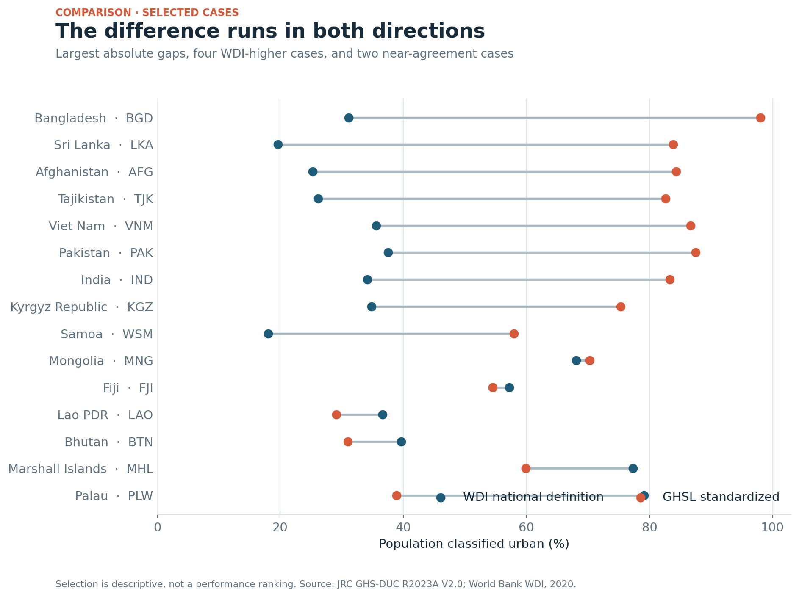
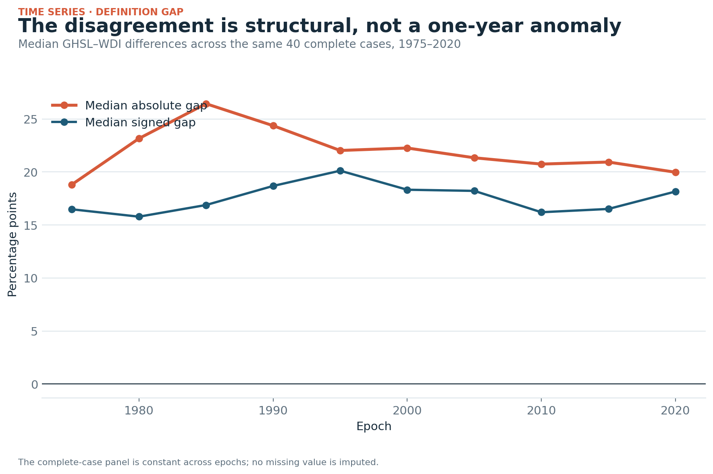
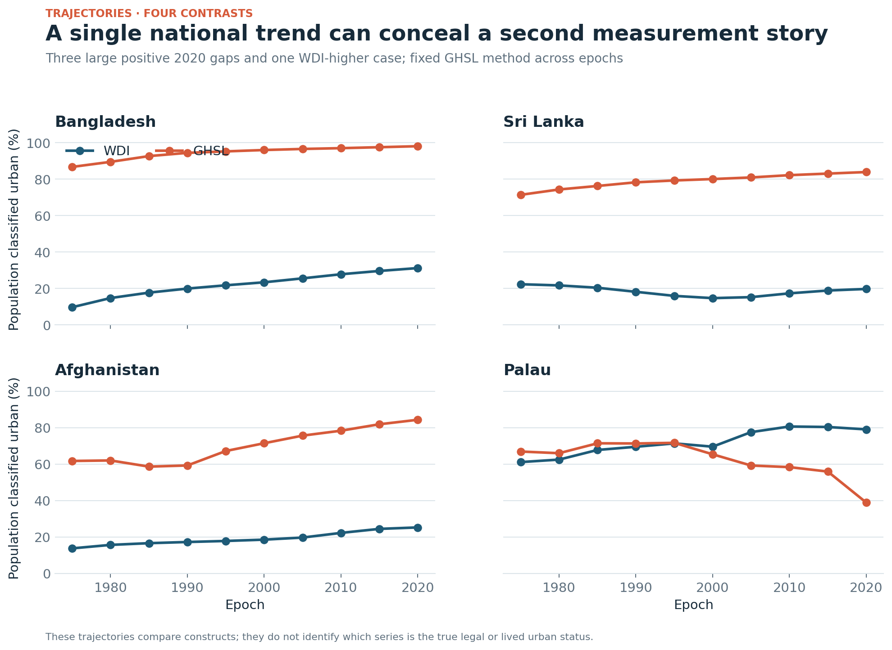
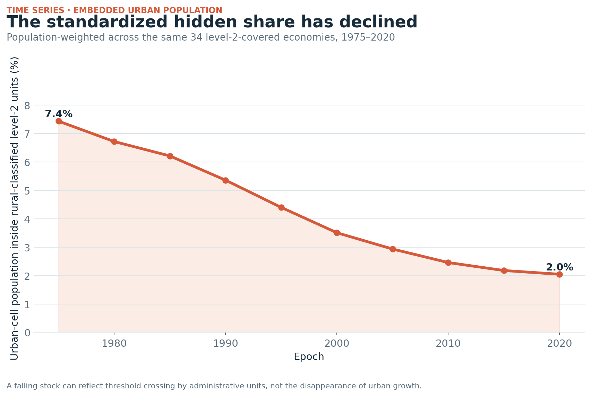
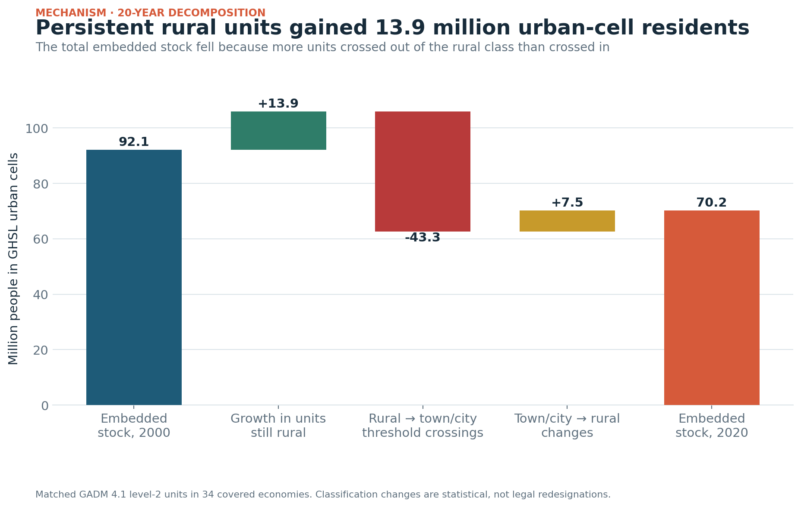
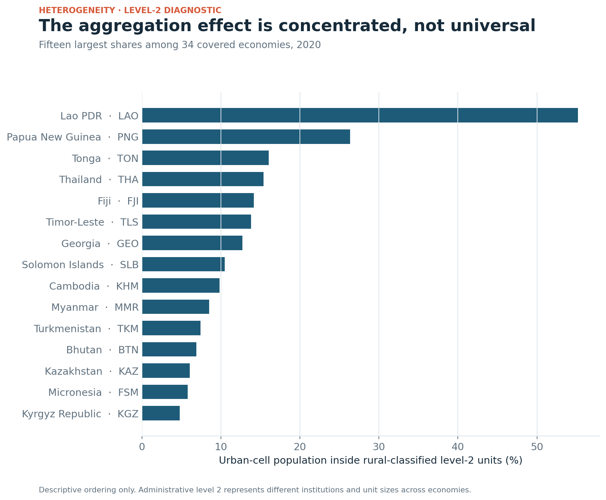

# Results — When urbanization depends on the definition

`attestation_chain: ai-first` · PP measurement study

## Result 1 — The national percentage is not a comparable urban object

The 2020 complete-case panel contains 40 economies. The median absolute gap
between GHSL's standardized urban share and WDI's national-definition share is
**19.98 percentage points**; the median signed gap is **+18.16 points**. GHSL
is higher in **33** cases and WDI is higher in **seven**.

The direction is not universal. Bangladesh has the largest positive difference
in the panel: 98.01% under the GHSL urban-centre-plus-urban-cluster construct
and 31.12% in WDI, a gap of +66.89 points. Palau has the largest negative
difference: 38.94% in GHSL and 79.08% in WDI, a gap of −40.14 points. These are
construct contrasts, not error estimates.

## Result 2 — The disagreement persists over time

The same 40 complete cases are observable at every five-year GHSL epoch from
1975 through 2020. The median absolute gap remains between roughly 19 and 26
percentage points. It does not converge to zero as the series approaches 2020.
This persistence is consistent with a structural difference between the
national and harmonized constructs, not a one-year data mismatch.

The country paths also differ. Bangladesh and Afghanistan show large, sustained
positive GHSL–WDI gaps; Sri Lanka's national share remains low while the GHSL
share rises; Palau changes from approximate agreement to a large WDI-higher
gap. A single cross-section would miss those different trajectories.

## Result 3 — Administrative scale changes the measured hidden share

“Urban-cell population inside a rural-classified unit” is computed as
`UCentre_Pop + UCluster_Pop` for units with `DEGURBA_L1 = 1`. In the same
13-economy sample, that population represents:

| GADM level | Embedded urban-cell population | Share of all urban-cell population |
|---:|---:|---:|
| 1 | 19.9 million | 0.61% |
| 2 | 63.1 million | 1.94% |
| 3 | 92.4 million | 2.84% |

Finer administrative units expose more urban cells inside units whose total
population composition still meets the GHS-DUC rural rule. The comparison is
population-weighted and restricted to economies present at all three levels;
the wider but changing samples are reported separately and are not used for
the scale claim.

## Result 4 — A falling embedded stock can coexist with continued urban growth

Across the same 34 economies covered at level 2 in every epoch, the embedded
share falls from **7.4% in 1975 to 2.0% in 2020**.

The transition decomposition explains why a smaller stock does not mean the
underlying settlement process stopped. From 2000 to 2020:

- 2,689 units remained rural and gained **13.9 million** urban-cell residents;
- 678 units moved from rural to town/city, taking **43.3 million** residents
  out of the embedded category;
- 173 units moved from town/city to rural, adding **7.5 million**;
- the net embedded stock fell from **92.1 million to 70.2 million**.

The standardized classification is therefore dynamic. Growth within rural
units can eventually push a unit across the threshold, making measured
“invisibility” decline even as urban-cell population continues to grow.

## Result 5 — The aggregation effect is heterogeneous

At level 2 in 2020, Lao PDR has 55.18% of its GHSL urban-cell population inside
rural-classified units, Papua New Guinea 26.36%, and Thailand 15.41%. Many
other economies are near zero. Those shares cannot be interpreted as a league
table because level-2 units differ in size and institutional meaning.

## Interpretation

The strongest defensible conclusion is about measurement. National urban
statistics and harmonized spatial classifications produce persistently
different pictures of settlement. Administrative scale and threshold crossing
then change how much urban-cell population appears inside a rural unit. A
policy-facing analysis should show both measures, state their purposes, and
investigate legal classification and service access separately.
