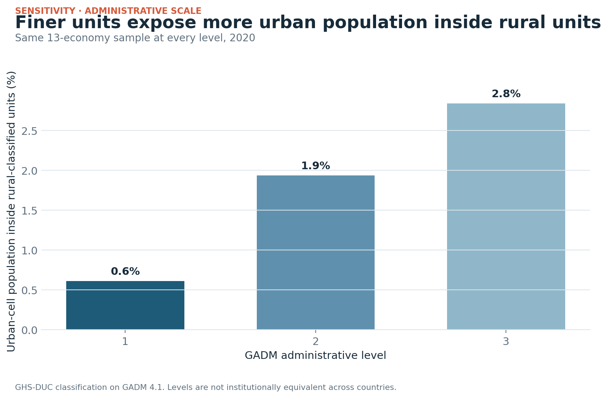

# Sensitivity and robustness

`attestation_chain: ai-first`

## Administrative scale

The embedded-share result is recomputed at GADM levels 1, 2, and 3 using the
same 13 economies at every level. The share rises monotonically from **0.61%**
to **1.94%** to **2.84%**. Using all available economies at each level gives
0.74%, 2.05%, and 2.84%, but those changing-sample figures are not used for the
claim.

## ±50% time-window sensitivity

The 20-year transition window is an analyst choice, so it is varied by ±50%:

| Window ending 2020 | Start embedded stock | End stock | Change | Share change |
|---:|---:|---:|---:|---:|
| 10 years | 74.7m | 70.2m | −4.5m | −0.41 pp |
| 20 years | 92.1m | 70.2m | −21.9m | −1.46 pp |
| 30 years | 115.4m | 70.2m | −45.2m | −3.31 pp |

The direction is unchanged at 10, 20, and 30 years. The magnitude grows with
the window, as expected.

## Transition decomposition checks

For every window, the sum of unit-level changes equals the difference between
the starting and ending embedded stocks to numerical tolerance. All windows
contain the same 7,918 matched level-2 units across 34 economies.

## Definition-gap direction

Both signed and absolute gaps are reported. GHSL is higher in 33 of 40 cases
in 2020, but seven cases run in the opposite direction. The conclusion is
therefore “definitions disagree materially,” not “national definitions always
understate urbanization.”

## Sensitivity not yet run

This study uses the official GHS-DUC V2.0 classification. It does not recompute
the underlying one-kilometre grid under alternative density, population,
contiguity, smoothing, or population-grid assumptions. Published work shows
those choices can have spatially heterogeneous effects
[@vanmigerode2024urbansensitivity].
